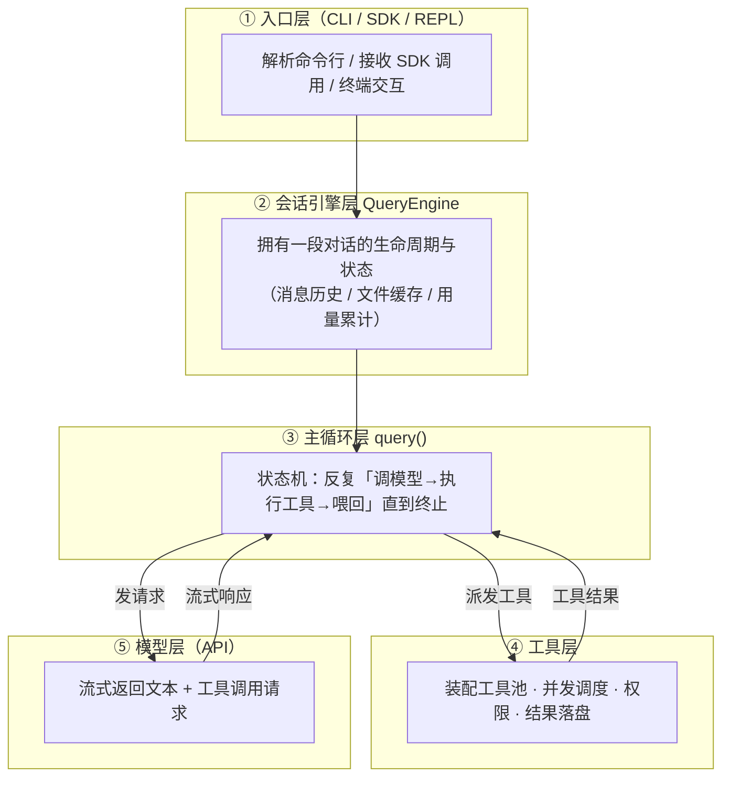
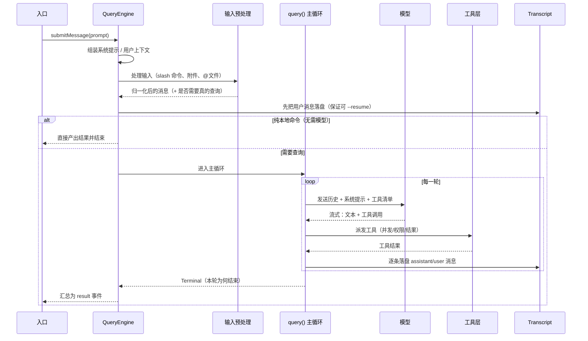
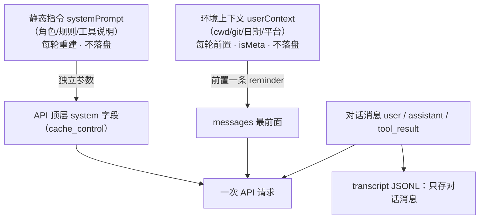
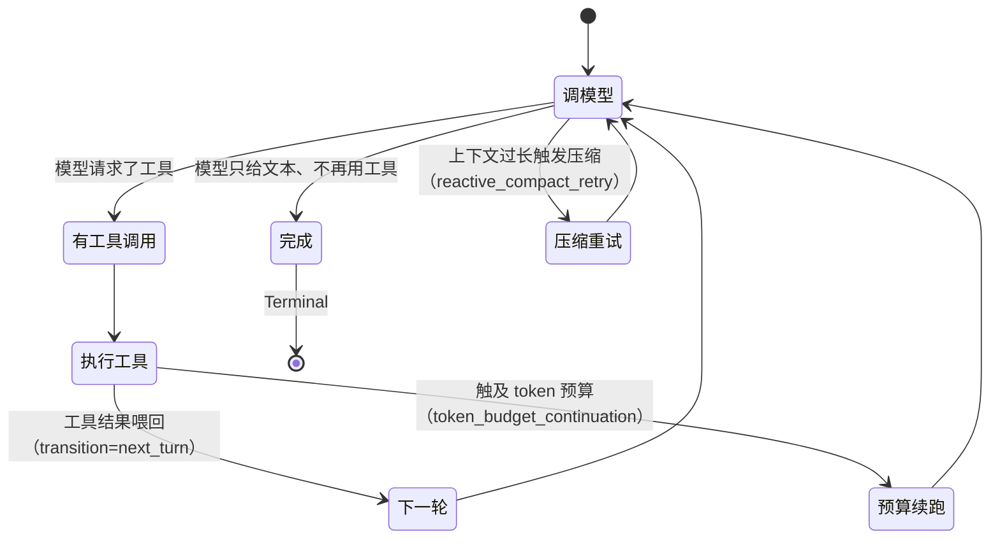
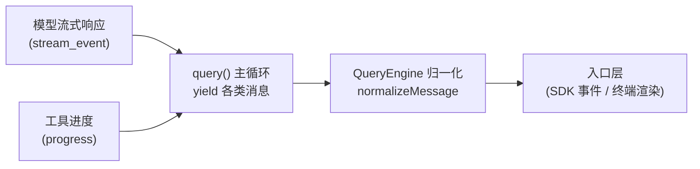
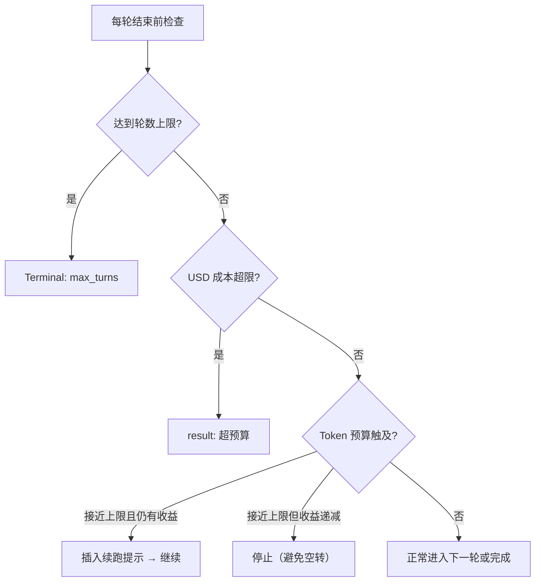
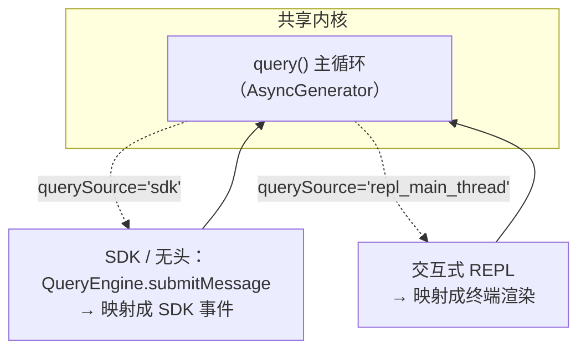

# 全景与主循环（Overview & Main Loop）

> 这是整套文档的**地基**。讲清 Claude Code 从"用户输入一句话"到"给出最终答复"之间，**主循环如何驱动"调模型 → 执行工具 → 把结果喂回"的闭环**，以及贯穿全栈的流式范式、终止判定与预算控制。
>
> **原则：源码为准。** 机制均从 `claude-code-cli` 求证；无法确证者标注「推断」。文末附涉及模块。

---

## 1. 五层全景

从"敲下命令"到"模型作答"，系统自上而下是五层。上层只依赖下层暴露的抽象：

- **入口层**：三种入口（命令行 / Agent SDK / 交互式 REPL），最终都汇到同一个会话引擎。
- **会话引擎层 `QueryEngine`**：**一整段对话共用一个实例**——多次提交消息（多轮）都跑在同一个 `QueryEngine` 上，每次 `submitMessage()` 只是在这个实例里开启新一轮；消息历史、文件读取缓存、Token 用量等状态**存在实例里、跨轮持久化**（源码注释：*One QueryEngine per conversation … state persists across turns*）。
- **主循环层 `query()`**：真正的"心跳"，一个不断迭代的状态机（详见 §3）。
- **工具层**：见[《工具·调用·权限系统》](./01-tool-call-authority.md)专篇。
- **模型层**：Claude API，流式吐出文本与工具调用请求。

---

## 2. 一次对话的完整旅程

以 `QueryEngine` 的"提交一条消息"为主线，一轮对话经历如下阶段（源码：`QueryEngine.ts` 的 `submitMessage`）：

几个**源码层面的关键事实**：

- **提交即先落盘**：用户消息在进入主循环**之前**就写入 transcript——这样即便随后进程被杀，会话仍可 `--resume`（`QueryEngine.ts` 内注释明确此意图）。
- **本地命令短路**：若输入是纯本地 slash 命令（如查看配置），`shouldQuery=false`，直接产出输出、不进主循环、不调模型。
- **一切皆流**：`submitMessage` 本身是个 `AsyncGenerator`，把主循环吐出的每条消息**归一化**后再流给入口层（详见 §4）。

### 2.1 系统提示与环境上下文：怎么进 API、存不存、怎么恢复

发给模型的"前置信息"其实走**两条独立通道**，且**都不进 transcript**——这点很反直觉，单独说清。

- **两条通道**：
  - **`systemPrompt`（静态指令）** → 走 API 的**顶层 `system` 字段**（独立参数，**不是**拼进 messages），并打 `cache_control` 作可缓存的稳定前缀（`buildSystemPromptBlocks`）。
  - **`userContext`（环境键值）** → `prependUserContext` 在**每次调模型时**即时拼**一条** `<system-reminder>` 放到 messages **最前面**（标 `isMeta`）。是"仅置顶一条"，不是每条消息都带。
- **会不会变**：一轮之内 `systemPrompt` **算一次、保持稳定**（为 prompt 缓存）；跨轮/每次提交**重新构建**，环境变了（cwd/工具/MCP/日期/git）它就变。真正每轮都变的动态内容（待办、提醒、记忆）**不放系统提示**，而走 `<system-reminder>` 附件（见[《08》](./08-context-assembly.md)），正是为了让 `system` 字段稳定可缓存。
- **存不存**：**都不存**。`recordTranscript` 只记 `messages`；`systemPrompt` 不入盘，`userContext` 那条因 `isMeta` 也**不进持久化**——每次调用即时生成、用完丢弃，**磁盘 0 份、也不累积**。
- **怎么恢复**：`--resume` **只还原对话消息**；系统提示与环境上下文是用**当前环境就地重建**的，不是从磁盘还原。**后果**：恢复出的对话忠实，但"框架"（系统提示/日期/可用工具）是**当下版本**，可能与原会话不同。
- **为何这样设计**：持久化的是"对话"这个**不可再生**的东西；系统提示/环境是"环境的**可复现函数**"，重建反而永远最新、且不撑大存储与上下文。

> 你在本对话最顶端看到的 `<system-reminder> … # currentDate …` 就是 `userContext` 前置的实例——它每轮都在，却从不进会话记录。

---

## 3. 主循环：Continue / Terminal 状态机

`query()`（`query.ts`）内部是一个 `while(true)` 的**状态机**（核心循环 `queryLoop`）。每次迭代持有一个 `State`（携带当前消息、工具上下文、轮次计数等），迭代末尾要么**转入下一状态继续**，要么**返回一个 `Terminal` 结束本轮**：

**继续（Continue）的几种转移**（`transition` 字段，源码可见的原因）：
- `next_turn`——最常见：本轮用了工具，把结果喂回，进下一轮；
- `token_budget_continuation`——触及 token 预算，插入续跑提示后继续；
- `reactive_compact_retry`——上下文超长，先压缩历史再重试（见[《会话管理与压缩》](./04-session-compaction.md)）；
- `stop_hook_blocking`——Stop 钩子暂时阻止结束、要求继续。

**终止（Terminal）的几种原因**（`query()` 的返回值）：

| Terminal 原因 | 触发 |
|---------------|------|
| `completed` | 正常收尾：模型不再请求工具 |
| `max_turns` | 达到轮数上限 |
| `prompt_too_long` | 上下文溢出（压缩也无法挽回时） |
| `model_error` | API 报错 |
| `aborted_streaming` | 请求被中止 |
| `hook_stopped` | 钩子主动叫停 |

> **本质**：主循环把"要不要再和模型聊一轮"抽象成**二元决策**——`Continue`（携带原因和新状态）或 `Terminal`（携带结束原因）。工具结果之所以能驱动"多轮自主"，正是因为"用了工具"默认转移到 `next_turn`，把结果作为下一轮输入回灌给模型。

---

## 4. 贯穿全栈的流式范式

从模型响应到工具进度，再到最终交给入口层，**全程是 `AsyncGenerator`**——一层套一层地 `yield`，而非"算完再返回"。

- **消息是有类型的流**：主循环吐出的消息包含 `assistant`（模型文本/思考/工具调用）、`user`（工具结果等）、`progress`（工具进度）、`stream_event`（底层流式增量）、`attachment`（结构化输出、上下文附件）、`system`（压缩边界、API 重试等）、`tool_use_summary`、`tombstone`（删除信号）等。`QueryEngine` 按类型分别处理（累计用量、落盘、归一化后再 yield）。
- **用量随流累计**：`message_start` 重置当轮用量、`message_delta` 累加、`message_stop` 汇入总量——所以成本统计是**边流边算**。
- **取消随流传播**：所有环节共享一条 `AbortController` 信号链；用户中止、预算超限、错误都通过它向下游取消（工具层还有子级信号做"兄弟工具"隔离，见工具篇）。
- **落盘穿插其间**：assistant 消息**火后不管**式写盘（避免阻塞生成器），user/进度/附件则按需即时写，兼顾"不丢历史"与"不卡流"。

> **术语·火后不管（fire-and-forget）**：源自导弹"发射后不管"。在代码里指**发起一个异步操作但不 `await` 它**（TS 常写成 `void fn()`）——调用一下就立刻继续，不等它完成、不内联取其结果。这里用于"慢又不想卡主流程"的场景（如写盘、起后台任务）：**发起写盘即继续吐下一段**，磁盘 I/O 不阻塞生成。代价是**放弃了内联等待与直接返回值**，错误只能靠 `.catch`/日志兜、写入顺序不严格跟随。后台任务启动（`void runAsyncAgentLifecycle`，见[《02》](./02-agent.md)§4.1）同理。

---

## 5. 终止、轮次与预算

主循环不会无限跑，有多重"刹车"：

> **本节"轮"= API 交互轮**（`query()` 内一次"调模型+执行工具"的迭代），**非提交轮**。`turnCount` 每次迭代 +1、每个提交轮从 1 起算；`maxTurns` 因此限的是"**一个提交轮内模型↔工具最多转几圈**"，本质防工具死循环。

- **轮数上限**：达到 `maxTurns` 直接终止（`max_turns`）。
- **USD 预算**：每轮核对累计成本，超过 `maxBudgetUsd` 立即以错误结果收尾。
- **Token 预算**（`query/tokenBudget.ts`）：接近上限（约 90%）时判断"是否还有收益"——若**每轮产出持续走低**（连续多轮低于阈值）判为收益递减、停止，避免空转；否则插入"续跑提示"继续。
- **结构化输出重试上限**：当要求 JSON schema 输出时，若模型多次给不出合规结果，达到重试上限也会以错误收尾。
- **用户中断**：分两条路径——**ESC** 可随时 `abort` → 本轮以 `aborted_streaming`/`aborted_tools` 收尾并插 `[Request interrupted]`；**运行中提交新消息**则**永远先入队**，仅当执行中工具全是可中断（`cancel`）时才 `abort('interrupt')` 提前结束、由队列消息开新一轮，否则在本 query 的下一交互轮把它 drain 进来。完整判定（`hasInterruptibleToolInProgress`、cancel/block、混合态合成错误、去向）见[《工具·调用·权限系统》](./01-tool-call-authority.md)§5.2。

---

## 6. SDK 与 REPL 的统一

无论是无头/SDK 调用还是交互式 REPL，**主循环 `query()` 是同一套**；差异靠一个 `querySource` 标签与外层封装区分：

- **同一内核，两个消费端**：`QueryEngine` 把主循环产出翻译成 SDK 事件；REPL 把同样的产出翻译成终端 UI。
- **`querySource` 影响细节**：如内容替换是否持久化、队列排水行为等，会因来源（`sdk` / `repl_main_thread` / `agent:*` / `compact` 等）而略有不同——但"调模型→执行工具→喂回"的骨架完全一致。
- **子 Agent 也复用它**：子 Agent 本质是带不同上下文再跑一遍这套循环（见[《Agent 系统》](./02-agent.md)）。

---

## 7. 关键设计取舍

| 取舍 | 做法 | 为什么 |
|------|------|--------|
| 会话状态集中在引擎 | `QueryEngine` 持有跨轮的消息/缓存/用量 | 单一真相源，SDK 与 REPL 共享 |
| 主循环即状态机 | Continue/Terminal 二元决策 + 具名原因 | 把"多轮自主"收敛成清晰可测的转移 |
| 全栈生成器 | 逐层 `AsyncGenerator` yield | 边算边出、可取消、可背压 |
| 工具结果即下一轮输入 | 用了工具默认转 `next_turn` 回灌 | Agent 自主性的来源 |
| 先落盘再查询 | 用户消息进循环前写 transcript | 崩溃/中止后仍可 `--resume` |
| 多重刹车 | 轮数 / USD / Token / 重试 上限并存 | 防失控、控成本、避免空转 |
| 一套内核两端封装 | `querySource` + 外层映射 | SDK 与 REPL 不重复实现循环 |

---

## 附录 · 涉及模块

- 会话引擎：`QueryEngine.ts`（`submitMessage`、`ask` 便捷封装）
- 主循环状态机：`query.ts`（`query` / `queryLoop`、`State`、Continue/Terminal）
- Token 预算：`query/tokenBudget.ts`
- 消息类型与构造：`types/message.ts`、`utils/messages.ts`
- 输入预处理：`utils/processUserInput/`
- Transcript 持久化：`utils/sessionStorage.ts`
- 工具调度：`services/tools/`（详见[《工具·调用·权限系统》](./01-tool-call-authority.md)）
