# 工具 · 调用 · 权限系统（Tool · Call · Authority）

> 本篇讲清 Claude Code 最核心的一环：**它支持哪些工具、工具怎么在主循环里被调用与回传、权限如何逐层校验、并发怎么调度、结果如何压缩落盘**。
>
> 讲**机制与设计**，不纠缠函数/字段等代码细节。所有结论均以 `claude-code-cli` 源码为准；无法确证、仅为推断者显式标注「推断」。文末附**涉及模块**（目录级）供溯源。

---

## 1. 支持哪些工具（能力全景）

工具是模型「伸向真实世界的手」。Claude Code 内置了一整套工具，按**能力域**可归为八类。模型每一轮能看到的只是其中一个**子集**（经权限过滤、按需加载后），而非全部。

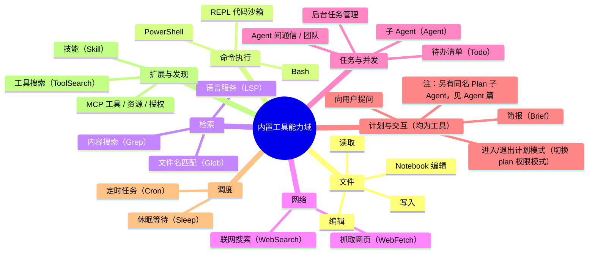

要点：

- **能力分层而非平铺**：文件/命令是「动手」，检索/网络是「感知」，任务/计划是「组织自己」，扩展是「接入外部」。
- **子集可变**：可用工具池每轮动态装配——受权限模式、deny 规则、是否交互式会话、以及 MCP/Skill/Plugin 是否接入影响。
- **工具即入口**：`Agent`、`Skill`、`MCP` 本身也以「工具」形态暴露给模型，即「用一个工具去启动一段子流程/外部能力」。这让「扩展」与「调用」在模型视角下是统一的。

---

## 2. 分层架构：从定义到执行

工具系统不是一个类，而是一条**自上而下的管线**。每一层只依赖下层的抽象，职责单一：

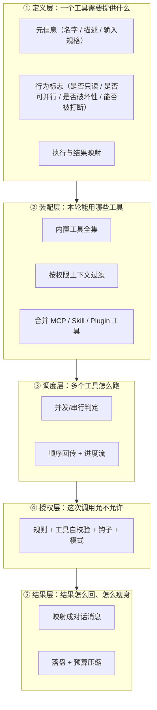

关键设计取向（贯穿全篇）：

- **工具是"数据契约"而非"活对象"**：工具不持有全局状态，运行所需一切由「执行上下文」注入。好处是可测试、无副作用、能在子 Agent 里携不同上下文复用同一套工具。
- **默认值失败关闭**：一个工具若没显式声明「可并行 / 只读 / 非破坏性」，一律按**更危险**的一侧对待（不可并行、会写、需要把关）。

---

## 3. 工具在主循环中的调用与回传

这是整个系统的**心跳**。一次「模型想用工具 → 工具执行 → 结果回到模型」的闭环如下：

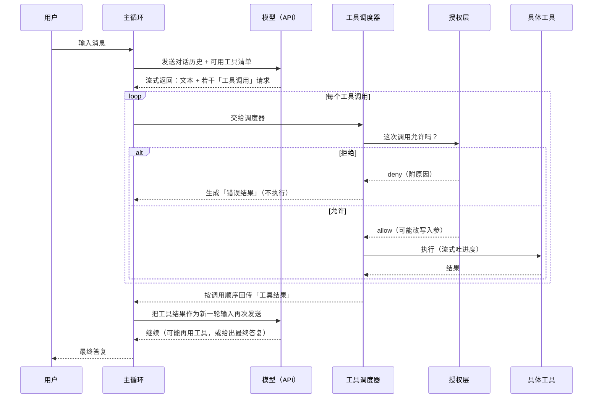

**"回传结构"的本质**——这是理解 Agent 循环的钥匙：

- 模型的一次响应里可以夹带**多个**工具调用请求。
- 每个工具执行完，其结果被包装成一条**「工具结果」消息**（在对话里以"用户侧"角色出现），带着对应的调用 ID 与内容。
- 这些结果**追加回对话历史**，连同之前的一切**再次整体发给模型**——于是模型"看到"了自己动作的后果，据此决定下一步。
- 循环持续到某一轮模型**不再请求任何工具**（给出最终文本），本轮结束。

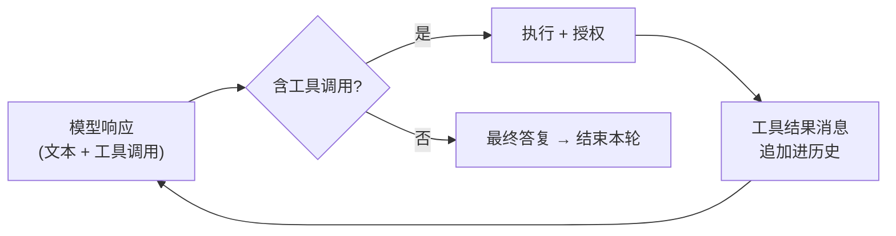

> 换言之：**工具结果不是"返回值"，而是"下一轮的输入"**。整个 Agent 的自主性，就来自这个"动作→观察→再决策"的回灌闭环。主循环、Token 预算、终止判定等骨架细节见[《全景与主循环》](./00-overview.md)篇。

### 3.1 旁路：状态型工具（结果分两条通道，且状态被"持续回灌"）

上面的主线是"工具结果 → 追加进历史 → 回灌一次 → 成为下一轮输入"。但**有一类工具走的是另一套路数**：它维护一份**持久化状态快照**，这份状态既**渲染到专用 UI 面板**给人看，又被**每轮以系统提醒的形式重新注入模型上下文**。典型代表是**任务/待办工具**（如 TodoWrite、以及 TaskCreate / TaskUpdate / TaskList 这组）。

要点在于区分**两个接收方（人、模型）× 两种时机（一次性、持续）**：

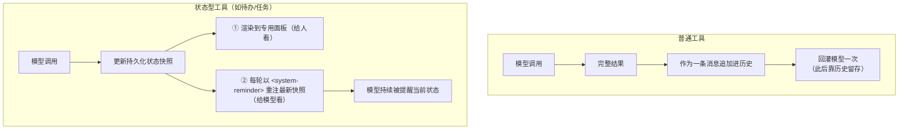

机制与性质（对照源码：`utils/attachments.ts` 有 `todo_reminder` / `task_reminder` 附件类型，分 **full / sparse** 两档节流）：

- **状态确实"回灌"，而且是持续重注**：这类工具的**最新快照**每轮（或每隔 N 轮的 full 档）被封装成 `<system-reminder>` 注入上下文，让模型**始终看到当前进度**，不会随对话变长而遗忘。我们这段对话就是实例——你每轮都能看到 `Here are the existing tasks: …` 被喂回给模型。这是**故意的"重复提醒"设计**，用来把模型"拉回正轨"。
- **人机两条渲染通道**：给**人**看的是**专用面板**（`N tasks (x done…)`），不占对话气泡；给**模型**看的是那份**重注的快照**。工具本身返回给模型的即时回执只是一句"已更新"，真正让模型持续知情的是上面的 system-reminder 机制。
- **重注的是"快照"而非"增量"**：每次注入的是**当前完整/概要状态**（幂等、体积有界），而不是把每一次状态变更堆成不断增长的日志——所以**每次注入本身很小、最新态始终在场**。注意：这些重注的 `<system-reminder>` **会作为消息落盘、在历史里累积**（不是 transient），只是靠**节流 + 压缩**把累积量兜住——真正每次即时生成、从不落盘的只有前置的 `userContext`（详见[《上下文装配》](./08-context-assembly.md)§5.1）。
- **它是"描述性/协调性"的，不是执行引擎**：把某任务标为"进行中"**不会自动触发**任何执行；步骤先后（依赖关系）在**单 Agent** 下只是**软标签**、不强制顺序，真正推进仍靠模型逐轮决策；只有在**多 Agent 协作**时，"领取/未解锁不可做"才成为**硬约束**。
- **为何这样设计**：把"当前该做什么"做成**每轮重注的持久快照**，正好解决 Agent 的两个痛点——① 上下文被压缩/截断后计划**不丢**（快照仍会重注）；② 长对话里**不跑偏**（持续提醒）；③ 顺带给用户**进度可见性**。

> 一句话修正：状态型工具的结果**不是"不回灌"，而是"以快照形式被持续重注"**——普通工具是"喂一口就靠历史记着"，状态型工具是"每轮把最新状态再念一遍"。前者驱动即时决策，后者维持长程一致。

---

## 4. 权限校验（核心中的核心）

工具让模型能触碰真实世界，**权限层就是那道闸门**。它要在「足够自动、不烦用户」与「绝不越权、可被硬拦」之间取得平衡。

### 4.1 三元决策与权限模式

每一次工具调用，最终只会落到三种结论之一：

| 决策 | 含义 |
|------|------|
| **allow** | 放行（可能顺带改写入参，如规范化路径） |
| **deny** | 硬拒绝，不执行，把原因作为结果回给模型 |
| **ask** | 需要用户当面批准 |

而**权限模式**决定了这套判定的"松紧基调"（源码中确有以下模式）：

| 模式 | 基调 |
|------|------|
| `default` | 标准：危险动作要问 |
| `acceptEdits` | 工作区内的文件编辑等自动放行，减少打断 |
| `plan` | 计划模式：只读探索。**注意其"只读"是软约束**——靠每轮 `plan_mode` reminder 指示 + 写操作落到 `ask` 兜底，**非权限层硬 deny**；真正结构性只读的是 Plan/Explore **子 Agent**（工具集砍掉写工具）。详见[《08》](./08-context-assembly.md)§4.1 |
| `bypassPermissions` | 尽量不拦（高信任场景） |
| `auto` | 用 AI 分类器替代"问用户"，实现无人值守自动判定 |
| `dontAsk` | 把本应"问"的一律转成"拒" |

### 4.2 判定的两层结构（先厘清，再看流程）

这是最容易误解的地方，务必先分清**两层**：

| 层 | 在哪 | 管什么 | 粒度 |
|----|------|--------|------|
| **① 整工具规则引擎** | 权限模块统一逻辑 | 整个工具的 deny/ask/allow 规则 + 权限模式 | **工具名级**（如"禁用 WebFetch""Bash 整体要问"）|
| **② 工具自校验** | 每个工具各自的 `checkPermissions` | 命令子规则、路径安全、操作特判 | **入参级**（如 `Bash(git *)` 放行、编辑 `.git/` 要问、越界路径拒）|

> **回答"pathRules / operationRules 去哪了、是配置还是写死"**：当前源码里**没有**这两个命名，也不是独立顶层阶段。路径/命令/操作的细粒度判定**都在各工具的 `checkPermissions` 内部**（下图 `1c`）汇合，而它由**两种来源**共同构成：
>
> - **可配置的权限规则**（来自 settings，多来源加载：policy / 项目 / 用户 / local / command）——统一的 `allow / deny / ask` 三类规则，每条解析为 `{toolName, ruleContent?}`，**支持入参级粒度**：`Bash`（整工具）、`Bash(npm install)`、`Bash(git *)`、`Read(./src/**)` 等。**deep-dive 说的 pathRules/operationRules 就是这套规则**——不是两个专门类别，而是靠 `ruleContent` 表达路径/命令模式。
> - **源码写死的安全护栏**（不可配置）——敏感路径（`.git/`、`.claude/` 等）、危险命令模式等，归为 `safetyCheck`，**即使 bypass 模式也强制问**（对应 `1g`）。
>
> 一句话：**细粒度 =（可配的 `Tool(content)` 规则）+（写死的安全护栏）**。顶层引擎的 `1a/1b/2b` 只读**整工具级**规则，`1c` 才下钻到**入参级规则 + 护栏**。企业还可用 `allowManagedPermissionRulesOnly` 锁定为"只认受管规则"。
>
> 规则系统的纵深（来源与优先级、解析与匹配、影子规则、"下次不再问"写回、文件路径边界、拒绝追踪升级）见 **[《10 · 权限规则系统》](./10-permission-rules.md)**。

### 4.3 决策流水线（严格按源码步骤 1a→3）

引擎是一条**有先后的短路流水线**，任一步给出终局结论即返回。步骤编号与源码注释一致：

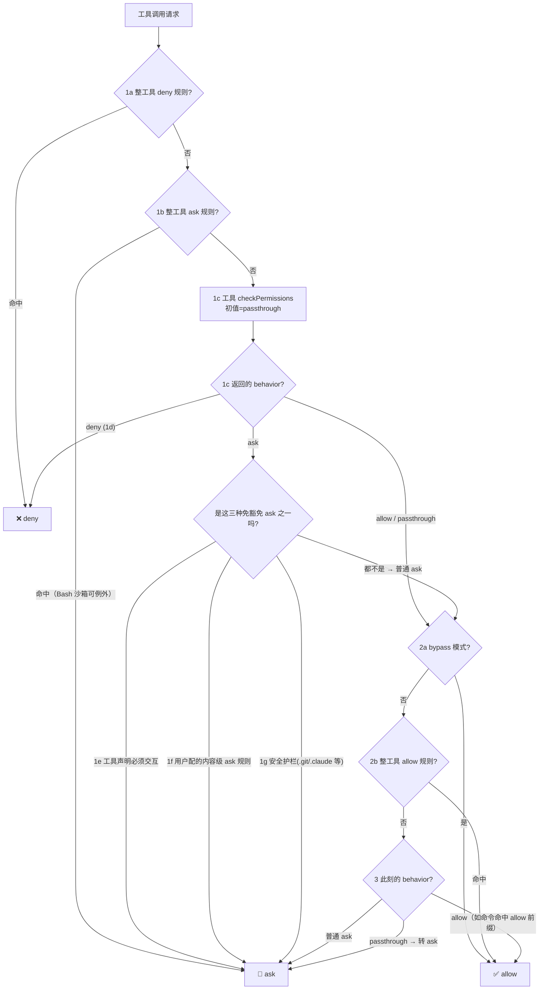

读这张图的关键（也是上一版单框太笼统之处）：

- **到 `1e~1g` 时只剩 `allow / ask / passthrough`**（`deny` 已在 `1d` 返回）。`allow` 与 `passthrough` **不触发** `1e~1g`，直接落到 `2a`；只有 `ask` 才进这三道细分。
- **`1e/1f/1g` 的本质是"免于被 bypass 覆盖"**：它们**抢在 `2a` 之前返回 ask**，于是 `bypassPermissions` 模式也压不动——这三种"必须问"的 ask 是①工具声明必须交互、②用户显式配的内容级 ask 规则、③安全护栏路径。
- **对比：普通 ask 会被 bypass 翻盘**。一个不属于上述三类的普通 ask，走到 `2a` 若处于 bypass 模式，就被**放行为 allow**；否则再看 `2b` allow 规则，最后在 `3` 以 ask 收尾。
- **`passthrough` 是"我不表态"**：工具没覆盖 `checkPermissions`（或显式返回 passthrough）时的初值，一路走到 `3` 才被**统一转成 ask**（除非中途被 `2a` bypass / `2b` allow 规则放行）。
- 另两处顺序更正：**deny 规则（1a）最前**，命中即拒、连 `checkPermissions` 都不调；**allow 规则（2b）在 checkPermissions 和 bypass 之后**，不是紧跟自校验。

### 4.4 得出 "ask" 之后：模式变换与兜底

上面引擎若最终判为 **ask**，还要再过一层**按模式的变换**（这才是 `auto`/`dontAsk`/钩子登场的地方）：

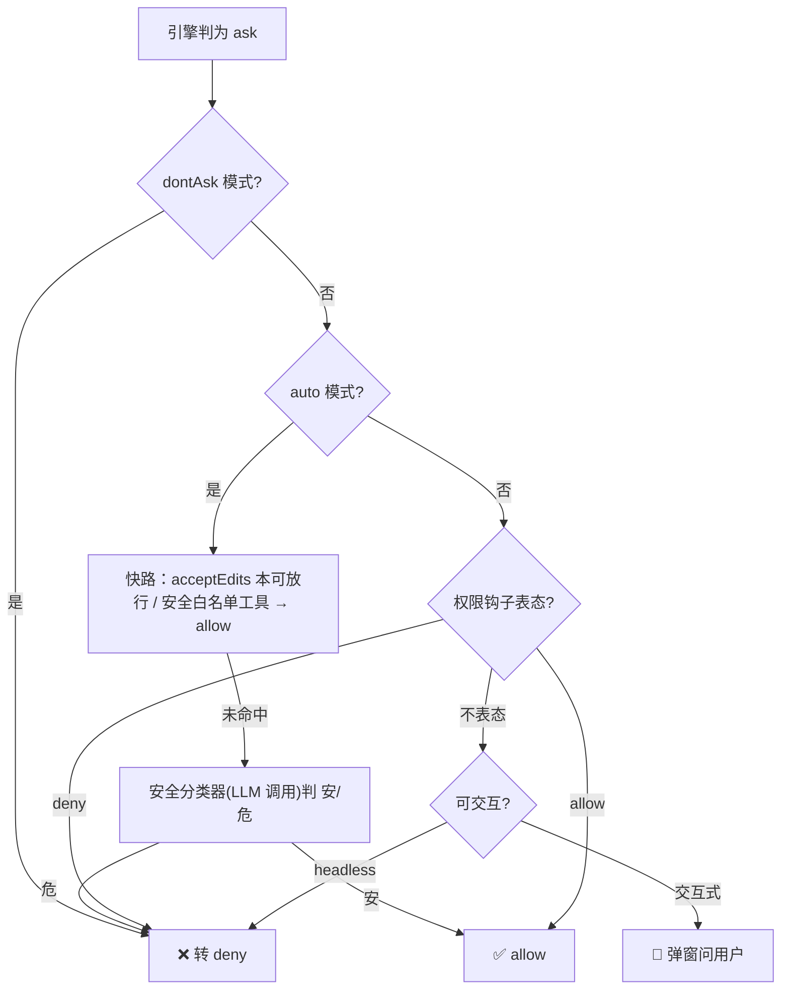

- **构造能直接 deny 吗——能，多处硬拒绝口子**：① `1a` 整工具 deny 规则；② `1c/1d` 工具自校验判 deny（越界路径、危险命令）；③ 权限钩子返回 deny（可携"中断"信号直接打断本轮）；④ `dontAsk` 把 ask 转 deny；⑤ headless 下仍需"问用户"却无处可问时兜底 deny。
- **allow 也非无脑放行**：allow 可顺带**改写入参**（返回规范化后的输入再执行）。
- **`auto` 分类器辅助审批**：判为 ask 且处于自动模式时，先走快路（acceptEdits 本可放行 / 工具在安全白名单），不中再调**安全分类器**判安/危，并记录**连续拒绝**状态以便必要时升级。

> 命令的语义级安全分析（危险命令识别、路径边界、只读强制、沙箱切换）发生在 `1c` 的 `checkPermissions` **内部**——这正是最复杂的 Bash 工具的战场，展开见下节 §4.5。

### 4.5 Bash 授权：一句话真相（详见专篇）

> **先辟谣**：坊间"剖析"资料里流传一套 **"威胁分数 = 命令基础分 × 标志乘数 × 目标乘数"**（`rm=80`、`dd=95`、`/etc=3.5`…）的算法——**源码里查无此物**。这是被杜撰的伪细节。

Bash 是所有工具里 `checkPermissions` 最复杂的一个。**真实机制不是打分**，而是"**AST 拆分 + 硬编码模式护栏 + 配置规则 + LLM 分类器**"，信条"证明不了安全就 ask/deny"：

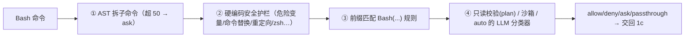

完整展开（命令拆分与前缀、逐类硬护栏、危险 allow 规则剥离、只读校验、sed 特判、沙箱、分类器内幕）见 **[《11 · Bash / 命令安全、沙箱与分类器》](./11-bash-security.md)**。

---

## 5. 执行调度：并发模型

一次模型响应里的多个工具调用，由**调度器**统一编排。核心目标：**在安全前提下最大化并行，同时保证结果顺序确定**。

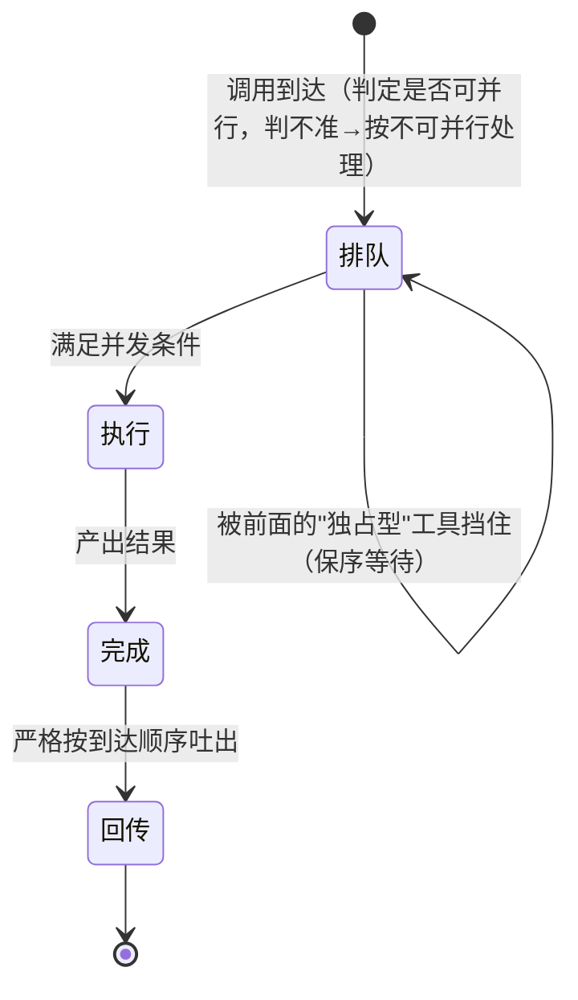

并发规则（概念版）：

- **只读/可并行工具彼此并行**；**任何"不可并行"工具必须独占执行**——运行时若已有别人在跑，它就得等；它在跑时别人也不能插。
- **顺序保证**：无论谁先跑完，**结果按调用到达的顺序回传**给模型，避免上下文错位。**进度消息**走独立通道即时显示，不受此顺序约束（体验上"边跑边有反馈"）。
- **失败牵连仅限命令类**：命令执行（Bash）常有隐式依赖链（前一步建目录失败，后续都白搭），所以一个 Bash 出错会**取消同批其余尚未完成的工具**；而读取、抓取等相互独立的工具，单个失败**不波及**他人。
- **可打断性可声明**：用户中途插话时，只有那些声明"可被取消"的工具会被中止并丢弃结果；声明"必须跑完"的工具继续执行，新消息排队等待。

### 5.1 结果何时吐出 vs 何时才回灌模型（别把两层混了）

"按调用顺序回传"**不等于**"憋到全部工具跑完才一次性返回"。这里有**两个不同层次**，等待与否也不同：

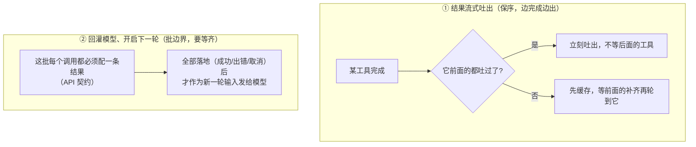

- **层①（流式吐出，不等全部）**：调度器**边完成边吐**，只受"到达顺序"约束（head-of-line）——前面的都吐过后，某工具一完成就立刻吐；靠后的工具即便先完成也**先缓存**、等前面的补齐。**进度消息更是即时吐出**，完全不受顺序约束。所以只读工具并行时，先完成的前缀会陆续显示，而非一起蹦出来。
- **层②（回灌模型，要等这批齐）**：模型这一次响应里发起的**每一个工具调用**，在下一轮请求里**都必须有一条对应结果配对**（API 硬性要求）。所以"把工具结果作为新一轮输入再次发送"这一步之前，**这一批工具必须全部落地**——成功、出错、被取消都算落地。
- 叠加并发规则：这批里若含**独占型（非并发安全）工具**，它会挡住排在它后面的工具，"要等多久"就取决于有没有独占工具、以及它排第几个。

> §3 时序图里"按调用顺序回传「工具结果」→ 作为新一轮输入"画的是**层②的批边界**；真正跑起来时，层①的增量吐出一直在发生。

### 5.2 用户中断的完整处理

一轮工具循环没结束时用户想打断——这不是"一刀切"，涉及**两条不同的中断路径**、**一个判定标志**、**每工具的 `interruptBehavior`**、以及**中断后去向的两种可能**。逐层说清。

> **先定义"轮"**（下文要用）：**提交轮** = 一次 `submitMessage()` → 一次 `query()`；**API 交互轮** = `query()` 内 `while` 的一次迭代（一次"调模型 + 执行工具"，由 `next_turn` 推进）。一个提交轮内含多次 API 交互轮。

#### A. 两条中断路径（触发与能力不同）

| 路径 | 怎么触发 | 是否 abort | abort 原因 |
|------|----------|-----------|------------|
| **ESC 纯取消** | 按 ESC（`useCancelRequest → onCancel`） | **随时**可 abort（等 API 或任何工具中） | 非 `'interrupt'` |
| **运行中提交新消息** | 输入 prompt/bash（`handlePromptSubmit`） | **永远先入队**；**仅当 `hasInterruptibleToolInProgress` 才** abort | `'interrupt'` |

两者是**不同机制**，别混：ESC 是"强停"；提交新消息是"排队 + 条件性加速"。

#### B. 判定标志：`hasInterruptibleToolInProgress`

提交新消息时是否 abort，只看这一个标志（`handlePromptSubmit`），它由 `StreamingToolExecutor` 维护，语义是：

> **当前有工具在执行，且执行中的工具*全部*是 `interruptBehavior === 'cancel'`**

所以它为 **false**（=不 abort、只入队）有两种情形：**① 当前没有工具在执行**（在等 API 流式、或两次工具调用之间）；**② 执行中的工具里有任何一个是 `block`**（默认值）。

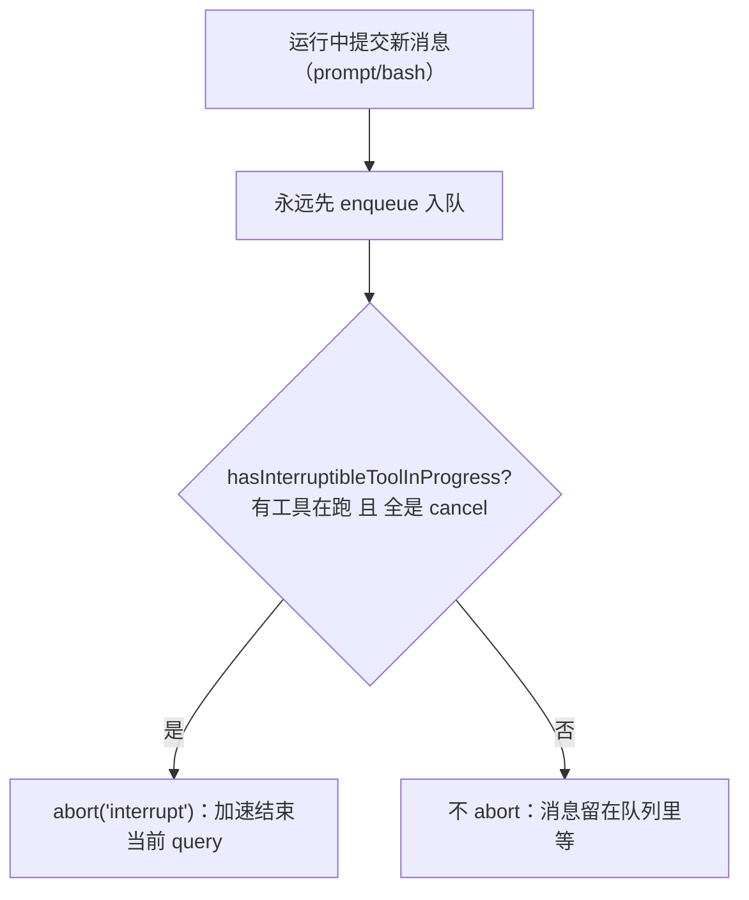

#### C. 信号如何传播 + 每工具的取舍

一次 abort 沿 **查询级 → `siblingAbortController` → 每工具子控制器** 逐级传导。到达执行中工具时，是否真被取消由 abort 原因 + `interruptBehavior` 决定（`getAbortReason`）：

- **原因 `'interrupt'`（提交新消息）**：只取消 `cancel` 工具；`block` 工具**返回不取消、继续跑**。（因为 B 的门槛保证：此路径 abort 时执行中工具本就全是 `cancel`。）
- **其它原因（ESC 强停）**：执行中工具**一律取消**（`block` 也不例外）。

> 另：`siblingAbortController` 还有一条**独立**机制——**仅 Bash 出错**时以 `sibling_error` 取消同批兄弟工具，与用户中断无关，别混。

#### D. 各工具状态的结果（保证 API 自洽）

无论走哪条，`StreamingToolExecutor` 都保证这批 `tool_use` **每个都拿到某种结果**，以满足"每个 `tool_use` 必配一个 `tool_result`"：

| 工具状态 | 中断后 |
|----------|--------|
| 已完成 | 结果**已缓存/已吐出，保留** |
| 执行中且被取消 | 停止 → **合成错误**（`user_interrupted`）；Bash 子进程被信号杀 |
| 排队未启动 | 永不启动 → 领取时给**合成错误** |
| 执行中且 `block`（仅 `'interrupt'` 路径） | **不取消、跑完**，正常结果 |

#### E. 中断后去向：两种可能（我此前口误的更正处）

关键结论：**"提交新消息"到底是"同一个 query 继续"还是"另起新 query"，取决于第 B 步有没有 abort**——

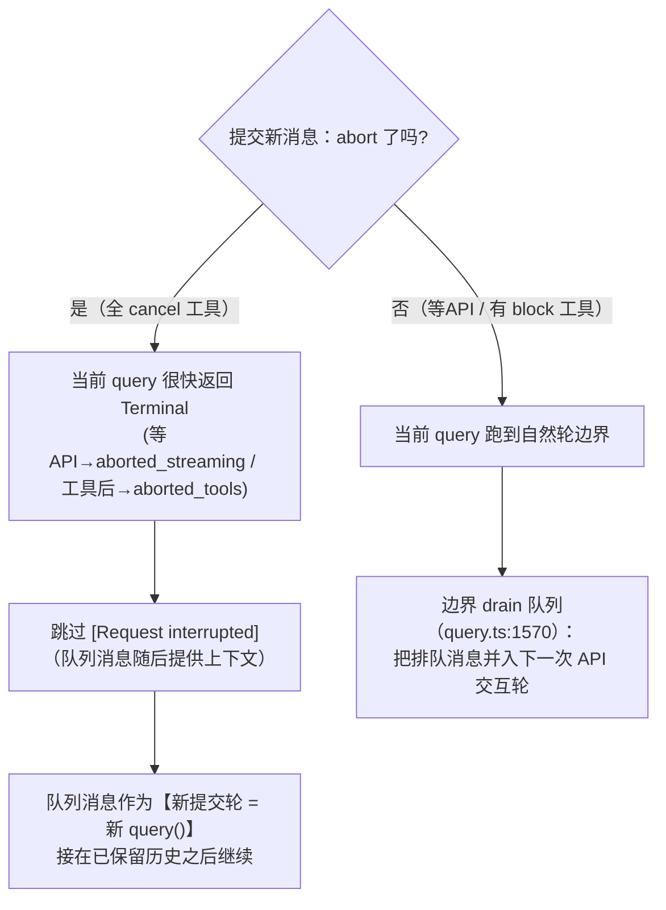

- **abort 了**（执行中工具全 `cancel`）→ 当前 `query()` 走 abort 检查**返回 Terminal**（等 API 时是 `aborted_streaming`，工具后是 `aborted_tools`）→ **结束**。因为"队列里的用户消息随后会跟上、提供上下文"，那条 `[Request interrupted]` **被跳过**。随后队列消息作为**新提交轮（新 `query()`）**运行，**接在被中断轮已保留的历史之后**（已完成结果 + 合成错误都在）。
- **没 abort**（在等 API，或有 `block` 工具）→ 当前 `query()` **不结束**，跑到自然的轮边界，在 `query.ts:1570` 处**从队列取出**这条消息、并入**同一个 `query()` 的下一次 API 交互轮**。

**关于 `toolResults` 的澄清**（易误解）：那条被 drain 的排队消息是**并入一个名为 `toolResults` 的累加器**——但它的类型是 `(UserMessage | AttachmentMessage)[]`，**并非"工具结果数组"**，而是"**下一次 API 交互轮要发出去的 user 侧载荷**"（工具结果 + 各类附件 + 被 drain 的排队消息都往这里放）。所以排队消息**不是"变成 tool_result"**，而是作为一条独立 user/attachment 消息塞进这个命名偏窄的数组。

#### F. ESC 的去向

ESC 就是**强停 + 等待**：`abort`（非 `'interrupt'`）→ 执行中工具一律取消 → `query()` 返回 Terminal → 插一条 `[Request interrupted by user]` → **回到提示符等你下一步**。它**没有随后跟上的消息**（所以要插中断提示），**不自动续跑**。

> 一句话总纲：**ESC = 随时强停、插中断消息、等输入；提交新消息 = 永远入队，仅当执行中工具全是 `cancel` 时才 `abort('interrupt')` 加速——abort 了就结束当前 query、用队列消息开新 query，没 abort 就在同一 query 的下一交互轮把它 drain 进来。无论哪条，已完成结果都保留、未完成/排队的补合成错误，保证对 API 自洽。**

---

## 6. ToolSearch：工具的延迟加载

工具越多，塞进 prompt 的"工具说明书"越长、越费 token，还会分散模型注意力。解决办法是**延迟加载**：

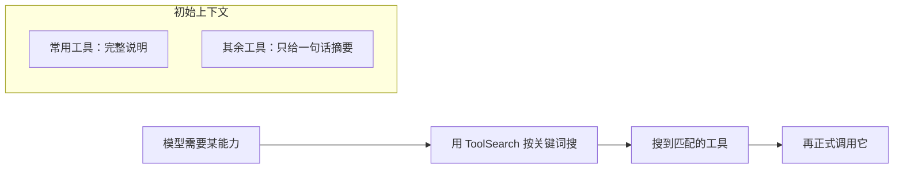

机制要点：

- **默认延迟谁**：外部接入的 MCP 工具一律延迟；部分内置工具也标记为延迟。少数"首轮就必须看到"的关键工具强制不延迟。
- **怎么被找回**：延迟工具在初始 prompt 里只留一句"能力摘要 + 关键词提示"，模型想用时先发一次搜索，命中后才拿到完整说明并调用。
- **收益**：初始 prompt 更小、更聚焦，token 成本随"实际用到的工具"而非"存在的工具"增长。

---

## 7. 结果处理与"工具压缩"

工具输出可能极大（整份日志、大文件、长命令回显）。若原样堆进上下文，很快撑爆窗口、抬高成本、还会拖慢缓存。系统用**两级瘦身**应对：

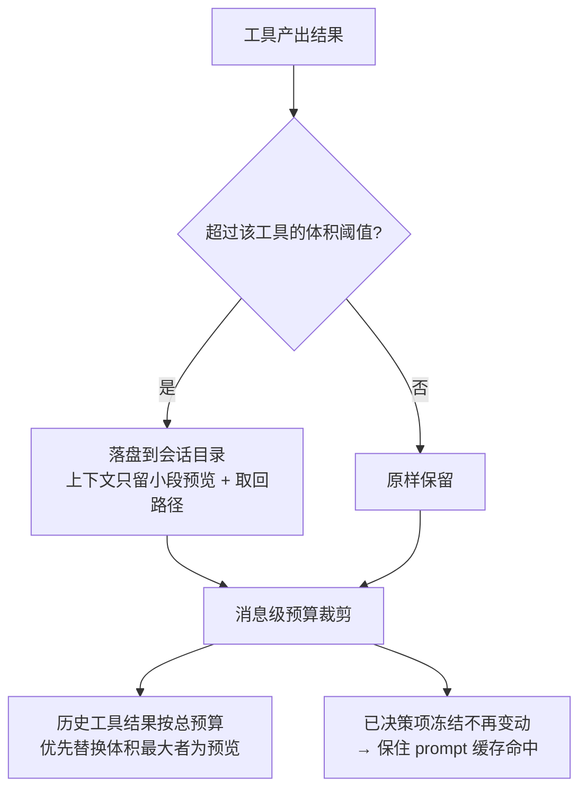

- **① 单结果落盘**：单个结果超过其阈值，就写到会话的结果目录，上下文里只保留一小段**预览**和一个**取回引用**——模型若真需要全文，可再去读。特例：像"文件读取"这类工具本身已自带上限，且落盘会造成"读文件→再读同一文件"的循环，因此**不参与落盘**。
- **② 消息级预算（这就是"工具压缩"）**：随着对话变长，历史里的工具结果会累积。系统给**每条消息的工具结果总量**设预算，超出时**优先把体积最大的历史结果替换成预览**，从而在保留"发生过什么"的同时压回体积。
- **③ 保住缓存**：一旦某条历史结果被决策为"保留/替换"，它就被**冻结**、不再来回变动。这样发往 API 的历史前缀保持字节稳定，**prompt 缓存**才能持续命中——压缩与缓存二者兼得。（前缀缓存的底层原理与打点见[《Prompt 缓存机制》](./prompt-cache.md)。）

> 这里的"工具压缩"是**局部、随手**的结果瘦身，属于 Token 预算管理；与"整段对话历史触发阈值后的自动压缩/摘要"是**两套不同机制**，后者见[《会话管理与压缩》](./04-session-compaction.md)篇。

---

## 8. 工具从哪来（扩展）

模型看到的工具池是**多源汇聚**的结果：

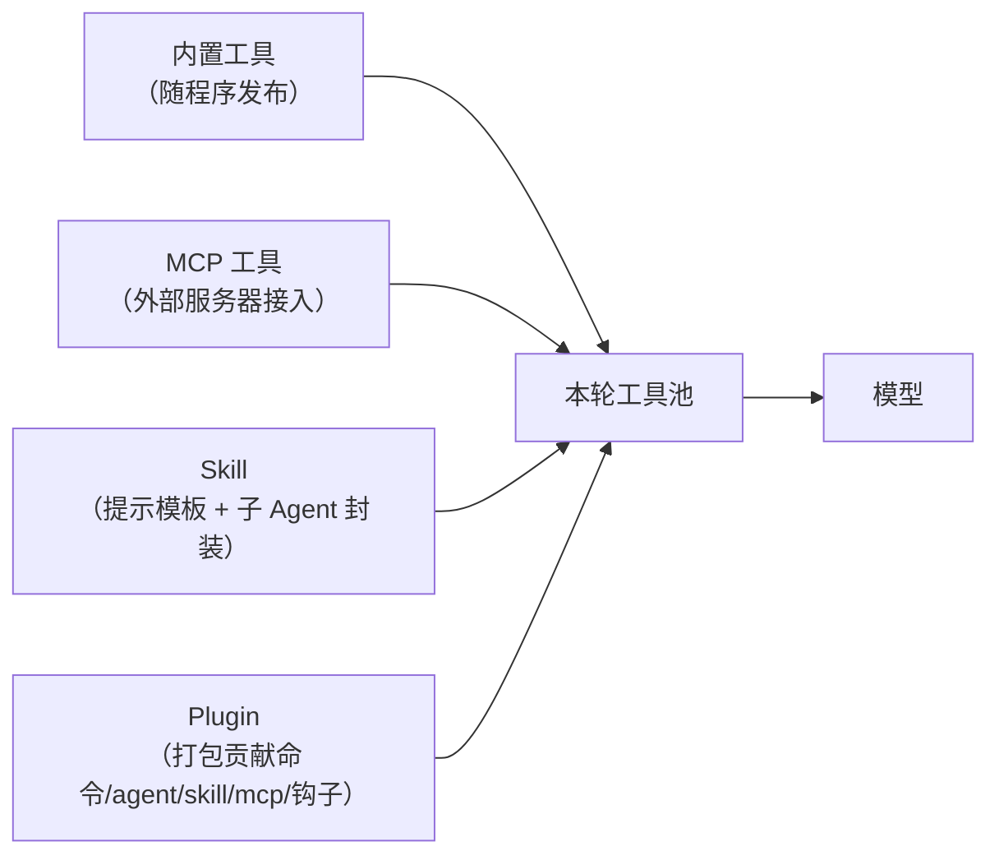

- **内置**：随程序发布的核心工具。
- **MCP**：通过标准协议接入的外部服务器所暴露的工具/资源（默认延迟加载）。
- **Skill**：把"一段专门流程"封装成可调用单元，调用时通常展开为一个带专属提示的子 Agent。
- **Plugin**：把命令、agent、skill、MCP 配置、钩子**打包分发**的扩展形态。

四者各有专篇展开，本篇只点明"它们最终都汇入同一个工具池、以统一的工具形态被模型调用"。

---

## 9. 设计取舍总表

| 取舍 | 做法 | 为什么 |
|------|------|--------|
| 工具是数据契约 | 契约 + 上下文注入，无全局状态 | 可测试、无副作用、子 Agent 可复用 |
| 失败关闭默认 | 未声明能力时按更危险处理 | 宁可多问，不可误放 |
| 权限流水线而非单点 | 规则→自校验→allow规则→模式→钩子→兜底，逐关短路 | 硬拦在前，自动化在后，层层可控 |
| 多口子可硬 deny | 规则/自校验/钩子/模式四处可拒 | 保证"一定拦得住"的底线 |
| 自动模式用分类器 | 无人值守时以 AI 判"安/危"替代问用户 | 兼顾自动化与安全 |
| 保守并发 + 严格保序 | 只读并行、写独占、结果按序回传 | 压低墙钟时间又不乱上下文 |
| 失败牵连仅限命令 | 仅 Bash 出错取消兄弟工具 | 匹配命令的隐式依赖语义 |
| 工具延迟加载 | 非常用/外部工具靠搜索现取 | 控 prompt 体积与 token 成本 |
| 结果两级瘦身 | 大结果落盘 + 历史按预算替换 + 冻结保缓存 | 控上下文体积同时保住 prompt 缓存 |

---

## 附录 · 涉及模块（目录级溯源）

> 仅指向源码位置，便于自行深挖；不展开符号。

- 工具契约与工厂：`Tool.ts`
- 工具注册/装配：`tools.ts`
- 并发调度与单工具执行：`services/tools/`（含 StreamingToolExecutor、toolExecution）
- 工具前后置钩子：`services/tools/`（toolHooks）
- 权限模式与判定：`utils/permissions/`（PermissionMode、permissions 的 `hasPermissionsToUseTool` / `...Inner`，步骤 1a→3）
- Bash 授权真实机制：`tools/BashTool/`（bashPermissions、bashSecurity、readOnlyValidation、shouldUseSandbox）
- auto 模式 LLM 分类器：`utils/permissions/`（yoloClassifier、bashClassifier、dangerousPatterns）
- 结果落盘与预算：`utils/toolResultStorage.ts`
- 延迟加载：`tools/ToolSearchTool/`、`utils/toolSearch.ts`
- 主循环：`QueryEngine.ts`、`query.ts`
- 扩展来源：`services/mcp/`、`skills/`、`plugins/` 与 `services/plugins/`
