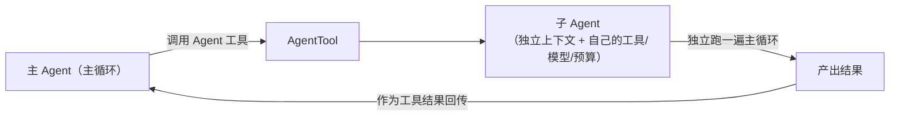
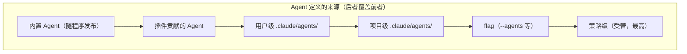
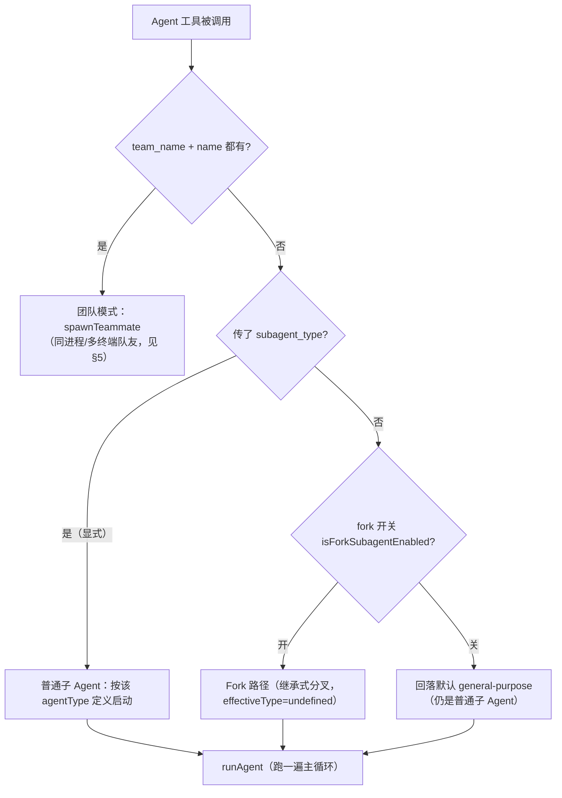
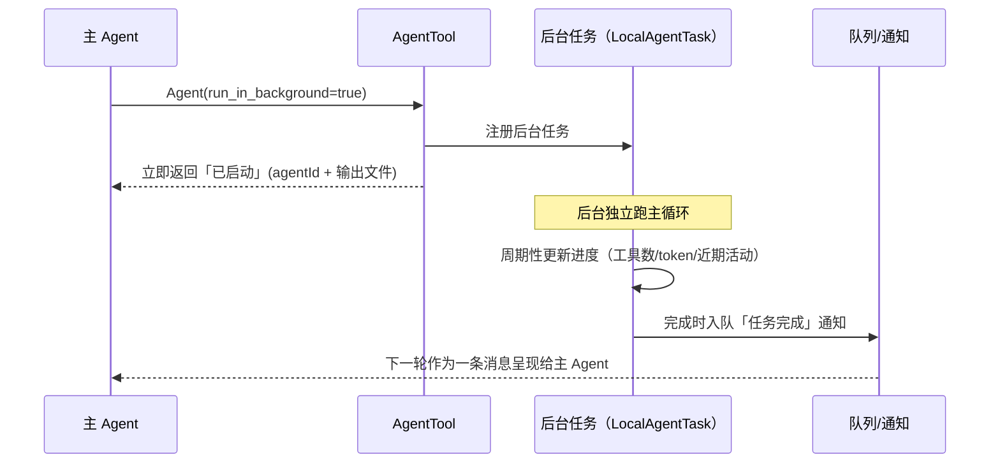
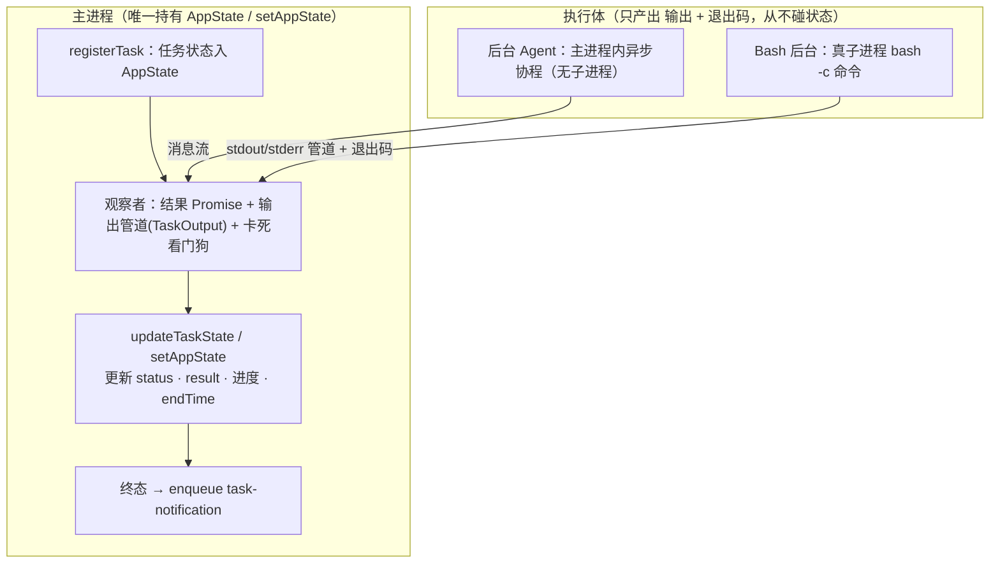
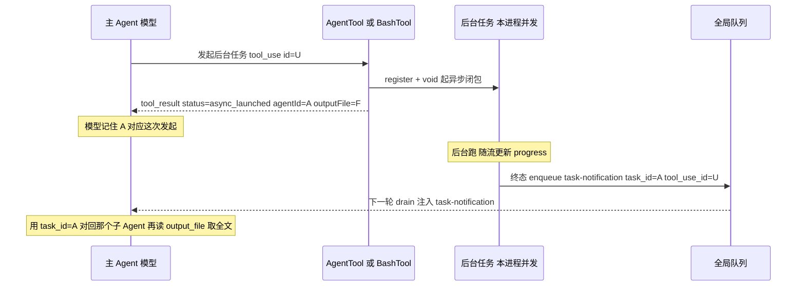
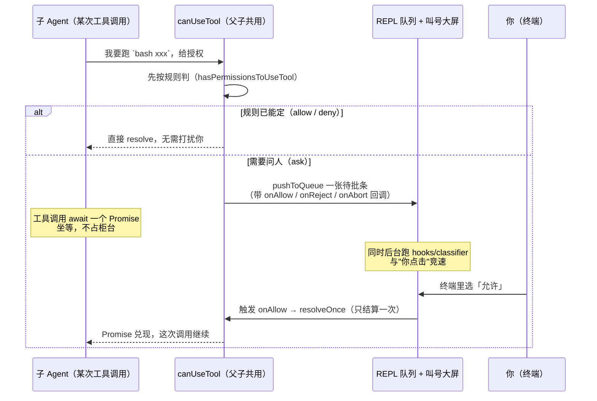
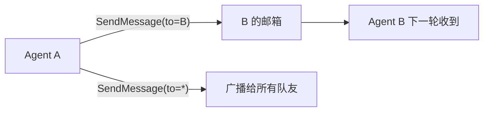
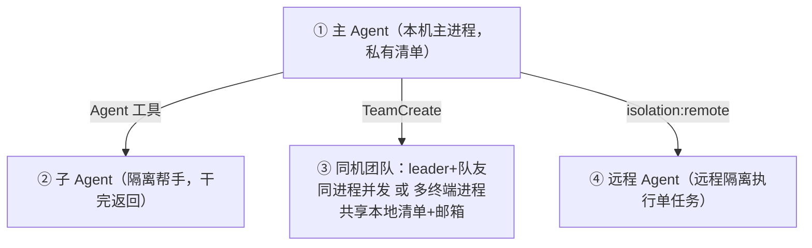
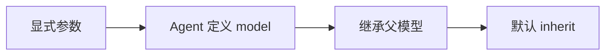

# Agent 系统（Sub-Agents）

> 讲清 Claude Code 的"Agent"是什么、内置与自定义 Agent 从哪来、**子 Agent 如何被编排（Fork / 普通 / 团队）**、后台任务如何调度与回传、以及 Agent 之间如何通信与记忆。
>
> **原则：源码为准。** 机制均从 `claude-code-cli` 求证；无法确证者标注「推断」。文末附涉及模块。

---

## 1. Agent 是什么：一次"带隔离上下文的主循环"

一个 Agent 本质上就是**再跑一遍主循环**（见[《全景与主循环》](./00-overview.md)），只是带着**自己的一套**：系统提示、工具子集、模型、Token/轮次预算、权限模式、以及**独立的上下文窗口**。

模型通过 **`Agent` 工具**发起子 Agent——所以在模型视角里，"启动一个子 Agent"和"调用一个工具"是同一种动作（`Agent` 工具是"工具即子流程入口"的典型）。



**为什么要子 Agent**：把大任务拆给"隔离上下文"去做——探索、规划、批量处理等既**不污染主对话上下文**，又能**并行/后台**推进。

---

## 2. Agent 的三种来源



**① 内置 Agent**（`tools/AgentTool/builtInAgents.ts` 及 `built-in/`）——典型有：
- **general-purpose**：通用，可用全部工具；
- **Explore**：只读探索，常用更快的小模型；**结构性只读**——`disallowedTools` 砍掉 Edit/Write/Notebook（prompt 亦明写 *no Write / no Edit*），写工具**根本不在它的 schema 里**；
- **Plan**：架构/实现规划（与"进入计划模式"这个**工具/权限模式**同名但不同物，见工具篇/[《08》](./08-context-assembly.md)§4.1 澄清）。**同样结构性只读**：`disallowedTools` 含 `FILE_EDIT`/`FILE_WRITE`/`NOTEBOOK_EDIT`（还禁 `Agent`/`ExitPlanMode`），复用 Explore 的只读工具集。**这才是"真不能编辑"的那种**——区别于 plan **权限模式**（主 Agent）的软只读；
- **claude-code-guide / verification / statusline-setup** 等专用 Agent。

每个内置 Agent 声明自己的 `agentType`、工具集、模型（多为 `inherit` 继承父模型）、以及动态生成系统提示的方法。

**`subagent_type` 与 `agentType`（同一东西的两面）**：`Agent` 工具的 `subagent_type` 参数（`z.string().optional()`）用来**选哪个 agent 定义**，匹配逻辑是 `activeAgents.find(a => a.agentType === subagent_type)`。即**你传的 `subagent_type` 值 = 某定义的 `agentType`**。内置的确切取值（注意大小写）：

| `agentType`（可传给 `subagent_type`）| 定义 | 只读? |
|---|---|---|
| `general-purpose` | 通用，全工具 | 否 |
| `Explore` | 只读探索（首字母大写）| **是**（`disallowedTools` 砍写工具）|
| `Plan` | 只读规划（首字母大写）| **是**（同上）|
| `claude-code-guide` | 答 Claude Code 用法 | — |
| `verification` | 校验 | — |
| `statusline-setup` | 配状态栏 | — |

- **`Explore`/`Plan` 受开关控制**：`areExplorePlanAgentsEnabled()` 关闭时不在可选列表。
- **省略 `subagent_type` 时的默认**（`AgentTool.call()`，`effectiveType = subagent_type ?? (isForkSubagentEnabled() ? undefined : 'general-purpose')`）：**显式传了 → 用它**；**没传 + fork 开关 `isForkSubagentEnabled()` 开 → 走 fork 路径**（继承式分叉，见 §3）；**没传 + 开关关 → 回落 `general-purpose`**。（注意 fork 开关是 `isForkSubagentEnabled`，与控制 `Explore`/`Plan` 是否可选的 `areExplorePlanAgentsEnabled` 是**两个不同开关**。）
- **`fork` 不是一个可传的 `subagent_type` 值**——它是"省略 subagent_type"时的默认行为，并非注册表里的正常定义（所以上表没有它）。
- **自定义 Agent 的 `agentType` = 其 frontmatter 的 `name`**，一样可作为 `subagent_type` 传入。

**② 自定义 Agent**（`.claude/agents/*.md`，`loadAgentsDir.ts` 解析）——Markdown 文件：**frontmatter 定义元数据 + 正文即系统提示**。frontmatter 支持的字段（源码可见）包括：`name` / `description` / `model`（含 `inherit`）/ `tools` / `disallowedTools` / `effort` / `permissionMode` / `maxTurns` / `memory` / `mcpServers` / `hooks` / `skills` / `isolation` / `background` / `color` / `initialPrompt` 等。

**③ 加载优先级与覆盖**（`getActiveAgentsFromList`）：把各来源按 **`内置 → 插件 → 用户 → 项目 → flag → 策略`** 顺序，逐个 `agentMap.set(agent.agentType, def)` 塞进一个 **`Map<agentType, 定义>`**——**同一个 `agentType` 后者直接覆盖前者**。所以最终每个 `agentType` 只留**优先级最高的那一份**，策略级（企业受管）在最后、优先级最高。

> **"自定义一个 Plan 会覆盖内置吗？"——会，前提是 `agentType` 完全相同**。自定义 agent 的 `agentType` = 其 frontmatter 的 `name`；只要你在用户级/项目级放一个 **`name: Plan`**（**大小写要一致**，内置是首字母大写 `Plan`）的 agent，它就和内置 Plan 共用 map key `Plan` → 因用户/项目组在内置组**之后**遍历 → **覆盖内置 Plan**（你的定义整份取代它，包括工具集/提示/模型）。若命名不同（如 `my-plan`），则**两者并存**、互不影响。同理，企业策略级可强制覆盖任何同名 agent。

---

## 3. 子 Agent 编排：三条路径

`Agent` 工具执行时（`tools/AgentTool/AgentTool.tsx`）先**路由**到三种模式之一：



> 路由**先判团队**（`teamName && name` → spawnTeammate），否则按 `effectiveType = subagent_type ?? (isForkSubagentEnabled() ? undefined : 'general-purpose')` 解析：**显式 subagent_type 最优先**；省略且 **fork 开关开** → `undefined` → Fork 路径；省略且**开关关** → 回落 `general-purpose`（走普通路径）。

**普通子 Agent**：按 `subagent_type` 选中一个 Agent 定义，用它**自己的**系统提示、工具集、模型启动一个全新上下文的主循环。

**Fork（继承式分叉）**（`forkSubagent.ts`）：不另起炉灶，而是**克隆父 Agent 当前上下文**再分叉——把父 assistant 消息（含其所有工具调用）连同占位的工具结果一起复制，追加各分叉专属的指令，形成分叉的起点。Fork 的意义是"**带着现场记忆**去并行做几件相关的事"，比从零起的子 Agent 更省重复交代。

**隔离级别**（可选）：普通/Fork 都可叠加 `isolation`——
- `worktree`：在**独立 git worktree** 里跑，避免并行改文件互相踩。**每个 agent 各一个**：slug = `agent-<agentId 前 8 位>`（`AgentTool.tsx`），据此得到**独立工作目录** `.claude/worktrees/agent-<id8>` + **独立分支** `worktree-agent-<id8>`，但**共享底层同一个 `.git` 对象库**。所以 N 个后台 fork = N 个目录 + N 条分支**并行提交、互不冲突**，跑完再把各分支 merge/cherry-pick 回主分支（同一 objects 库、归并几乎零成本）。「为什么能共享又隔离」的 git 内部模型见**附录 B**。与 `cwd` 参数**互斥**；未改动则自动清理（`hasWorktreeChanges`/`removeAgentWorktree`）。
- `remote`：**远程环境**执行（`teleportToRemote`，返回"已远程启动"）。

**Resume（恢复）**（`resumeAgent.ts`）：后台 Agent 可从磁盘 transcript **续跑**——读回历史、清理未完成的工具调用、恢复内容替换状态与 worktree 路径，再选中原定义继续。

---

## 4. 后台任务：调度与回传

子 Agent 可**同步**（主 Agent 等它跑完拿结果）或**异步后台**运行：



- **何时后台化**：显式 `run_in_background`、或 Agent 定义声明 `background`、或协调者场景等（且未被环境禁用）触发 `shouldRunAsync`，立即返回"已启动"，不阻塞主对话。
- **进度可见**：后台任务持续更新进度（工具调用数、token、近期活动），对应你在 UI 看到的任务面板。
- **完成回传**：任务结束把结果**入队为一条通知消息**，在主 Agent 的**下一轮**作为输入出现——这是后台结果回到主线程的路径（属状态型/队列机制，见[《上下文装配》](./08-context-assembly.md)篇）。

**任务类型**（`tasks/`）——这是**真实的代码类型**（`tasks/types.ts` 的可辨识联合 `TaskState`，每型带 `type` 辨识字段，如 `'local_agent'`/`'remote_agent'`/`'in_process_teammate'`），**不是**这里的抽象说法。要点：**任务类型不是你设的某个参数，而是由启动路径派生**——`AgentTool` 按 `isolation` / 是否 team / 是否后台 / 用哪个工具**路由**到对应类型。你设的是 `isolation`、team、`run_in_background` 等**输入**，任务类型是**结果**。

| 类型 | `type` | 隔离 | 何时落到它（派生条件）|
|------|--------|------|------------------------|
| `LocalAgentTask` | `local_agent` | 本地文件快照 + 消息队列 | 本地后台子 Agent |
| `InProcessTeammateTask` | `in_process_teammate` | 同进程 + 邮箱 + 上下文隔离 | 团队队友（TeamCreate/spawnTeammate）|
| `RemoteAgentTask` | `remote_agent` | 远程完全隔离 | `isolation:'remote'` |
| `LocalMainSessionTask` | 复用 `LocalAgentTaskState`（`agentType:'main-session'`，id 用 `s` 前缀）| **把正在跑的主 query 转后台**——按 `Ctrl+B` 两次触发，非"主会话恒为 task" |
| `LocalShellTask` | `local_bash`（为兼容旧持久化保留此名，非 `local_shell`）| 子进程 | Bash 后台命令 |
| `LocalWorkflowTask` | `local_workflow` | 本地编排 | 工作流（Workflow）|
| `MonitorMcpTask` / `DreamTask` | … | … | MCP 监控 / 其它专用 |

> 即：`tasks/` 下真有这些目录与类型；一个 agent「是哪种 task」由**怎么启动**决定，不是一个可直接指定的 `taskType` 字段。

### 4.1 后台任务的完整机制（通用框架，不止 agent）

`tasks/` 是一套**通用后台任务底座**：统一 `Task` 接口 + `TaskStateBase` + 队列/通知/面板/kill。**后台子 Agent（`LocalAgentTask`）与 Bash 后台命令（`LocalShellTask`）走的是同一套**——连回传格式都一样。逐环节讲清：

**① 谁启动——AgentTool/工具自己 fire-and-forget，同进程并发**（**不是**另有调度器/守护进程）：
- 后台子 Agent：`AgentTool.call()` 里 `shouldRunAsync` 为真时，先 `registerAsyncAgent(...)` 登记，再 `void runAsyncAgentLifecycle({ makeStream: runAgent(...) })` 用 **`void` 起一个游离异步闭包当场跑**，和主循环**在同一 Node 进程/事件循环里并发**（不是子进程），随后**立即返回 `status:'async_launched'`**（agentId + 输出文件）。
- Bash 后台：同理由 BashTool 起一个 `LocalShellTask`（真子进程执行命令，但**调度仍在本进程**）。
- 后台任务用**自己的 `abortController`**（不挂主线程 ESC，靠显式 kill）。

**①-b 执行体 vs 状态归属——为什么 Bash 是子进程、状态却还在主进程更新**：这是最容易困惑的一点。要分开"**谁在执行**"和"**状态存在哪/谁改它**"：



- **状态永远在主进程**：`registerTask`/`updateTaskState` 都走主进程的 `setAppState`；**执行体（子进程或协程）从不直接改 AppState**。
- **主进程是执行体的"观察者+建模者"**：
  - 后台 Agent —— 执行体就是**主进程内的异步协程**（连子进程都没有），主进程消费其**消息流**更新状态；
  - Bash 后台 —— 执行体是**真子进程**，主进程通过 ① `shellCommand.result`（一个**在主进程里的 Promise**，子进程退出即 resolve）②`TaskOutput`（**管道**收 stdout/stderr、写 `outputFile`、记行数）③ `startStallWatchdog`（**看门狗**）三样"隔着管道观察"它，再把观察到的输出/退出**翻译成主进程 AppState 里的状态更新**。
- **类比**：就像父进程用**管道 + `waitpid`** 管子进程——**状态是"父进程对子进程的模型"，不是子进程自己维护的东西**。所以"命令在另一个进程"和"状态还能在主进程调整"毫不矛盾。

**② 进度自动更新——随流被动累计，不需主动上报**：`runAsyncAgentLifecycle` 消费后台 agent 自己的消息流，每条消息 `updateProgressFromMessage(tracker, msg)` → `updateAgentProgress(taskId, …)` 写回 state。你在面板看到的"工具数/token/近期活动"即来源于此。

**③ 状态含什么——因任务型而异，别把 agent 的当成通用**：

- **通用底座 `TaskStateBase`（所有 task 都有）**：`id`、`type`、`status`（`running`/`completed`/`failed`/`killed`）、`description`、`toolUseId?`、`startTime`/`endTime?`、`outputFile`、`outputOffset`、`notified`。
- **后台 Agent（`LocalAgentTaskState`）额外有**：`progress`（`toolUseCount`/`tokenCount`/`lastActivity`/`recentActivities` 最近 5 条/`summary`）、`result: AgentToolResult`（含最终文本）/`error`/`messages`、`abortController`、`agentType`/`selectedAgent`/`prompt`、UI 用的 `isBackgrounded`/`retain`/`diskLoaded`/`evictAfter`/`pendingMessages`。
- **Bash 后台（`LocalShellTaskState`）则精简得多**（**不是"没状态"，是另一套**）：`command`、`result?: { code, interrupted }`（**仅退出码 + 是否被打断**，无 agent 文本）、`shellCommand`（子进程句柄）、`lastReportedTotalLines`（delta 按**输出行数**算，不是工具数）、`kind`（bash/monitor）、`agentId?`（谁派生的，用于孤儿清理）、`isBackgrounded`。**没有** `progress`（工具/token 计数）、`messages`、`abortController`。

> 核心差别：**Agent 记的是"跑了几个工具/烧了多少 token/最近在干嘛"（agent 式进度）；Bash 只记"输出了多少行 + 退出码"。** 全量输出两者都落在 `outputFile`。

**④ 完成回传——XML `<task-notification>`，经全局队列一次性注入**（agent 与 Bash **同机制**）：

整条链路（含**结果如何对回发起它的子 Agent**）：



**结果怎么对回是哪个子 Agent 发起的？——靠 ID，不靠顺序**：
- spawn 那一刻，工具结果就把 **`agentId`（记为 A）** 交给模型（还有 `outputFile`）；
- 完成通知里 **`<task_id>` 就等于 A**（`taskId === agentId`），`<output_file>` 是同一路径，`<tool_use_id>` 则回指**最初那次 `Agent` 工具调用块的 id（U）**，`<summary>` 还回显 `description`；
- 所以模型**用 `<task_id>`（=A）与自己发起时记下的 `agentId` 精确匹配**，即使同时并发了多个子 Agent、通知乱序到达也不会认错。要全文就按 `<output_file>` 去读。

两种 XML 的**原文格式**（`enqueueAgentNotification` / `enqueueShellNotification` 拼出）：

后台 **Agent**（`LocalAgentTask`，字段最全）：

```xml
<task-notification>
<task_id>{agentId}</task_id>
<tool_use_id>{最初 Agent 调用的 tool_use id}</tool_use_id>   <!-- 有 toolUseId 时才有此行 -->
<output_file>{结果全文落盘路径}</output_file>
<status>completed | failed | killed</status>
<summary>Agent "{description}" completed</summary>
<result>{agent 最终文本 finalMessage}</result>                <!-- 有结果时 -->
<usage><total_tokens>…</total_tokens><tool_uses>…</tool_uses><duration_ms>…</duration_ms></usage>
<worktree><worktree_path>…</worktree_path><worktree_branch>…</worktree_branch></worktree>   <!-- worktree 隔离时 -->
</task-notification>
```

**Bash 后台**（`LocalShellTask`，只有骨架，输出全在 `output_file`）：

```xml
<task-notification>
<task_id>{taskId}</task_id>
<tool_use_id>{最初 Bash 调用的 tool_use id}</tool_use_id>   <!-- 有 toolUseId 时才有此行 -->
<output_file>{stdout/stderr 落盘路径}</output_file>
<status>completed | failed | killed</status>
<summary>background command "{description}" completed (exit code 0)</summary>
</task-notification>
```

骨架相同、**字段有别**：

| 字段 | 后台 Agent (`LocalAgentTask`) | Bash 后台 (`LocalShellTask`) |
|------|------------------------------|------------------------------|
| `<task_id>` / `<tool_use_id>` / `<output_file>` / `<status>` / `<summary>` | ✅ | ✅ |
| `<result>`（agent 最终文本 finalMessage）| ✅ | ❌（输出全在 `<output_file>`）|
| `<usage>`（total_tokens/tool_uses/duration_ms）| ✅ | ❌ |
| `<worktree>`（若 worktree 隔离）| ✅ | ❌ |
| `<summary>` 内容 | `Agent "xxx" completed` | `background command "xxx" completed (exit code 0)` |

- **不是 tool_result**：原始 spawn 的那次工具调用早已返回（`async_launched` / "已在后台运行"）；完成是**事后、异步、经队列**送达的**新消息**。
- **状态由退出码定**（Bash）：`code===0 → completed`，否则 `failed`；被杀为 `killed`。
- **幂等 + 去冗余**：`notified` 标志防重复；若前台工具结果**已带全量输出**（命令跑得快、没真进后台），`markTaskNotified` 会**抑制这条通知**（避免重复）。

**⑤ 通用性**：Bash 后台命令（`LocalShellTask`）、工作流（`LocalWorkflowTask`）、MCP 监控（`MonitorMcpTask`）都共用这套"注册→自更新→终态→（多数）入队通知→面板→可 kill"。**连"把正在跑的主 query 转后台"（`LocalMainSessionTask`，`Ctrl+B` 两次）也复用它**——注意这不是"主会话恒为 task"，平时主会话就是主循环本身，只有被后台化的那个 query 才成为 task。**所以它是"任何需要后台并发、可观测、可中止的活儿"的底座，agent 只是最主要的使用者。**

---

### 4.2 子 Agent 要不要问人授权：同步/异步分档 + 「队列叫号」式解耦

§4 说了子 Agent 可同步、可异步。那**它们干活时要用危险工具（改文件、跑命令），该找谁授权？会不会把主对话卡住？** 这节讲清——先给三句话结论：

1. **派生子 Agent 这个动作本身不问人**；真正的关卡在**子 Agent 内部的每一次工具调用**上。
2. 问人**不是"回到主 Agent 那里干等"**，而是往一个**全局队列**塞一张"待批条"——谁塞的无所谓；**你在终端一选，那张条对应的那次调用就当场继续**。UI 显示和 agent 循环彻底解耦。
3. **能不能弹窗问你，取决于它是同步还是异步**：同步子 Agent 能问，异步后台 Agent 默认不问（自动拒，除非 hook 放行或显式开 `bubble`）。

#### ① 门开在哪：派生是"自动放行"，内部工具才是关卡

`Agent` 工具自己几乎不拦：`isReadOnly()` 直接返回 `true`，源码注释写得很直白——*"delegates permission checks to its underlying tools"*（把权限检查**委托给它内部调用的工具**，`AgentTool.tsx:1264-1265`）；`checkPermissions` 除 `auto` 模式会走分类器 `passthrough` 外，一律返回 `allow`（`AgentTool.tsx:1281-1297`）。所以"起一个子 Agent"本身基本不需要你点头，**危险操作的授权发生在子 Agent 跑起来之后、它每次要用 Bash/Edit 等工具的那一刻**。

#### ② 一个通俗类比：银行的"取号排队"

把整套授权想成银行大厅：

- 任何 agent（主的、子的）想办一笔**危险业务**（跑 bash、写文件）= 一位顾客要办业务；
- `canUseTool` = **取号机**；全场所有 agent 共用**同一台取号机、同一块叫号大屏**（就是 REPL 里那个 `toolUseConfirmQueue` 队列）；
- 顾客取号后**坐下等叫号**（这次工具调用 `await` 一个 Promise），**不占柜台、不霸大厅**——别的并发只读工具照样办；
- **你（人）= 唯一的柜员**，盯着大屏一号一号处理；你在终端点"允许/拒绝"，就等于"办完这一号"，对应那位顾客（那次工具调用）**当场被叫醒、继续往下走**；
- 号和顾客是用**回调**绑定的，所以柜员根本不用管"这号是主 Agent 取的还是某个子 Agent 取的"——**办完直接叫醒本人**。

#### ③ 机制：父子共用同一个 `canUseTool` + 队列 + Promise



对着源码逐环节坐实：

- **只有一个取号机，且父子共用**：主线程建了**唯一**的 `canUseTool` 闭包，绑定到 REPL 的队列 `setToolUseConfirmQueue`（`screens/REPL.tsx:2382`；队列 state `toolUseConfirmQueue` 在 `REPL.tsx:1101`）。子 Agent **不另造**：`AgentTool.call*(…, canUseTool, …)`（`AgentTool.tsx:250`）接收父层传入的这个闭包，原样丢给 `runAgent(… canUseTool …)`（`AgentTool.tsx:607`）→ **父子共用同一个队列、同一个终端 UI**。
- **取号后坐等 = await 一个 Promise**：`useCanUseTool` 里整个决策就是 `new Promise(resolve => …)`（`hooks/useCanUseTool.tsx:32`）。先 `hasPermissionsToUseTool` 按规则判（`:37`）——`allow` 就直接 `resolve` 放行、`deny` 直接回绝；只有落到 **`ask`** 才进入 `handleInteractivePermission`（`:160`）去"排队问人"。
- **排队问人 = 塞队列 + 竞速 + 只结算一次**：`handleInteractivePermission` 把一张 `ToolUseConfirm`（带 `onAllow/onReject/onAbort` 等回调）**推入队列**（`ctx.pushToQueue`），**同时**在后台跑 hooks/分类器，让它们和"你的点击"**竞速**；用 `createResolveOnce` 保证无论谁先出结果，那个被 park 的 Promise **只兑现一次**（`hooks/toolPermission/handlers/interactiveHandler.ts:70,92,154-202`；`PermissionContext.ts:75-83`）。
- **所以主循环没在"自旋等你"**：它只是有**一次工具调用**停在 Promise 上；同一批里的并发安全（只读）兄弟工具照跑，并发上限默认 10（`CLAUDE_CODE_MAX_TOOL_USE_CONCURRENCY`，`services/tools/toolOrchestration.ts:10`）。这正是你体感上"授权没卡住整个主 Agent"的原因。

#### ④ 同步 / 异步 / bubble 三档（决定"能不能弹窗问你"）

关键开关是 `canShowPermissionPrompts`，**默认 `!isAsync`**（同步能问、异步不能问；`runAgent.ts:276, 439-445`）：

| 子 Agent 类型 | 能弹窗问你? | 遇到 `ask`（规则/hook/分类器都定不了）时 |
|---|---|---|
| **同步子 Agent**（默认）| ✅ 能 | 冒泡到父终端的共享队列，正常弹窗等你选（`runAgent.ts:439-445`）|
| **异步/后台 Agent**（`run_in_background` / 定义 `background`）| ❌ 不能 → 置 `shouldAvoidPermissionPrompts=true`（`runAgent.ts:446-451`）| 先给 PermissionRequest hooks 一次决策机会；**hook 不决则自动 deny**（`permissions.ts:932-951`，理由标 `asyncAgent`，因为它没有 UI 可弹）|
| **`bubble` 模式 / 显式开 `canShowPermissionPrompts`** | ✅ 能 | 也弹窗，但额外置 `awaitAutomatedChecksBeforeDialog=true`（`runAgent.ts:443-444, 458-462`）——**只有自动检查都决不了才打扰你**，尽量少中断后台活儿 |

一句话记：**同步子 Agent"随时能敲你的门"；异步后台 Agent"默认自己扛（自动拒），除非 hook 替它放行或显式让它 bubble"。**

#### ⑤ 回到最初的三个疑问（逐条对账）

- **"human 会出现在任何派生子 Agent 返回时吗？"** → 更准确的说法是**"执行途中"而非"返回时"**：只要某个**有资格弹窗**的 agent（同步子 Agent / bubble / 主 Agent）在**某次工具调用**上撞到规则+hook+分类器都无法自动裁决的 `ask`，就会在共享队列里冒出来问你——**可能发生在子 Agent 跑到一半时**。异步后台 Agent 则不打扰你（自动拒或交给 hook）。
- **"应该不是在主 Agent 那里阻塞等人授权"** → **对**。授权是 Promise + 队列，主循环不自旋；并发安全的兄弟工具照跑。
- **"授权在终端选完传回去就行，不必过主 Agent，显示跟循环分开的"** → **对**。子 Agent 用的就是那个共用 `canUseTool`；终端选择触发 `onAllow/onReject` → `resolveOnce` **直接唤醒那次调用**，不绕经主 Agent 的对话逻辑；渲染（React 队列）与 agent 循环（await）解耦。
- **plan 模式为何看到 Explore、Plan agent"依次"跑** → 那是**模型自己排的序**（Plan 需要用 Explore 的探索结果），**不是系统只能串行**。系统本身支持并行（`AgentTool.isConcurrencySafe()=true`，`AgentTool.tsx:1273`；见 §1、§3）——同一轮吐出多个子 Agent 调用会真并发。

> 一句话收束：**授权像"共用一台取号机 + 一块叫号大屏"——任何 agent 要办危险业务就取号坐等（await Promise），你在终端叫号（选允许/拒绝）就唤醒对应那位；能不能敲你的门由"同步/异步"决定。所以既有多 Agent 并行，人的介入又不会把主循环钉死。**

---

## 5. Agent 间通信与记忆

**通信（SendMessage）**（`tools/SendMessageTool/`）：一个 Agent 可向另一个 Agent/队友发消息——目标可以是**具名队友**、**广播**、或跨会话通道。消息写入对方**邮箱**，在其下一轮作为输入注入。除普通文本外还支持**结构化消息**（如关机请求/响应、计划审批响应），用于团队编排里的控制流。



**记忆/摘要（AgentSummary）**（`services/AgentSummary/`）：对长时间运行的 Agent，系统**周期性**（约 30s）后台生成一段**摘要**——用一个"禁用工具"的分叉 Agent（`canUseTool` 恒 deny，以共享 prompt 缓存）跑一遍，抽取文本作为该任务的摘要，更新到任务状态，供 UI 与协调展示。

### 5.1 "多 Agent"到底指哪几种：四种形态

"Agent""多 Agent"被反复用到，容易混。梳理成四种形态——**默认就是单主 Agent，其余都要显式触发**：

| 形态 | 是什么 | 在哪运行 | 任务清单 |
|------|--------|----------|----------|
| **① 主 Agent** | 你对话的这一个（默认） | 本机主进程 | 私有，按 **Session ID** |
| **② 子 Agent** | `Agent` 工具派生的隔离帮手（Explore/Plan/自定义），干完返回 | 本机（可选 worktree 隔离） | 一般不碰主清单 |
| **③ 同机团队/队友** | `TeamCreate` + 协调者：leader + 多 teammate，各是独立 Claude 模型实例 | **同一台机器**：**同进程并发**（`InProcessTeammateTask`）或**多终端进程**（tmux/iTerm2） | **共享**，按**队伍名**（`owner`/`blockedBy` 才生效） |
| **④ 远程 Agent** | `isolation:'remote'`：把**单个** agent 送到远程云环境执行 | 远程环境 | 隔离，不共享清单 |

**关键澄清（回应"每台 Mac 各跑一个"的误解）**：

- **③ 团队是"单机内的多 Agent"，不是分布式集群**——任务清单在**本地磁盘** `~/.claude/tasks/<队伍名>/`、通信走**本地邮箱**（`utils/teammateMailbox.ts`），要共享就必须**同一文件系统 → 同一台机器**。`getTaskListId` 让 in-process 与 tmux/iTerm2 队友都 resolve 到同一份清单。
- **④ 远程 Agent ≠ 团队**：它是"把一个子任务送去远程隔离执行"，**不是**"多台机器组队共享清单"。
- **`owner`/`blockedBy` 只在 ③ 团队里才有意义**（多个 Agent 共享一份清单、认领与依赖排序）；① 单机主 Agent 下清单就是私有便签（见[《上下文装配》](./08-context-assembly.md)§4.1 ③）。
- **默认体验 = ①**；② 按需派生；③④ 属**较高级/可能受开关控制**（如 `COORDINATOR_MODE`）的能力，非开箱默认。



---

## 6. 工具集、模型与预算的解析

**工具集**（`agentToolUtils.ts`）：Agent 定义里的 `tools` / `disallowedTools` 被解析为实际工具池——支持通配 `*`；从 `Agent(worker,researcher)` 这种写法还能提取**允许启动的子 Agent 类型**（`allowedAgentTypes`）。此外有硬性过滤：MCP 工具总允许、计划模式放行退出计划的工具、异步后台 Agent 只允许一个**受限工具子集**（`ASYNC_AGENT_ALLOWED_TOOLS`）、插件/自定义 Agent 另有禁用名单。

**模型选择**（`utils/model/agent.ts`）：按优先级解析——**显式参数 → Agent 定义的 `model` → 继承父模型 → 默认 `inherit`**。`inherit` 意味着沿用父 Agent 的模型（保上下文长度一致）。`effort` 档位则换算为思考预算。



---

## 7. 关键设计取舍

| 取舍 | 做法 | 为什么 |
|------|------|--------|
| Agent = 隔离上下文的主循环 | 复用 `query()`，换一套提示/工具/模型 | 不重复造循环，隔离不污染主上下文 |
| 工具即子流程入口 | 用 `Agent` 工具发起 | 模型视角下"起子 Agent"与"用工具"统一 |
| 三条路径 | 普通 / Fork / 团队 | 分别覆盖"从零专责""带现场分叉""多方协作" |
| 定义多来源可覆盖 | 内置→插件→用户→项目→策略 | 兼顾开箱即用与企业受管定制 |
| 后台异步 + 通知回传 | 立即返回、完成入队通知 | 长任务不阻塞主对话 |
| 隔离级别可叠加 | worktree / remote | 并行改文件不冲突、可远程执行 |
| 摘要用禁工具分叉 | 只读、共享缓存 | 低成本维持长任务可观测性 |

---

## 附录 A · 涉及模块

- Agent 工具与路由：`tools/AgentTool/AgentTool.tsx`
- 内置 Agent：`tools/AgentTool/builtInAgents.ts`、`built-in/`
- 自定义 Agent 加载/解析：`tools/AgentTool/loadAgentsDir.ts`
- Fork / Resume：`tools/AgentTool/forkSubagent.ts`、`resumeAgent.ts`
- 工具集解析：`tools/AgentTool/agentToolUtils.ts`；模型：`utils/model/agent.ts`
- 后台任务：`tasks/`（真实类型联合 `tasks/types.ts` 的 `TaskState`：LocalAgentTask/RemoteAgentTask/InProcessTeammateTask/LocalMainSessionTask/LocalShellTask/LocalWorkflowTask/MonitorMcpTask/DreamTask）；通用底座 `Task.ts`（`TaskStateBase`/`createTaskStateBase`）
- 后台任务的启动/进度/回传：`tasks/LocalAgentTask/LocalAgentTask.tsx`（`registerAsyncAgent`/`runAsyncAgentLifecycle`/`updateProgressFromMessage`/`enqueueAgentNotification`）、`tasks/LocalShellTask/LocalShellTask.tsx`（`enqueueShellNotification`/`markTaskNotified`）；队列 `utils/messageQueueManager.ts`（`enqueuePendingNotification`，`mode:'task-notification'`）；XML 标签 `constants/xml.ts`（`TASK_NOTIFICATION_TAG`/`OUTPUT_FILE_TAG`/`STATUS_TAG`/`SUMMARY_TAG`…）；主循环 drain `query.ts`
- 通信 / 记忆：`tools/SendMessageTool/`、`services/AgentSummary/`
- 子 Agent 授权链路（§4.2）：`hooks/useCanUseTool.tsx`（唯一 `canUseTool`，绑定队列）、`screens/REPL.tsx`（`useCanUseTool(...)` 调用点 `:2382`、队列 state `toolUseConfirmQueue` `:1101`）、`AgentTool.tsx`（`call*` 收 `canUseTool` `:250`、传入 `runAgent` `:607`、`isReadOnly/checkPermissions` `:1264-1297`）、`tools/AgentTool/runAgent.ts`（`canShowPermissionPrompts` 默认 `!isAsync`、`shouldAvoidPermissionPrompts`/`awaitAutomatedChecksBeforeDialog` `:276,439-462`）、`utils/permissions/permissions.ts`（异步 agent `ask` → hooks 否则自动 deny `:932-951`）、`hooks/toolPermission/handlers/interactiveHandler.ts`（`pushToQueue` + 回调 + 竞速）、`hooks/toolPermission/PermissionContext.ts`（`createResolveOnce`/队列 ops）、并发上限 `services/tools/toolOrchestration.ts`（`getMaxToolUseConcurrency` `:10`、`runToolsConcurrently` `:152-176`）
- 团队/队友：`tools/TeamCreateTool/`、`utils/teammateMailbox.ts`、共享任务清单 `utils/tasks.ts`（`getTaskListId`，`~/.claude/tasks/<队伍名>/`）、协调者模式 `coordinator/`（`COORDINATOR_MODE`）
- worktree 隔离：`utils/worktree.ts`（`worktreePathFor`/`worktreeBranchName`/`getOrCreateWorktree`/`createAgentWorktree`）、`tools/AgentTool/AgentTool.tsx`（slug=`agent-<id8>`）、`utils/git.ts`（`resolveCanonicalRoot`：`.git` 文件 → `gitdir:` → `commondir` 链 + 安全校验）

---

## 附录 B · worktree 隔离的内部模型（为什么能共享又隔离）

`isolation:'worktree'` 常被误解成"像 clone 一样另开一个 `.git`"。其实 **git worktree 不复制对象库，只复制"工作区"**：`.git` 从**目录**退化成**一行指针文件**。这解释了为什么 N 个后台 agent 能"共享历史又各改各的"。

**目录布局（N 个 agent 并行时）：**

```text
myrepo/                              ← 主仓库 = 主工作区
├── .git/                           ← 真·目录：唯一一份"仓库大脑"，大家共用
│   ├── objects/                    ←   所有 commit/tree/blob（全部历史，共享）
│   ├── refs/heads/…                ←   所有分支、标签（共享）
│   ├── config
│   └── worktrees/
│       ├── agent-aaaa/             ← agent A 的"私有 git 状态"
│       │   ├── HEAD                ←   A 现在在哪条分支
│       │   ├── index               ←   A 的暂存区
│       │   └── commondir  ─────────→ 指回上面的共享 .git
│       └── agent-bbbb/             ← agent B 的私有状态（HEAD/index…）
│
└── .claude/worktrees/
    ├── agent-aaaa/                 ← agent A 的工作目录（检出的源码文件）
    │   └── .git  ← 是【文件】不是目录！内容：gitdir: /myrepo/.git/worktrees/agent-aaaa
    └── agent-bbbb/                 ← agent B 的工作目录
        └── .git  ← 文件：gitdir: …/agent-bbbb
```

**关键机制——`.git` 从目录变成"转发指针"**：普通仓库 `.git` 是目录；worktree 里 `.git` 是一行文本文件。源码 `resolveCanonicalRoot`（`utils/git.ts`）走的正是这条链：

```text
worktree/.git（文件） → 读出 "gitdir: X"
   → X/commondir → 指回主仓库的共享 .git
```

> 源码原话：*"In a worktree, .git is a file containing: gitdir: &lt;path> … commondir points to the shared .git directory"*。`git.ts` 还要**校验这条链**（worktreeGitDir 必须是 `<commonDir>/worktrees/` 的直接子目录、且其 `gitdir` 指回本 worktree），防止恶意仓库劫持 `commondir` 借信任目录执行钩子。

**谁共享、谁各自一份：**

| | 存哪 | 共享 / 私有 |
|---|---|---|
| **对象库 objects**（全部历史）| 主 `.git/objects` | **共享一份** |
| **分支 / 标签 refs** | 主 `.git/refs` | **共享** |
| **HEAD**（当前在哪条分支）| `.git/worktrees/<name>/HEAD` | **每 worktree 私有** |
| **index**（暂存区）| `.git/worktrees/<name>/index` | **每 worktree 私有** |
| **检出的工作文件** | `.claude/worktrees/<name>/` | **每 worktree 私有** |

**由此三条结论：**

- **为何不像 clone 那样新开 `.git`**：clone 会把 `objects/` **整个复制**成第二份独立对象库（可能数 GB），两库互不知情、要 push/pull 才同步；worktree **一个 object 都不复制**，只多一个 checkout + HEAD/index 几个小文件——**便宜、秒开**。
- **共享 `.git` 又互不踩**：会"打架"的东西（HEAD/index/工作文件）**都每 worktree 私有**，只有"只增不改"的历史（objects）共享。A commit → 新 object 写进**共享库** + A 的分支 ref 前移 → **B 立刻 `git log` 看得到**，无需 push/pull（同一 objects 库）。
- **为何每 agent 必须各一条分支**：git **禁止两个 worktree 同时检出同一分支**（两个私有 HEAD 抢同一共享 ref 会互相破坏）。故每 agent 发 `worktree-agent-<id8>`，N 个并行 commit 各走各分支、零冲突；跑完再 merge/cherry-pick 回主分支，**同一 objects 库、归并几乎零成本**。

> 一句话：**worktree = "多个工作目录 + 多条分支，共用一个对象库"；clone = "复制整个对象库"。** 前者是同一仓库开多个并行工位，后者是另立门户——这就是 fork 多个后台能"共享 `.git` 又各干各的"、且事后归并极快的原因。
