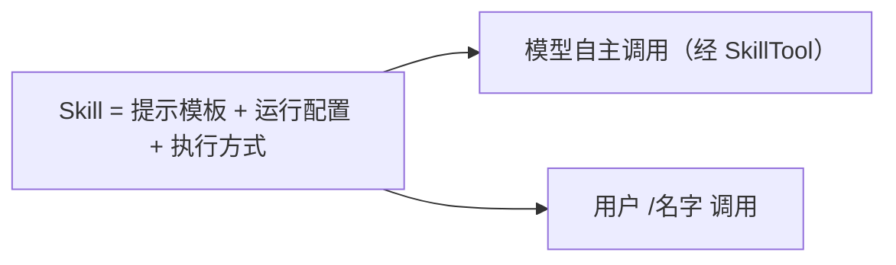
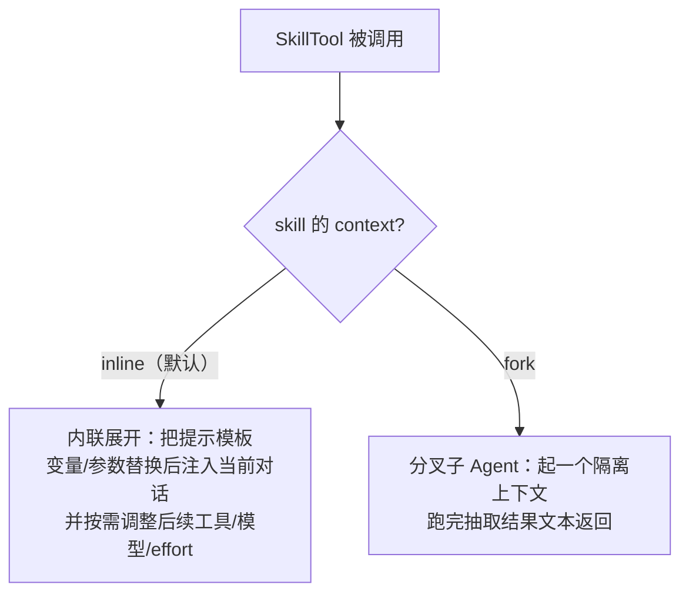
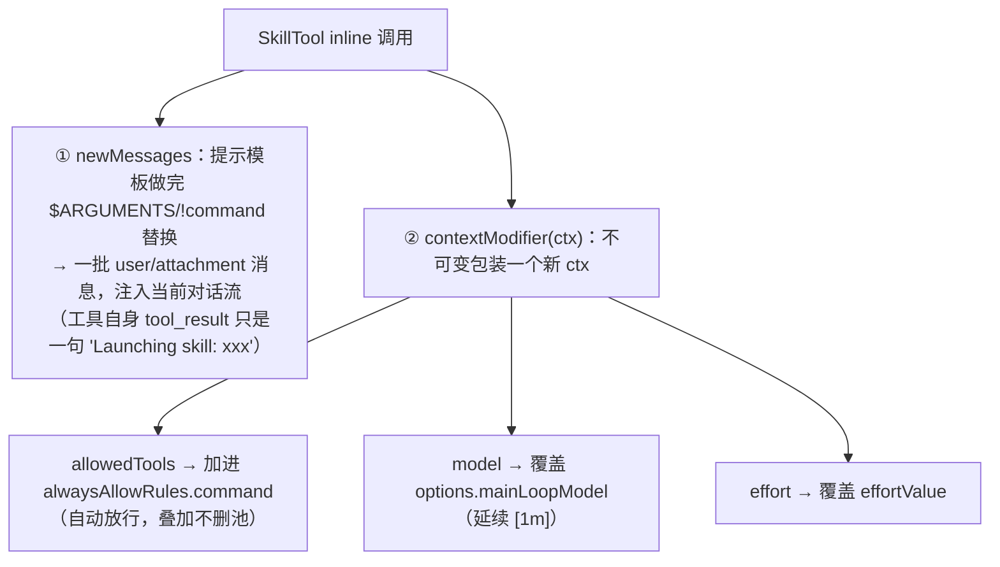
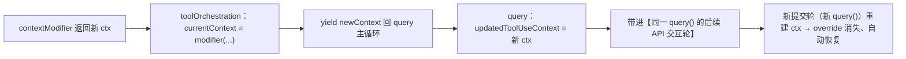
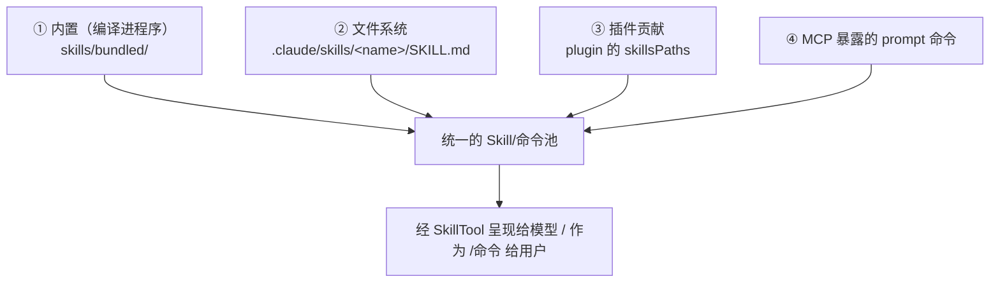
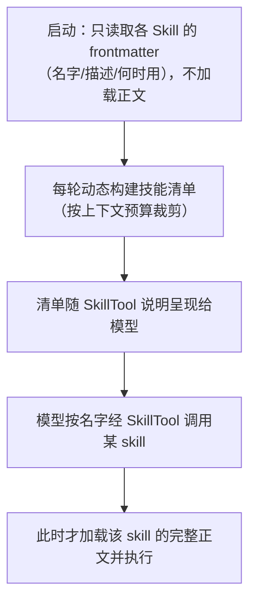
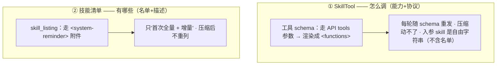

# Skill 系统（Skills）

> 讲清 Skill 的本质、四种来源、**内联 vs 分叉两种执行方式**、如何暴露给模型（发现与延迟加载），以及它与 Agent / Plugin / 命令的关系。
>
> **原则：源码为准。** 机制均从 `claude-code-cli` 求证；无法确证者标注「推断」。文末附涉及模块。

---

## 1. Skill 的本质：一段可复用的"提示流程"

Skill 不是一种新工具，而是一个 **`prompt` 类型的命令**（源码类型 `PromptCommand`）：把"一段专门的做事流程"封装成**提示模板 + 元数据**，可由**模型自主调用**，也可由**用户以 `/名字` 调用**。

关键在于它把三样东西打包：
- **一段提示**（正文模板，支持变量/参数替换）；
- **运行配置**（允许的工具子集、模型、effort、钩子等）；
- **执行方式**（内联展开，或分叉成子 Agent）。



---

## 2. 两种执行方式：内联 vs 分叉

一个 Skill 由其 `context` 字段决定怎么跑（`tools/SkillTool/SkillTool.ts`）：



- **内联（inline）**：把 Skill 的提示**展开进当前对话**（做变量替换、参数替换、必要时权限拦截），并可通过"上下文修改"影响**后续**的允许工具集 / 模型 / effort。适合"给当前 Agent 追加一段指导/流程"。
- **分叉（fork）**：为 Skill **另起一个子 Agent**（隔离上下文），跑完把输出的文本**抽取为结果**返回。适合"独立完成一段有边界的子任务、不污染主上下文"——本质上是[《Agent 系统》](./02-agent.md)里子 Agent 的一种封装用法。

**默认与实际分布**：`inline` 是**默认**（源码 `types/command.ts` 注 *"'inline' (default)"*；`loadSkillsDir` 里 `context === 'fork' ? 'fork' : undefined`，**只有显式写 `context: fork` 才分叉**，否则一律 inline）。**内置 17 个 bundled skill 全是 inline**（debug/verify/remember/simplify/stuck…无一 fork）；fork 是 opt-in 少数派，仅用于"自成一体、中途不需要用户介入"的封闭子任务。

### 2.1 inline 的实现机制：`newMessages` + `contextModifier`（以及"何时恢复"）

inline **不只是"注入消息"**——SkillTool 的 inline 分支返回**两样东西**：



**何时恢复——不持久化，换提交轮自动失效**（这是关键）：



- **作用域 = 本提交轮（`query()`）剩余的 API 交互轮**：override 顺 ctx 链往下传，影响接下来的调模型/工具。
- **边界 = 下一个提交轮**：contextModifier **从不 `setAppState` 写回全局**，只活在这条被线程式传递的 ctx 对象里；新 `query()` 重建 ctx 时 override **自然消失**——**不需要显式"恢复"动作，是"不落地 → 换轮即失效"**。
- **allowedTools 是叠加式**：只往 `alwaysAllowRules` **加放行**、**不删工具池**——inline **不会缩小工具集**，只是给 skill 声明的工具自动放行。
- **对比 fork**：fork 的注入与 override 全在**隔离子 Agent** 内，不进父对话、跑完只回一段结果文本，**父上下文毫发无损**；inline 则"注入父对话 + 改父的后续 ctx（但不持久化）"。

---

## 3. 四种来源，统一成同一种定义

Skill 从四处汇聚，最终都归一成 `PromptCommand`：



- **① 内置**（`skills/bundled/`）：随程序发布，启动时注册。典型有 `verify`、`debug`、`remember`、`simplify`、`batch`、`stuck`、`skillify`、`update-config`、`keybindings` 等，另有按功能开关条件注册的（如 `loop`、`claude-api` 等）。
- **② 文件系统**（`skills/loadSkillsDir.ts`）：从 `.claude/skills/<名字>/SKILL.md` 加载；亦兼容旧的 `.claude/commands/` 目录。
- **③ 插件**：插件清单里的 `skillsPaths` 指向的技能目录（见[《Plugin 系统》](./06-plugin.md)）。
- **④ MCP**：当 MCP 服务器暴露 `prompt` 类型命令时，由专门的构建器（`skills/mcpSkillBuilders.ts`）把它转成 Skill。

**统一的定义结构**（`types/command.ts` 的 `PromptCommand`）：`name` / `description` / `allowedTools` / `model` / `context`（inline|fork）/ `agent`（fork 时的子 Agent 类型）/ `effort` / `hooks` / `paths` / `source` / `loadedFrom`，以及生成实际提示的 `getPromptForCommand`。文件式 Skill 的 frontmatter 字段（如 `allowed-tools`、`argument-hint`、`arguments`、`when_to_use`、`disable-model-invocation`、`user-invocable`、`context`、`agent`、`paths`、`shell`、`hooks` 等）会被解析映射到这些字段。

---

## 4. 如何暴露给模型：发现 + 延迟加载

Skill **不是**作为一个个独立工具塞给模型的，而是通过**单一入口 `SkillTool`** + **一份可发现的技能清单**：



- **延迟加载**：启动阶段只读取每个 Skill 的**摘要**（名字/描述/何时使用），**正文在被调用时才加载**——省启动时间与上下文体积。
- **每轮动态清单**：技能清单**每轮重建**并按上下文预算裁剪（`formatCommandsWithinBudget`），确保不喧宾夺主。
- **可见性控制**：
  - `disable-model-invocation` 的 Skill **对模型隐藏**（只供用户 `/` 调用）；
  - `user-invocable=false` 则反之；
  - `paths` 声明的 Skill **只有在触及匹配文件后**才浮现（按需出现）。
- **权限**：`SkillTool` 也走权限校验——可配 `Skill(名字:*)` 的 allow/deny/ask 规则，"安全属性"的 Skill 可自动放行。

### 4.1 两条通道要分清：`SkillTool`（怎么调）vs 技能清单（有哪些）

上面 §4 图里"清单随 SkillTool 说明呈现给模型"要拆成**两条独立通道**——它们进 API 的方式、是否每轮重发、压缩后的命运都不同：



| | 载体 | 内容 | 每轮重发 | 压缩后 |
|---|------|------|----------|--------|
| **① 怎么调** | `SkillTool`（API `tools` 参数 → `<functions>`） | "能调 skill" + 调用协议（`skill:"name", args:…`） | ✅ 随 schema | **永在** |
| **② 有哪些** | `skill_listing`（`<system-reminder>` 附件） | 全部 skill 的**名字 + 描述** | ❌ 首次 + 增量 | **不重列（会丢）** |

**关键事实**：`SkillTool` 的描述里明写 *"Available skills are listed in system-reminder messages"*，且入参 `skill` 是 `z.string()`（**非 enum**）。所以**工具 schema 本身不枚举名单**——"怎么调"永在,"有哪些"全靠通道②那条 reminder。（"名单不进工具描述"是为保最前端 tools 缓存,机制见[《Prompt 缓存机制》](./prompt-cache.md)§5。）下面把两条通道**真实的字**贴出来。

**通道① 的真实内容**——`SkillTool` 在 `<functions>` 里渲染成一个 `<function>`（`tools/SkillTool/prompt.ts` 的 `getPrompt` + `inputSchema` 原文拼出）：

```text
<function>{
  "name": "Skill",
  "description": "Execute a skill within the main conversation

When users ask you to perform tasks, check if any of the available skills match. ...
When users reference a \"slash command\" or \"/<something>\" ... Use this tool to invoke it.
How to invoke:
- Use this tool with the skill name and optional arguments
- Examples: skill: \"pdf\"  /  skill: \"commit\", args: \"-m 'Fix bug'\"  ...
Important:
- Available skills are listed in system-reminder messages in the conversation   ← 把'有哪些'甩给通道②
- When a skill matches ... this is a BLOCKING REQUIREMENT: invoke ... BEFORE ...
- NEVER mention a skill without actually calling this tool ...",
  "parameters": {
    "type": "object",
    "properties": {
      "skill": { "type": "string", "description": "The skill name. E.g., \"commit\", \"review-pr\", or \"pdf\"" },
      "args":  { "type": "string", "description": "Optional arguments for the skill" }
    },
    "required": ["skill"]
  }
}</function>
```

> 注意：里面 `"commit"/"review-pr"/"pdf"` 只是 schema 描述里的**举例占位**，**不是你实际装了哪些 skill**。这块全是"怎么用"的规矩，**没有一个真实 skill 名**。每轮随 `tools` 参数重发，压缩碰不到。

**通道② 的真实内容**——`skill_listing` 附件渲染成 `<system-reminder>`（`utils/messages.ts` 原文模板，每行 `formatCommandDescription`）：

```text
<system-reminder>
The following skills are available for use with the Skill tool:

- commit: Create a git commit - Use when the user asks to commit changes
- review-pr: Review a pull request - Use when reviewing a PR by number
- pdf: Extract and analyze PDF content - Use when working with PDFs
（每个实际安装的 skill 一行：`- 名字: 描述 - 何时用`，每条 ≤250 字符，整份 ≤1% 上下文窗口）
</system-reminder>
```

#### 4.1.1 压缩后模型手里到底还剩什么（逐条·源码级）

这是本篇最尖锐的一点，务必**如实**讲：通道① 说"去 reminder 找名单"，但通道② 压缩后**不重发**——于是那句指引**指向一个空信箱**。所以：

> **压缩后模型确实拿不到完整名单了。** 这不是"有兜底所以无损"，而是**设计者明知并接受的有损取舍**。

| 还剩 / 丢了 | 具体 | 源码验证 |
|---|---|---|
| ✅ **怎么调** | `Skill` 工具 + 调用协议 + "匹配到必须先调"的硬规矩 | 每轮随 `tools` schema 重发 |
| ✅ **用过的 skill（全文）** | 本会话 invoke 过的，连正文补回 | `invoked_skills` 附件（`createSkillAttachmentIfNeeded`）|
| 🟡 **摘要里蹭到的名字** | 压缩摘要若在散文里提到某 skill，名字就还在 | 概率性，不保证 |
| ✅ **磁盘 skill 集真变** | 插件 reload / 新增 skill 文件 → 重新播报 | `skillChangeDetector` → `resetSentSkillNames` |
| ✅ **skill-search 构建** | 按需重新发现 | `EXPERIMENTAL_SKILL_SEARCH` 的 discovery / ToolSearch |
| ❌ **没用过 + 摘要没提 + 磁盘没变 + 非 skill-search** | 这类 skill 模型**就是不知道了** | `getSkillListingAttachments` 见 `sentSkillNames` 全命中 → 返回 `[]` |

**为什么设计者敢这么丢**（注释原话 *"pure cache_creation with marginal benefit"*）：① 压缩后通常在继续**同一件事**，相关 skill 多半已用过（→`invoked_skills` 保住）或在摘要里；② 重列整份 ~4K tokens 是纯 `cache_creation` 开销，而"压缩后恰好第一次要用一个从没碰过的 skill"是**低频事件**；③ 代价不对称——宁可"忘了没用过的"，需要时靠磁盘变化 / skill-search 再补。**一句话：用极低概率的一次遗忘，换每次压缩省 4K token。**

- 频率与压缩细节（`sentSkillNames`、`postCompactCleanup` 故意不重置、`invoked_skills` 补回、`stripReinjectedAttachments`）另见 **[《08 上下文装配》](./08-context-assembly.md)§5.3B/C**。

---

## 5. Skill vs Agent vs Plugin vs 命令

四个概念常被混，区别如下：

| 概念 | 是什么 | 关系 |
|------|--------|------|
| **命令（Command）** | 通用容器（`prompt` / 本地命令 / JSX 命令等） | Skill 是其中 `type='prompt'` 的那一类 |
| **Skill** | `prompt` 命令：提示模板 + 配置 + 执行方式 | 经 `SkillTool` 给模型；`context:fork` 时**内部起一个子 Agent** |
| **Agent** | 一次隔离上下文的完整主循环 | Skill 的 fork 执行会用到它；两者是"封装 vs 底座"的关系 |
| **Plugin** | 打包分发的扩展（可含多个 skill/agent/命令/MCP/钩子） | 是 Skill 的**来源之一** |

一句话：**Skill 是"打包好的一段提示流程"，命令是它的通用外壳，Agent 是它 fork 执行时的底座，Plugin 是它的分发容器之一。**

### 5.1 命令（Command）到底是什么——不是 Tool，是斜杠命令单元

**Command ≠ Tool**，两个不同概念，最容易混：

| | **Tool（工具）** | **Command（命令）** |
|---|---|---|
| 谁调 | **模型**经 API `tools` 参数调（→ `<functions>`）| **用户**敲 `/名字` 调（`prompt` 型也能被模型经 `SkillTool` 调）|
| 是什么 | Read/Bash/Edit/Agent/Skill… 的能力 | 斜杠命令单元 |
| 例子 | `Read`、`Bash`、`Edit` | `/help`、`/commit`、`/login` |

> 唯一交叉点：**`prompt` 型命令（= Skill）既能用户 `/` 调、也能模型经 `SkillTool` 调**——这就是 skill 同时出现在"用户命令"和"模型工具"两边的原因。

**Command 有三型**（源码 `types/command.ts`：`Command = CommandBase & (PromptCommand | LocalCommand | LocalJSXCommand)`）：

| `type` | 是什么 | 调模型吗 | 例子 | 能自定义吗 |
|--------|--------|----------|------|------------|
| **`prompt`** | **提示模板（= Skill）**，展开成提示喂模型 / 或 fork 子 Agent | ✅ 会 | `/commit`、`/debug`、自定义 skill | ✅ **可**（`.claude/skills/`、`.claude/commands/`、插件）|
| **`local`** | 跑一段**本地代码、直接返回结果文本** | ❌ 不调 | `/help`、`/cost` | ❌ 内置代码（仅插件可带代码贡献）|
| **`local-jsx`** | 弹一个**交互式 UI 组件**（Ink/JSX）| ❌ 不调 | `/login`、`/model` 选择器 | ❌ 内置代码 |

- **Skill = Command 里 `type='prompt'` 的子集**：命令是外壳，skill 是"提示型"那一类。
- **"自定义命令"实际就是写一个 prompt 命令（skill）**：markdown（frontmatter + 正文）即可；而 `local`/`local-jsx`（如 `/help`、`/login`，要跑代码/渲染 UI）是**随程序发布的 TS 模块**，普通用户写不了。

---

## 6. 关键设计取舍

| 取舍 | 做法 | 为什么 |
|------|------|--------|
| Skill = 提示命令 | 统一成 `PromptCommand` | 多来源归一，单一入口暴露 |
| 内联 vs 分叉 | `context: inline / fork` | 前者轻量追加流程，后者隔离做子任务 |
| 单工具入口 + 清单 | 经 `SkillTool` + 每轮技能清单 | 不用给每个 skill 占一个工具位 |
| 延迟加载 | 启动只读摘要、调用才加载正文 | 省启动与上下文成本 |
| 可见性/触发控制 | `disable-model-invocation` / `user-invocable` / `paths` | 精确控制"谁能调、何时出现" |
| 四源统一 | 内置/文件/插件/MCP | 开箱即用 + 可扩展 |

---

## 附录 · 涉及模块

- Skill 工具（内联/分叉执行、权限、调用协议描述）：`tools/SkillTool/`（SkillTool、prompt——描述里指明"名单在 system-reminder 中"、入参 `skill` 为自由字符串）
- 技能清单注入与去重：`utils/attachments.ts`（`getSkillListingAttachments`、`sentSkillNames`、`resetSentSkillNames`/`suppressNextSkillListing`）
- 变更侦测与压缩补回：`utils/skills/skillChangeDetector.ts`；`services/compact/compact.ts`（`stripReinjectedAttachments` 剔除清单、`createSkillAttachmentIfNeeded` 补回 `invoked_skills`）、`services/compact/postCompactCleanup.ts`（故意不重置技能清单）
- 内置 Skill：`skills/bundledSkills.ts`、`skills/bundled/index.ts`
- 文件系统加载与 frontmatter 解析：`skills/loadSkillsDir.ts`
- MCP 来源构建器：`skills/mcpSkillBuilders.ts`
- 插件来源：`utils/plugins/loadPluginCommands.ts`、`plugins/builtinPlugins.ts`
- 统一命令类型：`types/command.ts`；命令收集：`commands.ts`
