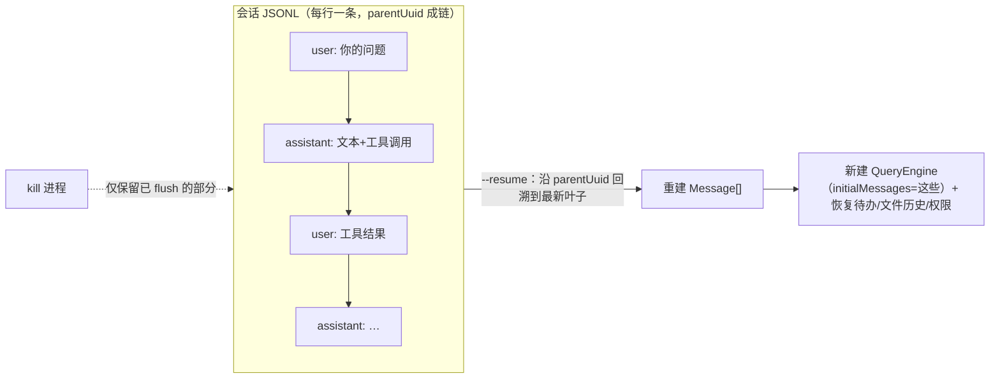
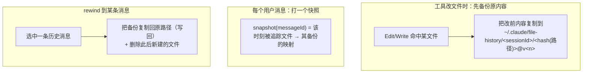
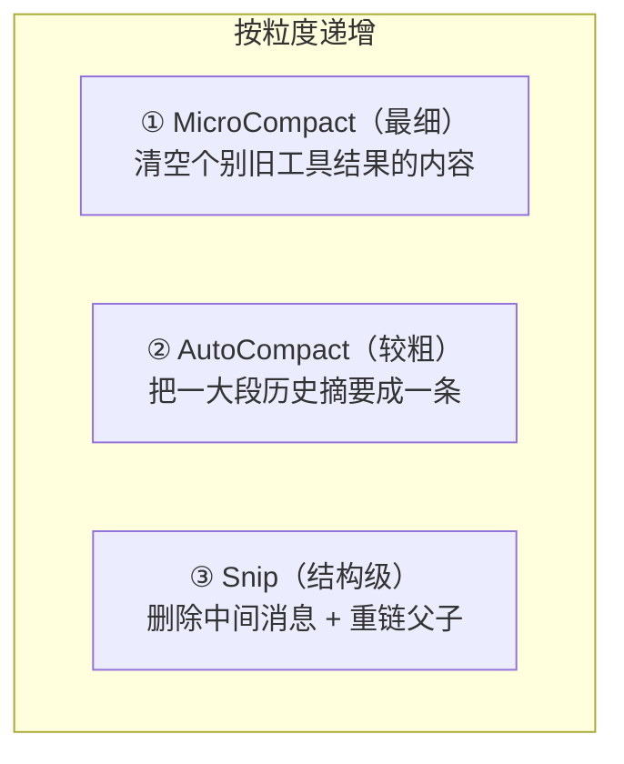
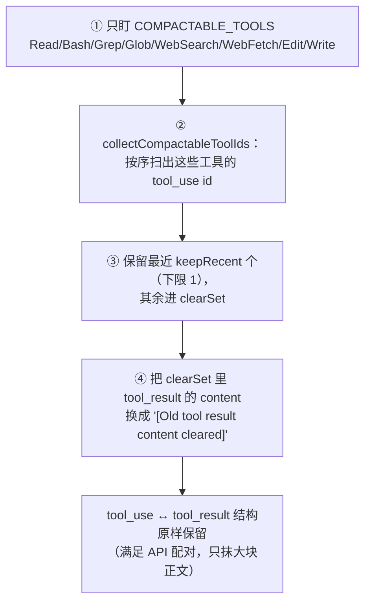
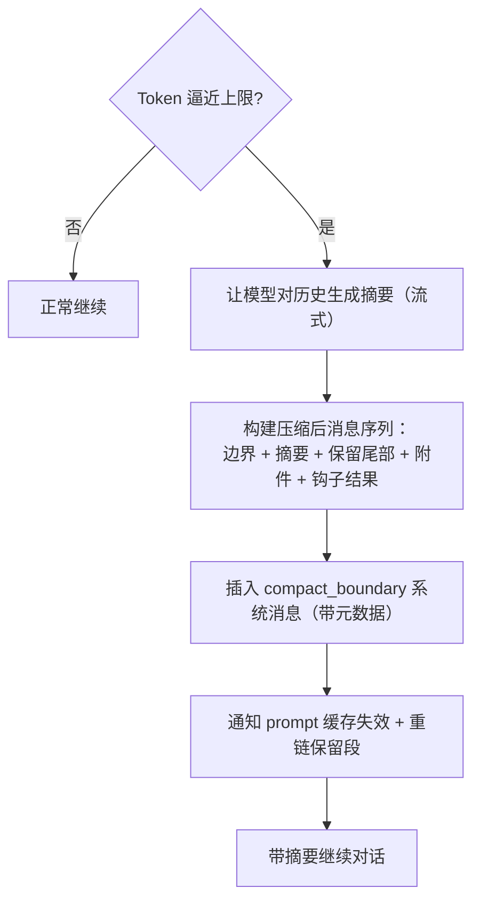
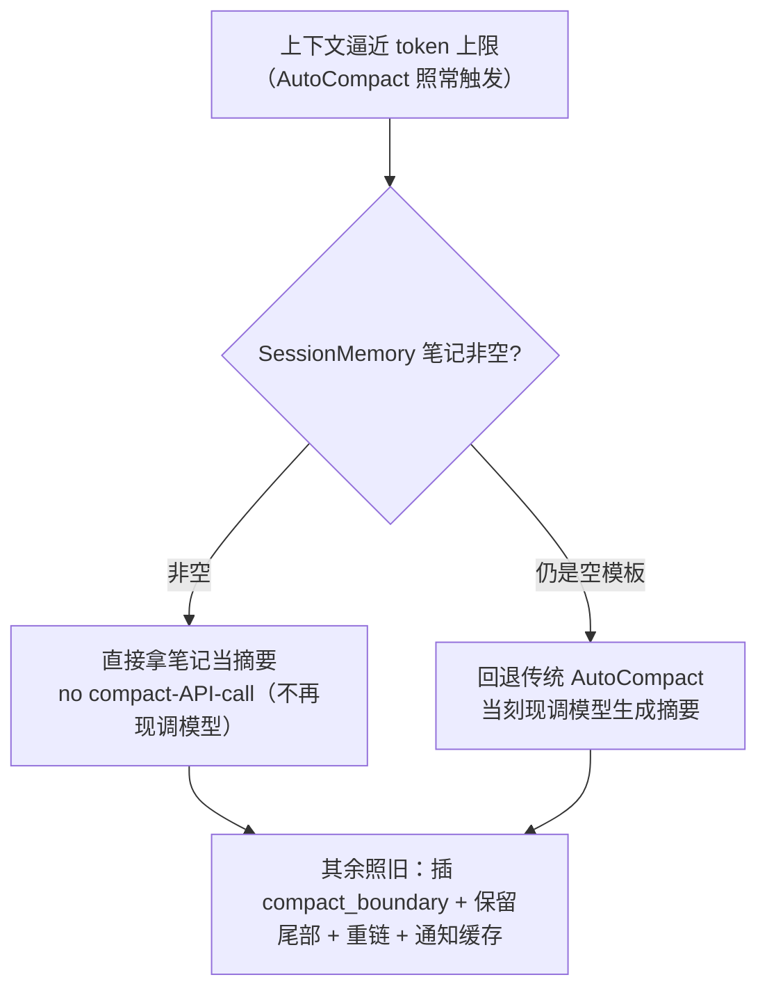
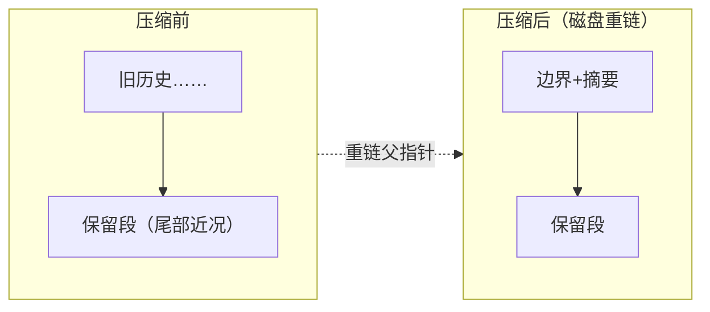
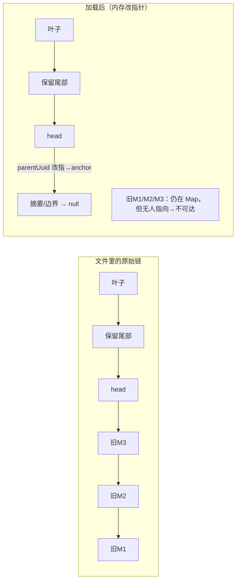
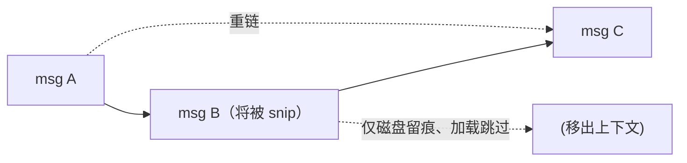

# 会话管理与压缩（Session & Compaction）

> 讲清会话如何持久化与恢复，以及**三级压缩**（MicroCompact / AutoCompact / Snip）如何在"上下文不撑爆"与"不丢关键信息、不毁 prompt 缓存"之间取得平衡。（"为何压缩要护 prompt 缓存"的机制见[《Prompt 缓存机制》](./prompt-cache.md)。）
>
> **原则：源码为准。** 机制均从 `claude-code-cli` 求证；无法确证者标注「推断」。文末附涉及模块。

---

## 1. 会话持久化：Transcript

每段会话被记录成一份 **JSONL**（每行一条消息）文件，**按项目（cwd）分目录 + 会话 ID 命名**存放。写入是**增量去重**的：只追加新出现的消息链，已存在的跳过。


- **先落盘再查询**：用户消息在进主循环前就写盘（见[《全景与主循环》](./00-overview.md)），保证崩溃后仍可 `--resume`。
- **火后不管 vs 等待**：assistant 消息多为**火后不管**式写入（不阻塞生成器），关键节点（如压缩边界）则**等待**写完再继续，兼顾"不卡流"与"不丢史"。
  - 「**火后不管（fire-and-forget）**」= 发起异步写盘但**不 `await`**（`void fn()`），调用即继续、不等完成——换取"不卡流"，代价是错误靠 `.catch`/日志兜、顺序不严格。术语详解见[《00》](./00-overview.md)§4。
- **恢复（`--resume`）**：从 JSONL 回放，重建消息链、文件历史、待办等状态（详见 §1.1）。

> 与[《工具·调用·权限系统》](./01-tool-call-authority.md)里的"工具结果落盘"不同：那是把**单个超大结果**移出上下文；这里是把**整段对话**持久化到磁盘。两者独立。

### 1.0 存储位置与清理策略

存储根是 **`~/.claude/projects/`**，**每个工作目录（cwd）对应一个子目录**（目录名由 cwd 路径清洗而来），会话文件与附属数据都挂在其下：

```
~/.claude/projects/
  <项目A（清洗后的 cwd）>/
    <sessionId>.jsonl          ← 一个会话一个文件（对话 transcript）
    <sessionId>/               ← 该会话的附属目录
      subagents/ …             ← 子 Agent transcript
      remote-agents/ …         ← 远程 Agent 元数据
      tool-results/ …          ← 超大工具结果落盘（见工具篇）
  <项目B>/ …
```

**清理机制**（`utils/cleanup.ts` 的 `cleanupOldSessionFiles`，作为后台清理运行）：

- **默认保留 30 天**（`cleanupPeriodDays`，可在设置里覆盖）；
- **按文件修改时间判定**：`mtime < 截止日` 即删——"超过 N 天没动过"的会话被清；
- **范围**：删过期的 `.jsonl`（会话）与 `.cast`（录屏）、清理会话目录下 `tool-results/` 的过期文件、并删空的会话目录。

> 换言之：会话**按项目分开存**、且**不会无限堆积**——默认 30 天未改动即被后台回收（可配）。

### 1.1 崩溃恢复：`--resume` 到底恢复了什么

关键前提：transcript **不是"结束时才存"，而是边产生边追加**，且每条消息带 `parentUuid` 指针，串成一条链。恢复就是把这条链**读回来重建对话**，而**不是**恢复一个运行中的进程。



`--resume` / `--continue` 的实际动作（`utils/sessionRestore.ts`）：定位会话文件（`--continue` 取最近一个）→ 读全部 JSONL、沿 `parentUuid` 从最新叶子回溯重建消息数组 → 以其为 `initialMessages` **新建一个 QueryEngine**，并恢复待办、文件历史、权限上下文等。

**被 kill 后能接到哪一步**：

- **用户消息在调模型之前就落盘**——所以**至少能恢复到"你问了什么"**，即使一个 API 响应都没等到（源码注释即以此为设计意图）。
- **assistant/工具消息是"火后不管"缓冲写**（短延迟、保序）。硬杀在流式响应中途，**最后一小段可能没落盘**；恢复时对**悬空的 `tool_use`（无配对 `tool_result`）会清理/补全**，保证重建出的对话对 API 合法。
- 对"出结果即杀进程"的宿主，有急 flush 开关把缓冲写强制落盘。

**两个必须说清的边界**：

1. **不是"进程快照"**：恢复的是**对话消息状态**，然后**另起一个查询引擎**继续——kill 那一刻**正在进行的模型生成会丢**，相当于从最后一条完整消息处接着聊，而非"续那半句网络请求"。
2. **能恢复的 = 已落盘的**：绝大多数情况完整，但硬杀存在"最后几十毫秒缓冲写"的极小丢失窗口（除非开急 flush）。而**文件已被改动的副作用是真实发生的**，属另一回事（由文件历史快照单独追踪）。

### 1.2 文件历史快照：如何"恢复文件状态"（rewind）

上一节说"文件改动是真实发生的"——那想把文件**退回到某一步之前**靠什么？靠**文件历史（file history）快照**，它与对话 transcript 是**两套独立**的记录（`utils/fileHistory.ts`）。



机制三步：

- **编辑即备份**：工具每次改/建文件，先把**改动前的内容**复制一份到 `~/.claude/file-history/<sessionId>/` 下（按"文件路径哈希 @ 版本"命名，`copyFile` 保内容与权限）。所以"每一步之前的样子"都留了底。
- **按消息打快照**：每条用户消息对应一个 `snapshot(messageId)`，记录"这一刻被追踪的文件 → 各自的备份"。于是形成一条**消息 ↔ 文件状态**的时间线。
- **rewind 才真正写回**：当你通过消息选择器/`/rewind` 选中某条早先消息，系统把该快照的**备份复制回原文件路径**（真正覆盖工作区文件），并**删除此后新建的文件**——把工作区**回退**到那一刻。

**与恢复（`--resume`）的关系**——这是要点：

- `--resume` 时会做两件事：① `fileHistoryRestoreStateFromLog` 从日志**重建快照状态**（哪些消息、哪些文件、哪些备份）；② `copyFileHistoryForResume` 把上个会话的**备份文件复制到新会话目录**——好让"rewind 能力"跨会话仍然可用。
- **但 `--resume` 不会自动改你的文件**：它恢复的是"**回退的能力**"，不是"帮你回退"。你磁盘上的文件维持编辑后的现状（真实改动仍在），**rewind 是用户主动发起**的动作才会写回。
- 这也和 `readFileState`（读缓存，用于"编辑前须先读/检测外部改动"的过期判定）是**不同的东西**：前者管"把文件退回过去"，后者管"模型对文件的读认知"。

---

## 2. 三级压缩：粒度从细到粗

上下文会随对话增长而膨胀。系统用**三种不同粒度**的压缩来控制体积，各司其职：



| 级别 | 动什么 | 触发 | 是否调用模型 |
|------|--------|------|--------------|
| 级别 | 动什么 | 触发靠什么 | 是否调用模型 |
|------|--------|------------|--------------|
| **MicroCompact** | 把**个别旧工具结果**的内容替换为占位符（`[Old tool result content cleared]`），**保留结构** | **条数**（活跃可压缩工具结果 ≥ 阈值）**或时间**（距上次间隔分钟数）——**不是** token 大小 | 否（纯裁剪） |
| **AutoCompact** | 把**一大段历史**摘要成一条摘要消息，保留尾部近况 | **Token** 逼近有效上下文上限（留约 13K 缓冲）| 是（让模型生成摘要） |
| **Snip** | 从记录中**删除中间消息**并重链父子指针 | 手动/特定条件（SDK 侧尤为重要）| 否（结构裁剪） |

三者可叠加：日常先靠 MicroCompact 轻量瘦身；逼近上限时 AutoCompact 摘要；SDK 长会话再用 Snip 控内存。**注意三者触发维度不同**：Micro 数"攒了几个大工具结果 / 隔了多久"，Auto 才看"离撑爆还差多少 token"。

### 2.1 MicroCompact 详解：机械清"旧工具结果内容"（无 LLM）

**本质**：MicroCompact **不是 LLM 摘要**（那是 AutoCompact），而是**机械地把老的、体积大的工具结果内容原地换成占位符** `[Old tool result content cleared]`，**保留消息结构、不调模型、近乎零成本**。

**核心机制（四步，`services/compact/microCompact.ts`）**：



1. **只针对特定工具**（`COMPACTABLE_TOOLS`）：Read、Bash/shell、Grep、Glob、WebSearch、WebFetch、Edit、Write——**产出大块、又很快过时**的那些；别的工具不动。
2. **按序收集** 这些工具的 `tool_use` id。
3. **保留最近 `keepRecent` 个**（`compactableIds.slice(-keepRecent)`，**下限 1**，否则模型手里零上下文），其余进 `clearSet`。
4. **原地清内容**：把 `clearSet` 里那些 `tool_result` 的 `content` 换成占位符，累计 `tokensSaved`；**`tool_use`/`tool_result` 这对结构不删**（满足 API"每个 tool_use 配一个 tool_result"），只抹正文。

**两条触发路径（都不是"看当前 token 大小"）**：

| 路径 | **触发**靠什么 | **保留**靠什么 |
|------|----------------|----------------|
| **time 版**（`maybeTimeBasedMicrocompact`）| **距上次 assistant 的间隔分钟数** `gapMinutes`（缓存已凉、反正要重写前缀 → 趁机清）| `keepRecent` **个** |
| **count 版**（cached MC）| **活跃可压缩工具结果的条数** ≥ `triggerThreshold` | `keepRecent` **个** |

> **关键澄清**：`triggerThreshold` / `keepRecent` 量的是**可压缩工具结果的"条数"，不是 token 大小**——证据：`keepRecent` 用在 `compactableIds.slice(-keepRecent)`（对**工具结果 id 列表**切片）、打点记的是 `activeToolCount = toolOrder.length - deletedRefs.size`（条数）。**看 token/上下文压力触发的是 AutoCompact，不是 Micro。**（`getToolResultsToDelete` 精确比较逻辑在 ant-only 的 `cachedMicrocompact` 模块、此快照被 DCE，故标「推断」为"条数 ≥ 阈值即删最老"。）

**cached-MC：把"清内容"从"冷失效"降级为"服务器缓存感知删除"（不是零缓存代价）**：

> ⚠️ **先纠一个易误解**：清 tool result **天生会动前缀缓存**——前缀缓存位置敏感，客户端若把老结果从消息中间抠掉，后面必然冷失效。所以**它偏不这么做**，而是走 **Anthropic 的 `context_management` / cache-editing beta**，把删除**挪到服务器侧**。

**为什么"服务器侧删"还能命中缓存——关键：命中只看"你发出去的前缀字节"，不看内容有没有用**。前缀缓存的判定是"逐字节比对本次发送的 token 序列与已缓存的，第一个不一致处往后全 miss"。两种删法发出去的东西完全不同：

```text
上次发送（已缓存）:  [sys][大工具结果A][轮2][轮3]…[轮K]

❌ 客户端就地删 A:   [sys][——A 被抠掉——][轮2]…[轮K][新]
                          ↑ 第一个不一致点在【很老的位置】
                     → 缓存只到 [sys] 有效，A 之后【全部 miss】+ 重发重算

✅ cache_edits 删 A: [sys][大工具结果A][轮2]…[轮K][新消息 + cache_edits:delete(A)]
                     └────── 与上次逐字节一致 ──────┘ ↑ 删除指令只挂在【尾部】
                     → 整个旧前缀【命中】；A 仍物理留在序列里、前缀没动
```

- **命中靠"前缀字节没变"**：老内容**故意留着不删**，删除只是**在最新那条消息尾部追加一条 `delete(A)` 指令**。所以本次发送的前缀和上次一模一样 → **缓存查找照样命中**。
- **"服务器知道"发生在命中之后**：服务器在**命中之后、自己那份工作副本上**把 A 去掉（回 `cache_deleted_input_tokens` 记账）——**它不影响缓存查找本身**（查找只认前缀字节）。
- **省在哪**：命中后服务器把 A 从模型真正的上下文里丢掉 → 上下文变短、省窗口/算力。

机制（`apiMicrocompact.ts` + `claude.ts`）：
- **老 tool_result 物理上仍留在消息里**（前缀字节不动 → 前缀缓存仍有效）；把 **`cache_edits` 删除指令追加到最后一条 user 消息（尾部）**，`{type:'delete', cache_reference}`——**不 splice 进前缀中间**；`pinCacheEdits` 让删除跨轮保持。
- 服务器对**自己的 KV 缓存**做**缓存感知的删除**，回 **`cache_deleted_input_tokens`** 记账；`notifyCacheDeletion` 同步缓存边界。
- 两种形态：**客户端 `cache_edits`（按 `cache_reference` 点名删）** 或 **服务器原生策略 `clear_tool_uses_20250919`（发 `trigger/keep/clear_at_least` 让服务器自己清）**。
- 仅主线程、受支持模型启用；**time 版因缓存已凉，直接跳过 cache 编辑**。

**诚实边界**：这**不是"零缓存代价"**——A 被删后，它**后面那些 token 的 KV 位置理论上会错位**，服务器如何高效复用/重排这部分 KV 是 **Anthropic 服务端内部实现**（这份源码看不到，属「推断」）。源码能确证的只是**客户端协议：保持前缀字节稳定 + 尾部追加 delete → 不制造冷 miss**。所以它省的是"**客户端改前缀 → 整段重发 + 冷失效**"这个最贵情况，降级为"**服务器按引用、就地、缓存感知地删**"，**远比冷 miss 便宜**且不必把内容重新上线。准确说法是 **"尽量少废缓存 / 避免前缀突变导致的冷失效"，而非"不毁缓存"**。

**模型视角**：老工具结果变成"内容已清除"占位符——模型仍知道"我跑过这个工具"（结构在），只是正文没了；真需要可**重读文件/重跑命令**（全文可能仍在磁盘 `outputFile` 或可再生）。

---

## 3. AutoCompact：摘要式压缩

这是最"重"的一级——当 Token 逼近有效上下文（保留约 13K 缓冲）时触发：



- **构建顺序**：压缩后的新序列 = **边界消息 + 摘要消息 + 保留消息（尾部近况）+ 附件 + 钩子结果**。
- **压缩边界**：用一条 `compact_boundary` 系统消息标记"此处发生过压缩"，携带压缩元数据；后续逻辑只取边界之后的消息前进。
- **前置尝试（SessionMemory）**：若已有从会话中**提取的记忆**（markdown），会先尝试基于它压缩，作为 AutoCompact 的前置——机制详见 §3.1。

### 3.1 SessionMemory：后台**预写好的摘要**，供压缩直接取用

一个高频困惑："**SessionMemory 是不是压缩产生的内容？有了它是不是就不 auto 了？**" 都不是。SessionMemory **本体是一份独立的、后台持续维护的会话笔记文件**——它**本身也要调 LLM 生成**，只是把"摘要这次 LLM 调用"从"压缩当刻、阻塞、一次性"挪成"平时、后台、增量"。

**它是什么（`services/SessionMemory/`）**：

- **一个磁盘上的结构化 markdown 文件**（`getSessionMemoryPath()`），固定模板分节：`Session Title / Current State / Task specification / Files and Functions / Workflow / Errors & Corrections / Codebase Documentation / Learnings / Key results / Worklog`（`DEFAULT_SESSION_MEMORY_TEMPLATE`）。
- **有预算**：整文件上限 ~**12000 token**、每节 ~**2000 token**，超了下次提取时被要求压缩老内容、优先保 `Current State`/`Errors`。
- **不注入每轮上下文**：它只是躺在磁盘上，**不随每轮请求前置**，所以不影响活跃上下文体积（也因此挡不住上下文照涨、照样撑到压缩阈值）。
- 模板与提取提示词都可自定义（`~/.claude/session-memory/config/{template,prompt}.md`）。

**谁在写、何时写——后台 fork 子 agent、非阻塞、增量**（`extractSessionMemory`，一个 post-sampling 钩子）：

| 条件 | 值 |
|------|----|
| 仅主线程 | `querySource==='repl_main_thread'`（子 agent/teammate 不跑）|
| 特性门 | `tengu_session_memory` 开 **且** auto-compact 开 |
| 触发阈值 | **token 增长**（距上次提取）**且** 工具调用数达阈值；或"最后一轮无工具调用 + token 阈值达"（在自然停顿点提取）|
| 提取动作 | fork 一个隔离子 agent（`runForkedAgent`，`querySource:'session_memory'`），**唯一被允许**的操作是对那一个文件调 `Edit`（`createMemoryFileCanUseTool` 把权限锁死到 memoryPath），改完即停、**不打断主对话** |

> 每次提取仍是一次 LLM 调用（读"当前笔记 + 对话"→ 更新笔记），但**靠 prompt 缓存复用已缓存的对话前缀**（`runForkedAgent` 正为此）、且是**增量 Edit** 而非重写，故单次便宜、又不阻塞主流程。

**和压缩的关系——省的不是"调用总量"，是"压缩当刻的阻塞"**：

| | 传统 AutoCompact 的摘要 | SessionMemory 的摘要 |
|---|---|---|
| **何时调 LLM** | **逼近上限那一刻**才调 | 对话进行中，**平时**分多次调 |
| **阻不阻塞** | **阻塞**：等它摘完整段历史才继续 | **非阻塞**：fork 隔离子 agent，主对话照跑 |
| **一次处理多少** | **一次性**把全部历史摘成一条 | **增量**：每次只在已有笔记上 `Edit` 更新 |
| **压缩当刻的开销** | 一次大 summary API 调用 | 源码原话 **"no compact-API-call"**——**零**额外调用 |

**"有 SessionMemory 就直接用、不 auto 了吗？"——不是。auto 照样触发，只换"摘要从哪来"这一步**（`trySessionMemoryCompaction`，受 `tengu_sm_compact` 门控）：



- **触发条件没变**：SessionMemory 不注入上下文 → 上下文照涨、照样撑到阈值 → **AutoCompact 仍按 token 压力触发**。
- **只替换"生成摘要正文"这一个子步骤**：边界、保留段、重链、缓存通知全部照旧（见 §3/§4）；笔记为空（`isSessionMemoryEmpty`）就**回退**到传统现摘要。
- 塞进摘要前还会 `truncateSessionMemoryForCompact` 截断超长节，避免笔记吃满压缩后的 token 预算；被截断时附一句"完整笔记见 &lt;memoryPath&gt;"。
- **手动触发**：`/summary` 命令走 `manuallyExtractSessionMemory`，绕过阈值立即提取一次。

> **一句话**：SessionMemory = "**压缩要用的那份摘要，提前在后台增量写好了**"。它本身要调 LLM，但把摘要开销**从"压缩当刻阻塞一次大的"改成"平时后台非阻塞多次小的"**；**有它 ≠ 不压缩**——auto 仍照常触发，只是触发时拿现成笔记当摘要、省掉当刻那次阻塞的摘要调用，笔记为空则回退现摘要。

---

## 4. 压缩边界与"保留段重链"——保住 prompt 缓存

压缩最怕两件事：**毁掉 prompt 缓存**（导致后续请求全部 miss、变慢变贵）、以及**恢复时链断裂**。系统用"保留段 + 重链"应对：



- **保留段标记**：压缩边界记录保留段的**头/锚/尾**指针（headUuid / anchorUuid / tailUuid）。恢复时据此**重链父子关系**——把保留段接到边界之后，跳过被摘要掉的旧史。
- **清零陈旧用量**：保留消息的 usage 字段被**清零**，避免 `--resume` 后因为"看起来已很满"而立刻又触发一轮压缩（防压缩螺旋）。
- **通知缓存**：压缩会**主动通知 prompt 缓存检测**，让缓存边界正确前移，而非静默地让整段缓存失效。

### 4.1 为什么恢复串出的是"压缩视图"——改指针，不改文件

一个常见困惑：`--resume` 明明是沿 `parentUuid` 一路回溯串消息，压缩前的原文行又还在文件里，**怎么串出来的是压缩视图而不是原文？**

答案是：**回溯算法没变，变的是"指针在加载时被改写了"**。

- **append-only 删不掉旧行**：transcript 只追加、去重，压缩前的老消息**带着原始 `parentUuid` 留在文件里**，`recordTranscript` 无法回头改写它们。
- **边界带重链元数据**：`compact_boundary` 记录了保留段的 `head`（保留尾部首条）/ `anchor`（摘要或边界）/ `tail`。
- **加载时在内存里改指针**：把**保留段头 `head` 的 `parentUuid` 从"老历史"改指到 `anchor`（摘要/边界）**。



于是回溯走到 `head` 时，其 `parentUuid` 已指向**摘要**，直接"跳过"旧历史、接到摘要，再往上是边界（`parentUuid=null`，到头）。旧 M1/M2/M3 **物理还在**，但**没有任何消息再指向它们**，成了不可达孤儿，回溯永远碰不到。

**一句话**：**压缩不改文件，改的是"下次从哪读起"的指针**——边界元数据 + 加载时重链，让"沿 parentUuid 回溯"这套不变的代码，串出的却是「摘要 + 保留尾部」的压缩视图（呼应 §1.1 的"物理留存、逻辑跳过"）。

---

## 5. Snip：结构级删除（SDK 侧尤重）

Snip 不摘要、也不清内容，而是**从记录中删除中间消息**并修复链：

- 在 JSONL 追加日志里标记被删消息的 UUID，磁盘记录仍在，但**加载时跳过**；被删消息的子节点父指针**重链**到存活祖先，避免孤儿。
- **REPL vs SDK 差异**：REPL 为了滚动回看**保留完整历史**、按需投影出"删减视图"；而 SDK/无头长会话**直接截断内存中的消息**以**限制内存增长**（没有 UI 需要保留）。



---

## 6. 压缩后的清理

一次压缩完成后有一批**善后**（`postCompactCleanup.ts`）：重置 MicroCompact 状态、折叠上下文、清理权限审批与内存文件缓存（部分仅主线程）。目的是让压缩后的状态**自洽**，不残留会导致重复触发的旧标记。

---

## 7. 关键设计取舍

| 取舍 | 做法 | 为什么 |
|------|------|--------|
| 三级压缩分工 | Micro（清内容）/ Auto（摘要）/ Snip（删结构） | 用最小代价先做，不够再升级 |
| 留缓冲触发 | 逼近上限前留约 13K 触发 AutoCompact | 给摘要本身留出空间，不越界 |
| 边界+保留段重链 | 记录头/锚/尾指针，恢复时重链 | 保 prompt 缓存、防链断裂 |
| 清零陈旧用量 | 保留消息 usage 归零 | 防 `--resume` 后压缩螺旋 |
| 主动通知缓存 | 压缩时通知缓存检测 | 缓存边界前移而非整段失效 |
| REPL/SDK 分策略 | REPL 留全史投影、SDK 截断 | 前者要回看、后者要省内存 |
| 增量去重落盘 | 只追加新链、火后不管 | 不卡流又不丢史，`--resume` 可靠 |

---

## 附录 · 涉及模块

- Transcript 与恢复：`utils/sessionStorage.ts`、`utils/sessionRestore.ts`、`utils/fileHistory.ts`
- AutoCompact：`services/compact/autoCompact.ts`、`compact.ts`、`grouping.ts`、`prompt.ts`
- MicroCompact：`services/compact/microCompact.ts`（`COMPACTABLE_TOOLS`、`collectCompactableToolIds`、`TIME_BASED_MC_CLEARED_MESSAGE`、`microcompactMessages`、`maybeTimeBasedMicrocompact`）、`timeBasedMCConfig.ts`（time 版 gap/keepRecent）；count 版 cached MC：`cachedMicrocompact`（ant-only、DCE，`getToolResultsToDelete`/`getCachedMCConfig`/`triggerThreshold`）；**服务器侧缓存编辑**：`services/compact/apiMicrocompact.ts`（`getAPIContextManagement`、策略 `clear_tool_uses_20250919` 的 `trigger`/`keep`/`clear_at_least`）、`services/api/claude.ts`（`context_management` 参数、`cache_edits {type:'delete',cache_reference}`、`addCacheBreakpoints`/`pinCacheEdits`、`cache_deleted_input_tokens`）、`services/api/promptCacheBreakDetection.ts`（`notifyCacheDeletion`、`cachedMCEnabled` 追踪）
- Snip：`services/compact/snipCompact.ts`、`snipProjection.ts`
- 压缩善后：`services/compact/postCompactCleanup.ts`
- 会话记忆（SessionMemory，§3.1）：`services/SessionMemory/sessionMemory.ts`（`extractSessionMemory` post-sampling 钩子、`shouldExtractMemory` 阈值、`runForkedAgent` 后台提取、`createMemoryFileCanUseTool` 权限锁死、`manuallyExtractSessionMemory`=`/summary`）、`prompts.ts`（`DEFAULT_SESSION_MEMORY_TEMPLATE`、`MAX_TOTAL_SESSION_MEMORY_TOKENS=12000`/`MAX_SECTION_LENGTH=2000`、`buildSessionMemoryUpdatePrompt`、`isSessionMemoryEmpty`、`truncateSessionMemoryForCompact`）、`sessionMemoryUtils.ts`（阈值/状态）；压缩侧 `services/compact/sessionMemoryCompact.ts`（`shouldUseSessionMemoryCompaction`=`tengu_session_memory`&`tengu_sm_compact`、`trySessionMemoryCompaction`、`createCompactionResultFromSessionMemory` 的 "no compact-API-call"）
- 边界消息：`utils/messages.ts`（compact_boundary）
