# MCP 协议与认证（Model Context Protocol）

> 讲清 Claude Code 如何作为 **MCP 客户端**接入外部服务器：多种传输层、连接与发现、把 MCP 工具/资源转成内部形态、以及认证（OAuth / XAA）、通道权限与 Elicitation。
>
> **原则：源码为准。** 机制均从 `claude-code-cli/services/mcp/` 求证；无法确证者标注「推断」。文末附涉及模块。

---

## 1. MCP 是什么：一条标准化的"外部能力接线"

MCP（Model Context Protocol）是一套基于 **JSON-RPC** 的协议。Claude Code 作为**客户端**连接到 MCP **服务器**，把服务器暴露的**工具、资源、提示命令**接入本地，让模型能调用外部能力（数据库、浏览器、第三方 API…）。

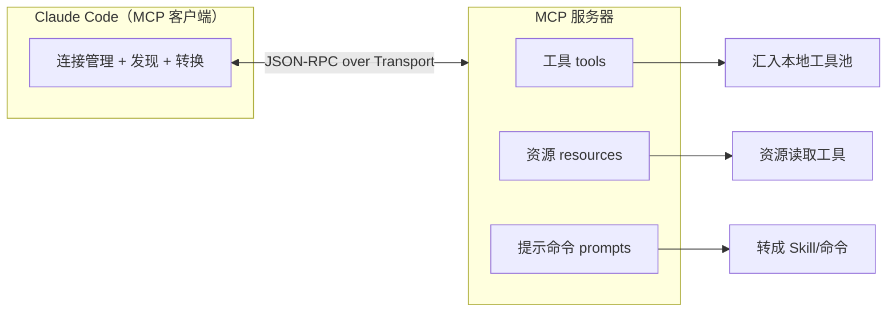

---

## 2. 传输层：一套协议，多种"管道"

同样的 JSON-RPC，可跑在多种传输之上。客户端按服务器配置选择（`services/mcp/client.ts` 的连接逻辑）：

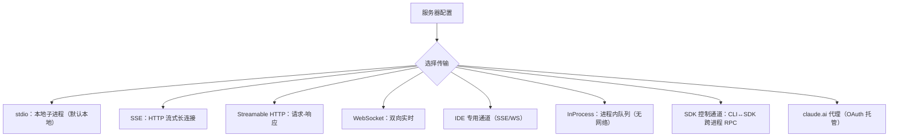

- **本地 vs 远程**：本地（stdio）与远程（SSE/HTTP/WS）走不同分支，且**并发连接数**不同（本地更保守、远程更宽）。
- **进程内（InProcess）**：无需网络的内建集成（如浏览器/Computer-Use 类），用进程内直连（详见 §2.1）。
- **SDK 控制通道**：当 MCP 服务器由 SDK 侧提供时，CLI 与 SDK 之间用专门的控制传输互通（详见 §2.2）。

> **注意 MCP 里的两个"进程内"别混**：**§2.1 InProcess** 是"**客户端和服务器都在同一个进程**（CLI 内）"；**§2.2 SDK 控制通道**是"**客户端在 CLI、服务器在 SDK，两个进程**，借 CLI↔SDK 的控制通道搭桥"。前者真·同进程、后者跨进程。

### 2.1 InProcess：同进程互链 Transport（无子进程、无网络、无序列化上线）

用于**随程序内建、又实现成 MCP 服务器**的集成（浏览器 / Computer-Use 类）：它们本就活在 CLI 进程里，没必要 spawn 子进程或开 socket。机制是**一对互链 Transport**（`createLinkedTransportPair() → [clientTransport, serverTransport]`，`InProcessTransport.ts`）：

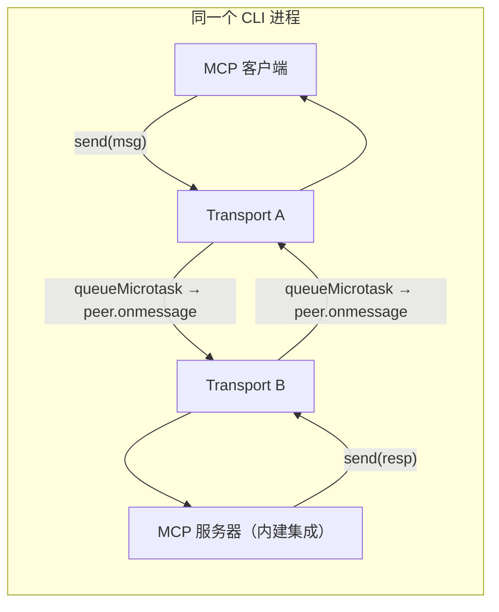

- **互为 peer**：A/B 两个 Transport 各持对方引用；`A.send(msg)` 就是 `queueMicrotask(() => B.onmessage(msg))`——**直接把 JSON-RPC 消息塞给对方的回调**，没有子进程、没有网络、没有"打包成字节流再解析"。
- **queueMicrotask 而非同步调用**：把投递推到微任务，**避免同步 请求→响应 递归把调用栈打爆**。（所以严格说不是"持久队列"，而是"微任务延迟的直投"。）
- **任一端 `close()` 关双方**：`onclose` 同时触发两侧。
- **收益**：延迟≈0、零 IPC/序列化开销——最轻的 MCP 传输。

### 2.2 SDK 控制通道：把 MCP 消息驮在 CLI↔SDK 的控制流上（跨进程）

场景：**MCP 服务器跑在 SDK 进程里**，而 **MCP 客户端在 CLI 进程**——两个进程。不另开 MCP 传输，而是**复用 CLI↔SDK 之间已有的"控制消息"通道（stdout/stdin）**驮 MCP 的 JSON-RPC（`SdkControlTransport.ts`）：

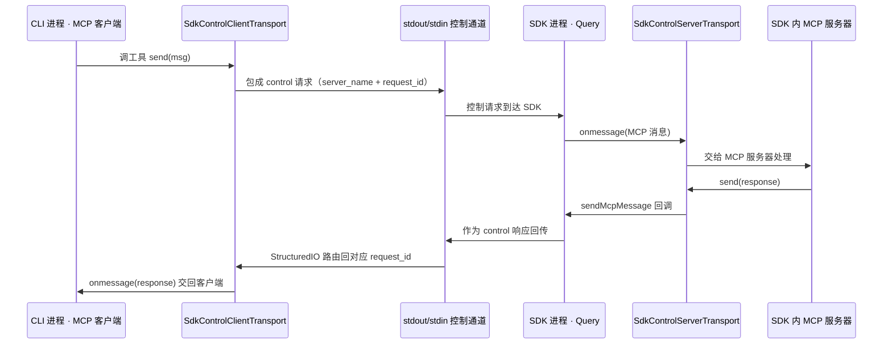

- **两半对称**（`SdkControlClientTransport` 在 CLI 侧、`SdkControlServerTransport` 在 SDK 侧）：客户端侧把 MCP 消息**包成 control 请求**（带 `server_name` 路由 + `request_id` 关联）发出、等 control 响应再解包回 `onmessage`；服务器侧是个**透传**——`onmessage` 转给 MCP 服务器、`send` 经回调把响应交回 Query。
- **靠 `server_name` 路由 + `request_id`/消息 id 关联**：因此**能同时挂多个 SDK MCP 服务器**，响应也能精确对回请求（StructuredIO 与 Query 各自跟踪 pending 请求）。
- **与 InProcess 的本质区别**：InProcess 是**同进程直投**；SDK 控制通道是**跨进程**，只是"不为 MCP 单开传输，而是搭在 CLI↔SDK 现成的控制流上"。

#### 2.2.1 stdio vs SDK 控制通道：最容易混的一对（谁 spawn 谁 / 怎么判定 / 行为差异）

两者都是"进程间管道跑 JSON-RPC"，但**方向和归属相反**：

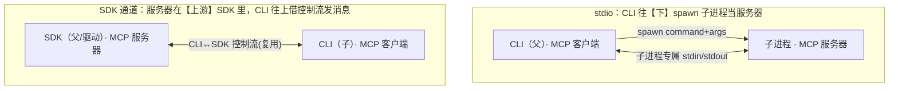

| 维度 | **stdio** | **SDK 控制通道** |
|------|-----------|------------------|
| MCP 服务器在哪 | **CLI 亲手 spawn 的子进程**（`StdioClientTransport({command,args})`）| **CLI 的上游驱动 SDK 进程**里（CLI **不 spawn** 任何东西）|
| 父子方向 | CLI = 父，服务器 = 子（往下）| SDK = 父/驱动，CLI = 子（往上）|
| 用什么管道 | 子进程**专属的一对 stdin/stdout**（一服务器一对）| **CLI↔SDK 已有的控制流**（=CLI 自己的 stdout/stdin），MCP 消息**多路复用**其上 |
| 消息形态 | 裸 JSON-RPC 走子进程管道 | JSON-RPC **包成 control 请求**（`server_name` 路由 + `request_id` 关联）|
| 生命周期归谁 | **CLI** spawn/kill 子进程 | **SDK 侧**；CLI 只发消息、管不着 |
| **怎么判定** | 配置 `type:'stdio'`（带 `command`）→ `client.ts` 建 `StdioClientTransport` | 配置 `type:'sdk'`（**无 command/url**）→ `client.ts` 直接 `throw 'handled in print.ts'` → 由 `print.ts` 用 `SdkControlClientTransport` 接 |
| 进程开销 | 每挂一个 = **一个真子进程**（内存/启动；故 Chrome MCP 才特意 in-process 省 325MB）| **零 spawn**，无新进程 |
| 通道数 | 一服务器一对管道 | **多个 SDK 服务器复用同一条控制流**，按 `server_name` 分拣 |
| 可用场景 | 本地任意（REPL / 无头都行）| **仅 SDK/无头模式**（`print.ts`）——交互 REPL 没有上游 SDK 就没这条通道 |

- **判定不是运行时猜的**：由**配置声明的 `type` 字段**决定分支（`services/mcp/types.ts` 的 `z.enum([...,'stdio',...,'sdk'])`）；`stdio` 有 `command`/`args`，`sdk` 只有名字。
- **一句话核心**：**stdio = "CLI 往下 spawn 一个子进程当服务器"；SDK 通道 = "服务器在 CLI 的上游 SDK 里，CLI 往上借现成控制流发消息"**——谁 spawn 谁、方向、归属都相反；行为上前者每服务器一进程一管道、CLI 全权掌控，后者零进程、多服务器挤一条控制流、且只在被 SDK 驱动时存在。

### 2.3 消息层语义：全双工、超时、并发与批边界（跑在任何传输之上）

不管底层是 stdio / HTTP / InProcess，**上面跑的都是同一套 JSON-RPC 2.0**——它**不是"CC 问一句、MCP 答一句"的纯同步**，而是**全双工消息总线**。

**两种消息 × 两个方向**：

| 消息类型 | 结构 | 要不要回 | 谁能发 | 例子 |
|----------|------|----------|--------|------|
| **请求 Request** | `{id, method, params}` | ✅ 期待**同 id 的响应** | **双向** | CC→MCP：调工具；MCP→CC：**elicitation**（`elicitation/create`，服务器反向要输入）|
| **通知 Notification** | `{method, params}`（**无 id**）| ❌ **单向、火后不管** | **双向** | MCP→CC：`notifications/claude/channel`、`list_changed`、progress |

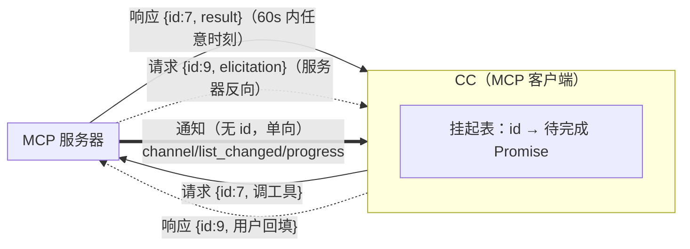

- **靠 `id` 配对**：每个请求带唯一 `id`，响应带回同 `id` → CC 在"挂起表"里找到对应 Promise resolve。**响应何时到都行**（异步），和后台任务 `task_id`、通道 `request_id` 是同一种 ID 关联套路。
- **通知无 id、不等回**：`list_changed`（服务器工具集变了→触发刷新）、channel 消息、progress 都是单向推送。

**"CC 调工具怎么知道等多久"——不是知道，是超时 + id 匹配**：

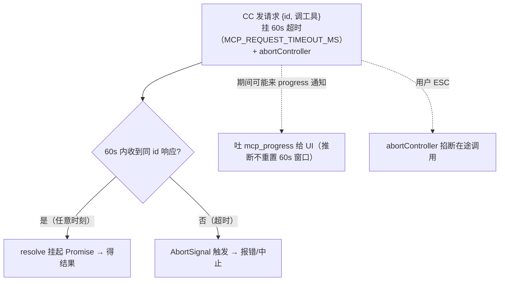

- 超时值 **60 秒**（`MCP_REQUEST_TIMEOUT_MS = 60000`）；长调用有 **progress 通知**（`onProgress` → `mcp_progress`）给 UI 反馈；`abortController.signal` 让 ESC 随时掐断。

**"CC 能不能继续做别的"——分三层看**：

| 层 | 能否继续 | 说明 |
|----|----------|------|
| **进程 / 事件循环** | ✅ **能** | `await` 响应是**非阻塞异步 I/O**——期间照常收通知、跑并行工具、渲 UI、响应 ESC，**进程不冻结** |
| **同批工具并发** | ✅ **看 `readOnlyHint`** | MCP 工具 `isConcurrencySafe() = annotations.readOnlyHint ?? false`：声明只读 → 与其它只读工具**并行**；默认 → **独占串行** |
| **模型下一轮** | ⏸ **要等这批齐** | API 硬契约"每个 tool_use 必配 tool_result"——这批工具全落地前模型**不进下一轮**（超时/中断会把缺的补成错误结果再前进）|
| **用户** | ✅ **能** | `Ctrl+B` 把整个查询转后台、自己开新 prompt（见[《02》](./02-agent.md)主会话后台化）|

> **一句话**：MCP↔CC 是 **"请求靠 id 配对、通知单向火后不管"的全双工总线**；CC 调工具不是"知道等多久"，而是**挂 60s 超时等同 id 响应**；等待期间**事件循环照跑**（收通知、并行只读工具、可 ESC），但**模型的下一轮要等这批工具齐**——真想撒手可 `Ctrl+B` 后台化。（"等这批齐才回灌模型"正是[《工具·调用·权限系统》](./01-tool-call-authority.md)§5.1 的**层②批边界**；通知则走队列在**轮边界 drain**，见[《08》](./08-context-assembly.md)。）

---

## 3. 连接、发现与转换

一个 MCP 服务器接入后，客户端完成握手并**发现三类东西**，再把它们转成本地形态：

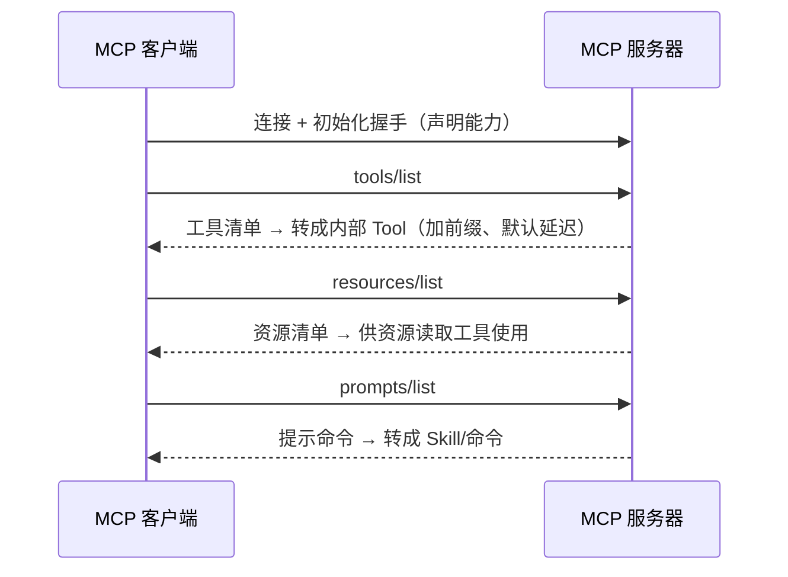

- **工具命名与前缀**：MCP 工具被重命名为 `mcp__<服务器>__<工具>`（并对非法字符归一化），避免与内置工具或跨服务器重名冲突。
- **默认延迟加载**：MCP 工具默认标记为 **deferred**——初始 prompt 只留摘要，模型经 ToolSearch 现搜现用（见[《工具·调用·权限系统》](./01-tool-call-authority.md)§6）。服务器可用元注解声明 `alwaysLoad`（首轮即加载）或 `searchHint`（关键词提示）。
- **权限**：MCP 工具的 `checkPermissions` 默认"passthrough"，交由中央权限系统按规则决定（见权限篇）。
- **连接生命周期**：连接结果被缓存；出错/断开时清理缓存、按需重连；服务器可发 `list_changed` 通知触发刷新。

**资源系统**：`resources/list` 列举、`resources/read` 读取；二进制资源以 base64 取回后**落盘**并返回路径（对应 `ListMcpResources` / `ReadMcpResource` 两个工具）。

---

## 4. 配置来源

MCP 服务器配置**多来源合并**：

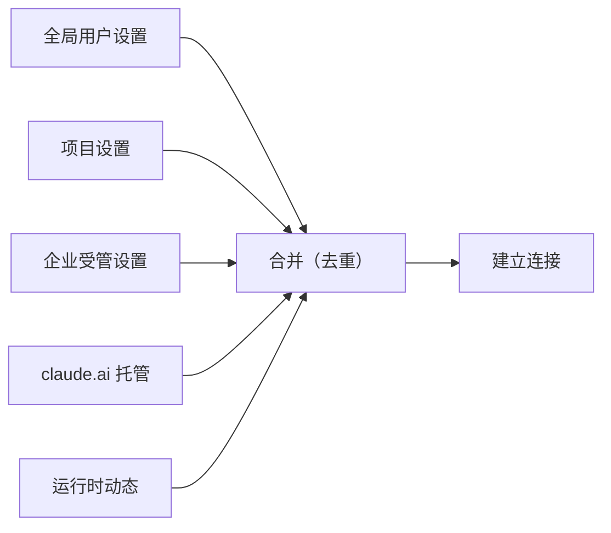

配置里支持环境变量展开（`${VAR}` / `${VAR:-默认}`），缺失变量会被记录以便校验；官方注册表用于**标记官方服务器 URL**（日志分类/安全提示）。禁用的服务器在合并阶段就被剔除，**不建立网络连接**。

---

## 5. 认证：OAuth 与 XAA

远程/托管 MCP 常需认证。系统支持两条路径，**核心分野是"要不要弹浏览器让用户点同意"**：

| | **标准 OAuth** | **XAA 跨账户访问（企业）** |
|---|---|---|
| 要浏览器同意吗 | ✅ 要（用户点授权）| ❌ **不要**（静默） |
| 靠什么身份 | 当场登录、授权码 | **用户已有的企业 IdP 身份**（`id_token`）|
| 场景 | 个人接第三方 MCP | 企业统一管控、访问受控 MCP |

### 5.1 标准 OAuth：授权码流程（要用户点同意）

`services/mcp/auth.ts` + `ClaudeAuthProvider`，是标准 RFC 6749 授权码 + PKCE：

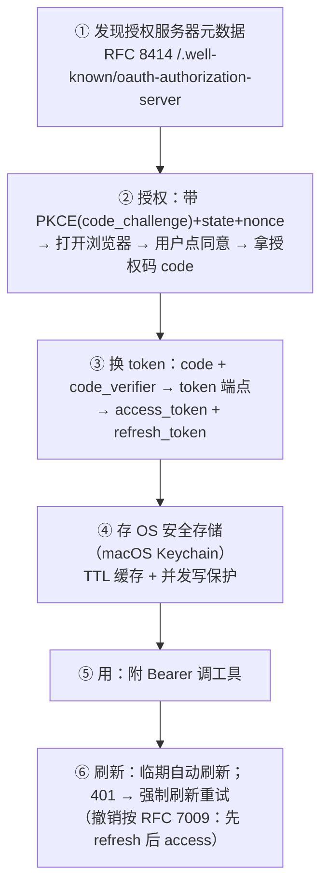

- 关键：**必须弹浏览器让用户当面授权**（有 consent 屏）。
- token 进**操作系统安全存储**（Keychain），带 TTL 缓存 + 并发写保护；临期自动刷新，**401 触发强制刷新 + 重试**。
- **claude.ai 托管**是它的变体：走 **Bearer + 代理**（`claudeai-proxy`，OAuth 令牌由 claude.ai 托管），见 §2 传输图。

### 5.2 XAA（Cross-App Access, SEP-990）：两次令牌交换，无浏览器

**目的一句话**：**不弹浏览器**，用**用户已经登录企业 IdP 的身份**（`id_token`），经**两次标准令牌交换**换到目标 MCP 服务器的 `access_token`。适合"企业统一发身份、员工无感访问受控 MCP"。

为什么要**两步 + 中间那张 ID-JAG**：IdP 认得"你是谁"，但守着 MCP 资源的是**授权服务器（AS）**；**ID-JAG**（Identity Assertion Authorization Grant）就是 IdP 开的一张**"我担保这个身份可访问资源 X（面向 AS Y）"的可携带断言**，AS 认这张断言就发访问令牌——于是企业能**集中管控**、用户**不必逐个 MCP 点同意**。

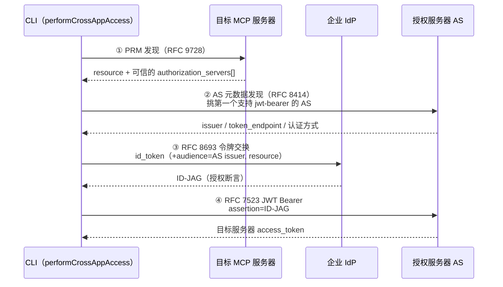

四步（`performCrossAppAccess`，源码 `services/mcp/xaa.ts`）：

1. **PRM 发现（RFC 9728）**：问 MCP 服务器的"受保护资源元数据"，拿到 `resource` 和它信任的 `authorization_servers[]`（并校验 resource 与服务器 URL 一致）。
2. **AS 发现（RFC 8414）**：逐个候选 AS 发现元数据，**挑第一个支持 `jwt-bearer` grant 的**；据 AS 声明选 `client_secret_basic`/`_post`。
3. **换 ID-JAG（RFC 8693 令牌交换，在 IdP）**：把 `id_token` 发到 **IdP 的 token 端点**，grant=`token-exchange`、请求类型=`id-jag`、`audience`=AS issuer、`resource`=MCP 资源 → 拿回 **ID-JAG**。
4. **换 access_token（RFC 7523 JWT Bearer，在 AS）**：把 ID-JAG 当 JWT 断言发到 **AS 的 token 端点**，grant=`jwt-bearer` → 拿到目标 MCP 服务器的 **access_token**。

- **两个"换"分别在两处发生**：`id_token → ID-JAG` 在 **IdP**；`ID-JAG → access_token` 在 **AS**——别混。
- **受开关控制**；`XaaConfig` 需 IdP 侧（`idpTokenEndpoint`/`idpIdToken`/`idpClientId`/`idpClientSecret`）+ AS 侧（`clientId`/`clientSecret`）凭据；**敏感令牌日志脱敏**（`state`/`nonce`/`code_verifier`/`code` 等被 redact）。

> 一句话对照：**标准 OAuth = "当场弹浏览器点同意 → 授权码 → token"；XAA = "拿你已有的企业身份 id_token，在 IdP 换成 ID-JAG 断言、再在 AS 换成 access_token，全程无浏览器"。** 中间的 ID-JAG 是让"IdP 的身份"能被"守资源的 AS"信任的桥。

---

## 6. 通道权限与 Elicitation

### 6.1 通道（Channel）——**不是 MCP 网络传输**，是"消息平台桥"

先破一个误会：**这里的"通道"跟 §2 的 stdio/SSE/HTTP 传输层无关**。它指 **Telegram / iMessage / Discord 这类消息平台**——当你**不在终端**时，把权限询问 / elicitation **发到你手机**、并收回你的回复。它本身**以一个 MCP 服务器（channel 插件）的形态接入**（底层当然经网络到达 IM 平台，但对 CC 而言它只是"一个声明了 channel 能力的 MCP 服务器"）。

**CC 怎么知道有通道、怎么建立**（**不是自动发现，是你显式开 + 三重门控**）：

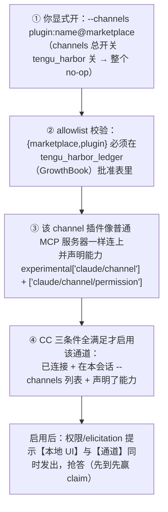

- **权限中继怎么走**：命中权限对话时，CC **同时**把提示发到活跃通道，与本地 UI / bridge / 钩子 / 分类器**赛跑**，第一个应答者赢（`claim()`）。
- **回复是结构化事件、不是文本**：你在 IM 里回 "yes tbxkq"，是**通道服务器解析后发出** `notifications/claude/channel/permission {request_id, behavior}` ——**CC 从不把 IM 文本当审批**，必须服务器**主动发这个特定事件**才算数（防"聊天内容被当成审批"注入）。
- **信任边界是 allowlist，不是终端**：审批人是"通道另一端的人"。源码坦承:**被攻陷的通道服务器能伪造 "yes &lt;id>"**——这是**已接受的风险**(被攻陷的通道本就有无限次对话注入能力，自审批只是更快、并不更强)。所以门槛在 `tengu_harbor_ledger` 白名单。

一句话:**通道 = "把审批/索取搬到 Telegram 等 IM"的能力,以 channel-插件-MCP-服务器 实现;你用 `--channels` 显式开、过 allowlist、服务器声明能力,CC 才认——不是网络自动建链。**

### 6.2 Elicitation（索取输入）——服务器**反向**向用户要信息

**本质**：平时是"客户端调服务器的工具"；elicitation 是**反过来——MCP 服务器在工具执行到一半时，主动向客户端发一个 `elicitation/create` 请求**（"我需要你补个输入/去浏览器点一下才能继续"）。CLI 弹给用户、拿到 `ElicitResult` 回传，服务器再继续。**注意它和 §6.1 通道正交**：默认弹在本地终端 UI；若开了通道，这个提示也会被中继到 IM。两种形态：

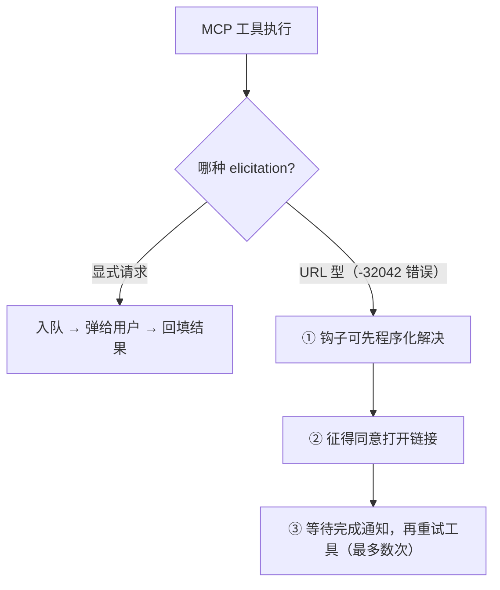

- **显式 elicitation**：工具主动请求，客户端弹给用户、回填后继续。
- **URL 型**：工具以特定错误码（`-32042`）表示"需要用户在浏览器完成某操作"，客户端进入"同意 → 等待 → 重试"的重试循环；钩子可在此介入程序化处理。

---

## 7. 关键设计取舍

| 取舍 | 做法 | 为什么 |
|------|------|--------|
| 一协议多传输 | stdio/SSE/HTTP/WS/InProcess/SDK/代理 | 覆盖本地、远程、IDE、托管各场景 |
| 工具加前缀 + 默认延迟 | `mcp__srv__tool` + deferred | 防重名冲突、控初始 prompt 体积 |
| 权限交中央系统 | MCP 工具默认 passthrough | 外部工具同样受统一规则约束 |
| 配置多源合并 | 全局/项目/企业/云/动态 | 灵活配置 + 企业受管 |
| 两套认证 | OAuth + XAA | 覆盖个人授权与企业跨账户 |
| 通道权限中继 | 白名单 + 结构化回复 | 让远程通道也能安全审批 |
| Elicitation 重试循环 | 同意→等待→重试 + 钩子介入 | 支持"需用户在外部完成"的工具 |

---

## 附录 · 涉及模块

- 客户端与传输：`services/mcp/client.ts`、`InProcessTransport.ts`、`SdkControlTransport.ts`、`MCPConnectionManager.tsx`
- 消息层语义：`services/mcp/client.ts`（`MCP_REQUEST_TIMEOUT_MS=60000`、`callMCPToolWithUrlElicitationRetry` 的 `signal`/`onProgress`、MCP 工具 `isConcurrencySafe = annotations.readOnlyHint`）；JSON-RPC 请求/通知由 `@modelcontextprotocol/sdk` 承载
- 命名归一：`services/mcp/normalization.ts`
- 资源工具：`tools/ListMcpResourcesTool/`、`tools/ReadMcpResourceTool/`
- 认证：`services/mcp/auth.ts`（`ClaudeAuthProvider`、`fetchAuthServerMetadata`、刷新/401 重试、`revokeServerTokens`、Keychain 存储）、`services/oauth/`；XAA `services/mcp/xaa.ts`（`performCrossAppAccess` 编排 + 四步 `discoverProtectedResource`/`discoverAuthorizationServer`/`requestJwtAuthorizationGrant`=RFC8693→ID-JAG/`exchangeJwtAuthGrant`=RFC7523→access_token）、`xaaIdpLogin.ts`
- 通道：`services/mcp/channelAllowlist.ts`、`channelPermissions.ts`、`channelNotification.ts`
- Elicitation：`services/mcp/elicitationHandler.ts`
- 配置：`services/mcp/config.ts`、`envExpansion.ts`、`officialRegistry.ts`、`claudeai.ts`
