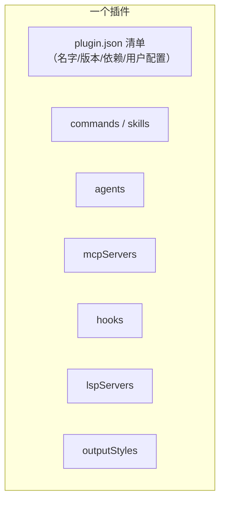
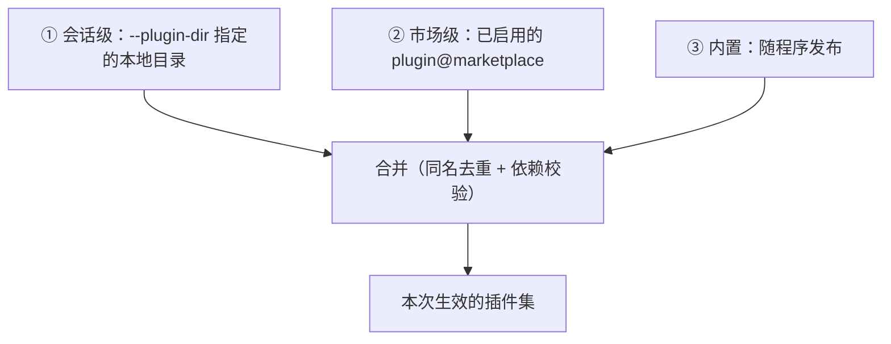
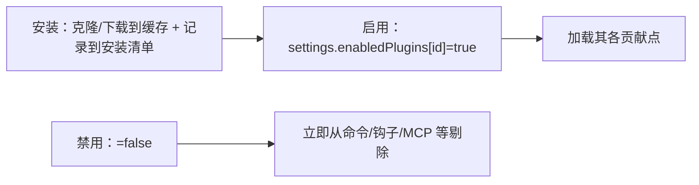
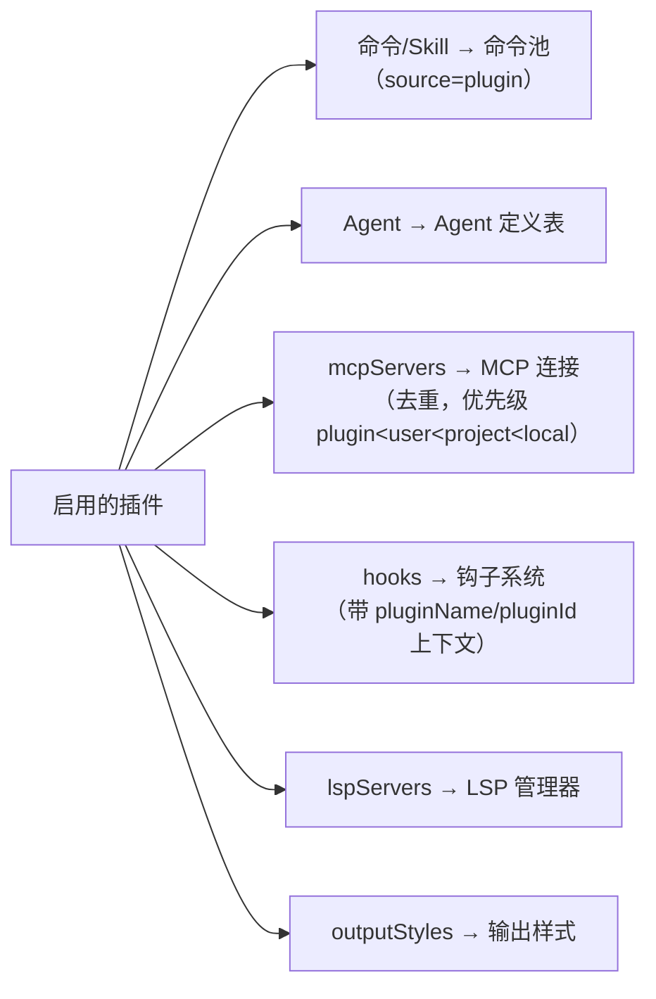

# Plugin 系统（Plugins）

> 讲清插件是什么（清单 + 多个贡献点）、从哪发现与安装、启用/禁用如何生效，以及各贡献点如何**汇入主系统**（命令、Agent、Skill、MCP、Hooks、LSP、输出样式）。
>
> **原则：源码为准。** 机制均从 `claude-code-cli` 求证；无法确证者标注「推断」。文末附涉及模块。

---

## 1. 插件是什么：一个"打包分发的贡献集合"

一个插件 = **一份清单（`plugin.json`）+ 若干贡献点**。它把前面各篇讲过的可扩展点**打包在一起分发**，装一次即可同时带来命令、Agent、Skill、MCP 服务器、钩子等。



- **清单**：声明元数据（名字、版本、作者、依赖）、各贡献点路径、安装时的用户配置项、通道绑定等。
- **贡献点**：命令/Skill、Agent、MCP 服务器、钩子、LSP 语言服务器、输出样式。
- **安全边界**：插件贡献的 Agent 有**额外限制**（例如不允许在 agent 级声明权限模式/钩子/MCP 服务器），避免插件借 Agent 定义绕过约束。

### 1.1 一个最小完整例子：`pr-helper`

**插件 = 一个目录：一份清单 + 若干"贡献物"**。各类组件默认按**约定目录**（`commands/`·`agents/`·`skills/`·`hooks/`）自动发现，也可在清单里显式写 `commandsPaths`/`skillsPaths` 等指别的路径。

```text
pr-helper/                          ← 插件根目录
├── .claude-plugin/
│   └── plugin.json                 ← 清单（唯一必需；源码定位 .claude-plugin/plugin.json）
├── skills/
│   └── standup/
│       └── SKILL.md                ← 贡献一个 Skill：/standup
├── agents/
│   └── reviewer.md                 ← 贡献一个子 Agent：reviewer
├── hooks/
│   └── hooks.json                  ← 贡献一个钩子
├── scripts/
│   └── block-force-push.sh         ← 钩子调用的脚本
└── .mcp.json                       ← 贡献一个 MCP 服务器
```

**① 清单 `.claude-plugin/plugin.json`**（`name`/`description` 必需，`version` 可选）：

```json
{
  "name": "pr-helper",
  "description": "PR 小助手：站会总结 + 评审子 Agent + 提交前检查 + 内部 MCP",
  "version": "0.1.0"
}
```

**② Skill `skills/standup/SKILL.md`**（= `prompt` 命令，见[《03》](./03-skill.md)）：

```markdown
---
description: 汇总今天的 git 改动，生成站会要点
when_to_use: 用户要"站会总结 / standup"时
---
读取今天的 git log 和 diff，用三条要点总结：做了什么、卡在哪、下一步。
```

**③ 子 Agent `agents/reviewer.md`**（`name` 即 `agentType`，见[《02》](./02-agent.md)）：

```markdown
---
name: reviewer
description: 只读评审改动、挑问题，不改文件
tools: Read, Grep, Glob
---
你是代码评审员，逐文件找 bug / 风格问题，输出清单，不做任何修改。
```

**④ 钩子 `hooks/hooks.json`**（生命周期事件，见[《07》](./07-hooks.md)）：

```json
{
  "PreToolUse": [
    { "matcher": "Bash", "hooks": [
      { "type": "command", "command": "$CLAUDE_PLUGIN_ROOT/scripts/block-force-push.sh" }
    ]}
  ]
}
```

> `$CLAUDE_PLUGIN_ROOT` 是插件根目录的注入变量（钩子命令里可用，指向本插件目录），所以脚本随插件一起分发、路径自适应。

**④-b 钩子脚本 `scripts/block-force-push.sh`**——命令型钩子的**输入/输出契约**（源码 `utils/hooks.ts`）：**输入**是 stdin 上的一段 JSON（含 `tool_name` / `tool_input` / `session_id` / `cwd` / `hook_event_name`）；**拦截**有两种方式——① 打印一段 JSON、`permissionDecision:"deny"`（`exit 0`）；② 直接 **`exit 2`**（阻断错误，stderr 回给模型）。这里用方式①：

```bash
#!/usr/bin/env bash
# PreToolUse 钩子：拦 force-push。工具调用以 JSON 从 stdin 传入。
input=$(cat)
tool=$(printf '%s' "$input" | jq -r '.tool_name  // ""')
cmd=$(printf '%s' "$input" | jq -r '.tool_input.command // ""')

# 只管 Bash；命中 git push --force / -f，但放行更安全的 --force-with-lease
if [ "$tool" = "Bash" ] \
   && printf '%s' "$cmd" | grep -Eq 'git[[:space:]]+push' \
   && printf '%s' "$cmd" | grep -Eq -- '(--force([[:space:]]|=|$)|(^|[[:space:]])-f([[:space:]]|$))' \
   && ! printf '%s' "$cmd" | grep -q -- '--force-with-lease'; then
  # 拒绝：reason 会回给模型
  cat <<'JSON'
{"hookSpecificOutput":{"hookEventName":"PreToolUse","permissionDecision":"deny","permissionDecisionReason":"force-push 被 pr-helper 拦截：请改用 --force-with-lease，或先 git pull --rebase。"}}
JSON
  exit 0
fi
exit 0   # 放行：不输出（或空 JSON）即可
```

- **`matcher:"Bash"`** 先粗筛（只有 Bash 调用才触发这个钩子），脚本内再按命令内容细判——**省得每个工具都跑脚本**。
- 拦下后模型收到 `permissionDecision:"deny"` + reason，于是**不会执行**该命令、并据 reason 改用安全做法。

**⑤ MCP 服务器 `.mcp.json`**（见[《05》](./05-mcp.md)）：

```json
{ "mcpServers": { "jira": { "command": "npx", "args": ["-y", "@acme/jira-mcp"] } } }
```

**装上之后（各贡献物分别汇入各自的池）**：

| 贡献物 | 装上后 | 并入哪 |
|--------|--------|--------|
| `skills/standup` | 用户能 `/standup`、模型能经 SkillTool 调 | 命令/技能池（[《03》](./03-skill.md)四源统一）|
| `agents/reviewer` | 可 `subagent_type:"reviewer"` 派生 | Agent 注册表（[《02》](./02-agent.md)§2③ 覆盖规则）|
| `hooks/hooks.json` | 每次跑 Bash 前先过脚本（如拦 `git push --force`）| 钩子表（[《07》](./07-hooks.md)）|
| `.mcp.json` | 多出 `mcp__jira__*` 工具 | 工具池（[《05》](./05-mcp.md)配置合并）|

- 插件 ID = **`pr-helper@<marketplace>`**（内置插件是 `name@builtin`）；用户在 `/plugin` UI 启/停，`/reload-plugins` 热重载 commands/agents/MCP。
- **一句话**：插件只是**分发容器**——每样贡献物本身还是你已认识的那些东西（skill/agent/hook/mcp），打包成"带 `plugin.json` 的目录"批发出去，装一次全带来。

---

## 2. 三种来源，按优先级合并

插件从三处发现，**会话级 > 市场级 > 内置**（同名取高优先级；受管设置可锁定）：



- **加载两模式**：启动走**仅缓存**（`loadAllPluginsCacheOnly`，不联网、不阻塞启动）；显式刷新才**联网克隆**新插件。
- **市场（Marketplace）**：插件来源可以是 GitHub / git / npm / pip / URL / 本地目录等；已安装信息记录在安装清单文件中（含安装路径、版本、作用域）。

---

## 3. 安装与启用/禁用



- **后台安装**：启动时后台协调市场（新增/更新/过期），不阻塞主流程；失败则提示手动 `/reload-plugins`。
- **启用即可见、禁用即隐藏**：只有**已启用**插件的贡献点会被加载；**禁用会立即清理**其钩子等（不必等重载），其余启用插件不受影响。

---

## 4. 各贡献点如何汇入主系统

这是理解插件的关键：插件本身不"运行"，它只是把贡献点**接线**到既有子系统里。



- **命令/Skill**：解析插件目录下的 `.md`（普通命令）与 `SKILL.md`（技能），命名带插件前缀（`插件名:命名空间:命令名`），汇入统一命令池（见[《Skill 系统》](./03-skill.md)）。
- **Agent**：解析 agent 定义并注入 Agent 定义表，带 `source=plugin` 标记（见[《Agent 系统》](./02-agent.md)）。
- **MCP**：把插件声明的 MCP 服务器并入 MCP 配置，**去重**并按优先级合并（插件级最低），再交给 MCP 连接（见[《MCP 协议》](./05-mcp.md)）；支持打包格式（MCPB）。
- **Hooks**：把插件钩子转成带插件上下文（根路径/名字/ID）的匹配器注册进钩子系统；禁用时**原子替换/剔除**（见[《Hooks 扩展系统》](./07-hooks.md)）。
- **LSP / 输出样式**：分别接入语言服务管理器与输出样式渲染。

> 换言之：**插件 = 各子系统贡献点的"批发包"**。它的价值不在于新增机制，而在于把"命令+Agent+Skill+MCP+钩子"**一次性打包、可分发、可开关**。

---

## 5. 关键设计取舍

| 取舍 | 做法 | 为什么 |
|------|------|--------|
| 插件是贡献集合 | 清单 + 多贡献点 | 一次分发多种扩展，统一开关 |
| 三源可覆盖 | 会话 > 市场 > 内置 | 本地调试优先、市场分发、内置兜底 |
| 启动仅缓存 | 不联网、不阻塞 | 保启动速度，联网留给显式刷新 |
| 启用/禁用即时生效 | 禁用立即剔除贡献 | 无需重载，行为可预期 |
| 贡献接线而非新机制 | 汇入既有子系统 | 复用命令/Agent/MCP/钩子体系 |
| Agent 贡献受限 | 禁止 agent 级敏感字段 | 防插件借 Agent 绕过约束 |
| MCP 去重按优先级 | plugin&lt;user&lt;project&lt;local | 用户/项目配置可覆盖插件默认 |

---

## 附录 · 涉及模块

- 类型与校验：`types/plugin.ts`、`utils/plugins/schemas.ts`
- 加载核心：`utils/plugins/pluginLoader.ts`（`loadAllPluginsCacheOnly`、合并/依赖）
- 内置：`plugins/builtinPlugins.ts`、`plugins/bundled/index.ts`
- 贡献点加载：`utils/plugins/loadPluginCommands.ts`、`loadPluginAgents.ts`、`mcpPluginIntegration.ts`、`loadPluginHooks.ts`、`loadPluginOutputStyles.ts`
- 安装与操作：`services/plugins/PluginInstallationManager.ts`、`pluginOperations.ts`、`pluginCliCommands.ts`
- 市场：`utils/plugins/marketplaceManager.ts`
