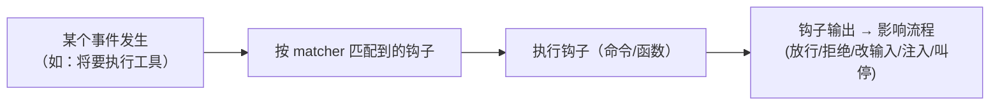
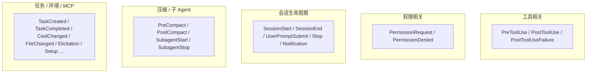
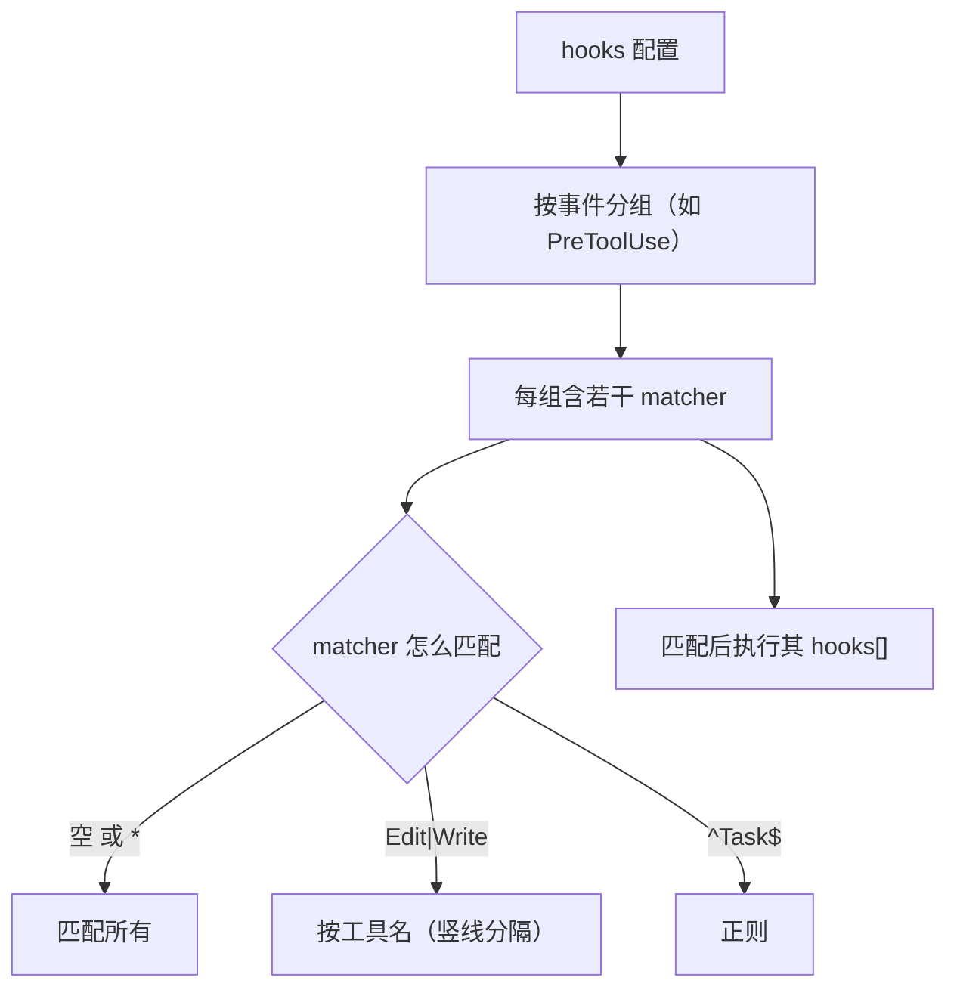
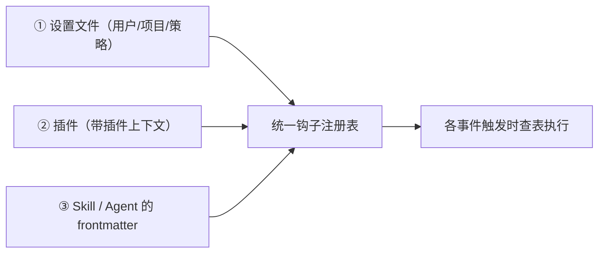
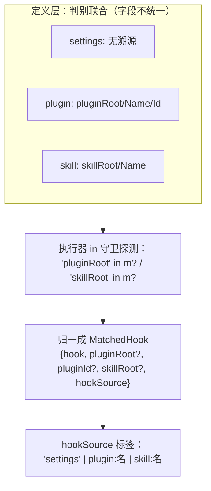
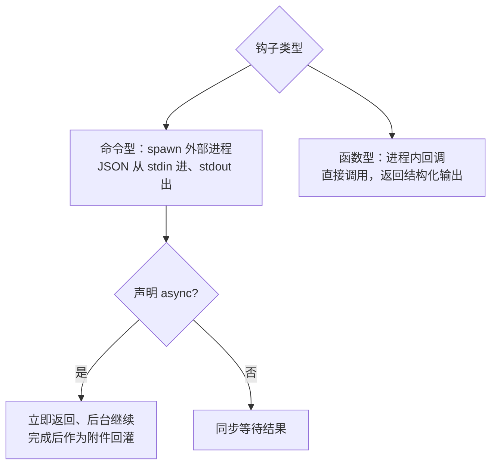
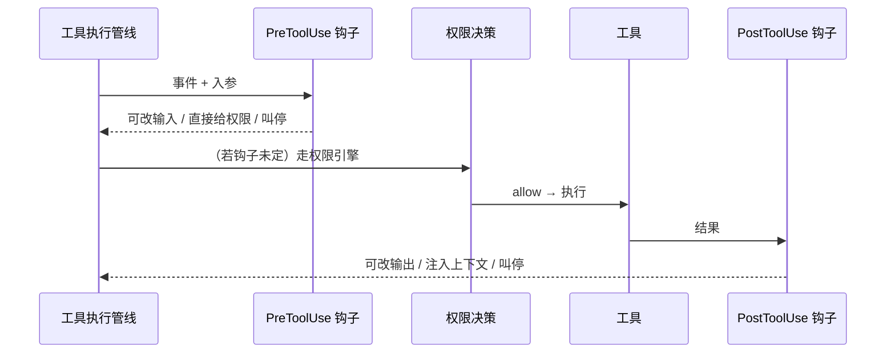

# Hooks 扩展系统（Hooks）

> 讲清 Hooks 是什么、有哪些事件、如何配置与注册、命令型/函数型如何执行、以及**钩子如何介入并改变主流程**（放行/拒绝、改写输入、注入提醒、叫停）。这是 Claude Code 最核心的**行为可编程扩展点**。
>
> **原则：源码为准。** 机制均从 `claude-code-cli` 求证；无法确证者标注「推断」。文末附涉及模块。

---

## 1. Hooks 是什么：在关键节点插入你的逻辑

Hooks 让用户/插件在系统运行的**关键生命周期节点**插入自定义逻辑——可以是**外部命令**（收发 JSON），也可以是**进程内函数**。钩子不仅能"旁观"，还能**改变流程**（拦截工具、改写输入、注入上下文、叫停本轮）。

---

## 2. 有哪些钩子事件

系统定义了一大批事件（`entrypoints/sdk/coreTypes.ts`），覆盖工具、会话、权限、压缩、子 Agent、任务、文件等生命周期：

最常用的是 **PreToolUse / PostToolUse**（工具执行前后）与 **PermissionRequest**（权限决策时）——它们让"每次工具调用"都可被拦截与改写。

---

## 3. 配置与匹配

钩子在设置里按"**事件 → 匹配器 → 钩子列表**"组织（`schemas/hooks.ts`）：

除了 `matcher`（按工具名/模式匹配），钩子还可带 `if` 条件（基于权限规则模式匹配入参）进一步筛选。

---

## 4. 注册：三种来源汇入统一表

钩子从三处来，最终合并进**统一注册表**（`bootstrap/state.ts` 的 `registeredHooks`）：

插件钩子会带上插件根路径/名字/ID 等上下文；插件被禁用时其钩子**被立即剔除**（见[《Plugin 系统》](./06-plugin.md)）。

### 4.1 各来源的上下文字段：**内核统一、溯源不统一、执行层再归一**

一个常见误解是"各来源的钩子字段是不是一套统一结构"。**不是**——它们是一个**判别联合（discriminated union）**：**共享一个内核 `{matcher?, hooks}`，各来源再挂各自需要的溯源字段**（`utils/settings/types.ts`）：

| 来源 | 类型 | matcher | hooks | 额外溯源字段 |
|------|------|:---:|:---:|------|
| **用户/项目/策略 settings** | `HookMatcher` | ✓ | ✓ | **无**（裸内核）|
| **插件** | `PluginHookMatcher` | ✓ | ✓ | `pluginRoot` + `pluginName` + `pluginId`（**3 个**，id 格式 `name@marketplace`）|
| **Skill** | `SkillHookMatcher` | ✓ | ✓ | `skillRoot` + `skillName`（**2 个**，无 id）|
| **SDK / 内建回调** | `FunctionHookMatcher` 等 | — | ✓ | 无 `pluginRoot`（执行器正靠"有没有 pluginRoot"与插件区分）|

- **统一的只有内核**：`{matcher?, hooks: HookCommand[]}`。每个 `HookCommand`（`{type, command/prompt/url}`）与它的 **I/O 契约（stdin JSON → `exit 2`/`permissionDecision:deny`）跨来源完全一致**——这正是"**钩子函数签名一样**"的根据；溯源字段是**匹配器级兄弟字段**，不进钩子入参、不改签名。
- **溯源字段并不统一**：settings 一个没有、plugin 三个、skill 两个，连命名都只是**平行**（`pluginRoot` vs `skillRoot`）而非同名。

**执行层用 `in` 守卫探测、再归一成一个 `MatchedHook`**（`utils/hooks.ts:1690-1709`）——"统一"发生在这里，而非定义层：

**两个执行期细节（都源自 `utils/hooks.ts`）**：

- **plugin 与 skill 共用同一个环境变量 `$CLAUDE_PLUGIN_ROOT`**：命令型钩子执行前，`pluginRoot`（插件）或 `skillRoot`（skill）都会被写进 `CLAUDE_PLUGIN_ROOT` 环境变量并替换命令串里的 `${CLAUDE_PLUGIN_ROOT}`（`:844-845/889-908`）——**skill 复用了这个名字，没有单独的 `CLAUDE_SKILL_ROOT`**；settings 钩子两者都不设。
- **去重键按来源根命名空间隔离**（`hookDedupKey`，`:1453-1454`）：键 = `${pluginRoot ?? skillRoot ?? ''}\0${payload}`。
  - **settings 钩子共享 `''` 前缀** → 同一条命令在 用户/项目/local 各写一遍会**收敛成一条**（去重的本意）；`new Map` 保留**最后一条**，即最后合并的作用域胜出。
  - **plugin/skill 钩子带各自根做前缀** → 两个插件都写 `${CLAUDE_PLUGIN_ROOT}/hook.sh` **不会**被误去重（展开后指向不同文件，gh-29724）。
  - 带不同 `if` 条件的钩子视为不同键；**纯 callback/function 钩子跳过整个去重**（各自唯一，快路径，`:1723-1729`）。
- **"仅受管钩子"过滤**也靠这套字段：企业策略下用 `'pluginRoot' in matcher` 判定（`:1524`），只放行带 pluginRoot 的受管来源。

> 一句话：**内核统一（matcher + hooks + 执行契约 → 签名一致），溯源字段不统一（settings 无 / plugin 三 / skill 二），执行器用 `in` 守卫归一成 `MatchedHook` + `hookSource` 标签**；`$CLAUDE_PLUGIN_ROOT` 被 plugin/skill 共用，去重键按来源根隔离以免跨来源误合并。

---

## 5. 两种执行形态

- **命令型**：启动外部进程，把事件数据以 **JSON 从 stdin** 传入、从 **stdout 读回** JSON 结果——语言无关，任何可执行程序都能当钩子。支持声明**异步**（立即返回、后台跑完再回灌结果）。
- **函数型**：进程内回调，用于内建钩子（如会话文件访问控制）。
- **并行 + 超时**：同一事件匹配到的多个钩子并行执行，每个有独立超时（工具类默认较宽、会话结束类很短）。

---

## 6. 钩子如何改变流程（决策能力）

这是钩子的威力所在——其结构化输出能**直接干预**主流程：

| 输出 | 效果 |
|------|------|
| `permissionDecision: allow/deny/ask` | 在 PreToolUse/PermissionRequest 阶段直接给出权限决策 |
| `decision: approve/block` | 旁路或否决工具执行 |
| `updatedInput` | **改写工具入参**后再执行 |
| `updatedMCPToolOutput` | 改写 MCP 工具**输出** |
| `continue: false`（+`stopReason`） | **阻止继续**后续轮次 |
| `systemMessage` / `additionalContext` | 向上下文**注入** `<system-reminder>` 或补充信息 |
| 退出码 `2` | 阻塞式错误；其他非零码为非阻塞错误 |

对照[《工具·调用·权限系统》](./01-tool-call-authority.md)：**PreToolUse 钩子在权限决策之前**运行、可直接给决策或改输入；**PermissionRequest 钩子**能在"要问用户"之前 allow/deny；**PostToolUse 钩子**能改输出或叫停。这就是为什么权限篇里说"钩子是多个硬 deny 口子之一"。

---

## 7. 安全与错误处理

钩子会执行**任意代码**，所以有多重防护：

- **工作区信任**：交互模式下，未接受工作区信任**不运行钩子**（防在陌生仓库里被 RCE）。
- **企业策略**：可限制"只允许受管钩子"或"全部禁用"。
- **环境隔离**：给钩子进程注入稳定的项目根、插件根、以及可写环境变量的文件路径等，避免受 worktree 切换干扰。
- **错误多为非阻塞**：钩子异常、JSON 不合法、HTTP 4xx/5xx 通常记为**非阻塞错误**（用户可见但流程继续）——注意这与权限的"失败关闭"不同：钩子失败不等于放行，最终放行与否仍由权限引擎（headless 下兜底 deny）决定。

---

## 8. 关键设计取舍

| 取舍 | 做法 | 为什么 |
|------|------|--------|
| 生命周期全覆盖 | 20+ 事件 | 工具/会话/权限/压缩/子代理皆可插入 |
| 命令型语言无关 | JSON stdin/stdout | 任何可执行程序都能当钩子 |
| 函数型内建用 | 进程内回调 | 低开销、类型安全的内部钩子 |
| 三源统一注册 | 设置/插件/Skill-Agent | 统一表、可开关、可清理 |
| 钩子可改流程 | 权限/输入/输出/继续/注入 | 真正的"行为可编程" |
| 信任门 + 隔离 | 工作区信任、环境隔离、超时 | 抵御 RCE 与阻塞风险 |
| 失败非阻塞 | 异常不硬拦 | 钩子出错不至于卡死主流程 |

---

## 附录 · 涉及模块

- 事件与类型：`entrypoints/sdk/coreTypes.ts`、`schemas/hooks.ts`、`types/hooks.ts`
- 来源字段（判别联合，§4.1）：`utils/settings/types.ts`（`HookMatcher` 内核、`PluginHookMatcher`=+`pluginRoot`/`pluginName`/`pluginId`、`SkillHookMatcher`=+`skillRoot`/`skillName`）
- 执行核心：`utils/hooks.ts`（`executeHooks`、`getMatchingHooks`、`execCommandHook`、`executePre/PostToolHooks`；§4.1 归一：`in` 守卫探测 → `MatchedHook`{`hook`,`pluginRoot?`,`pluginId?`,`skillRoot?`,`hookSource`}、`hookSource` 标签、`hookDedupKey`=`${pluginRoot??skillRoot??''}\0${payload}`、`CLAUDE_PLUGIN_ROOT` 由 plugin/skill 共用、`'pluginRoot' in matcher` 受管过滤）
- 工具钩子接线：`services/tools/toolHooks.ts`
- 注册：`bootstrap/state.ts`（`registerHookCallbacks`）、`utils/hooks/registerSkillHooks.ts`、`utils/plugins/loadPluginHooks.ts`
- 触发点：`utils/processUserInput/`、`utils/sessionStart.ts`、`services/compact/` 等
