# 上下文装配与 system-reminder（Context Assembly）

> 一个常被忽视、却极其核心的机制：**模型看到的上下文不是静态历史，而是被"装配"出来的**。本篇讲清：如何收集一批"附件（Attachment）"、如何包装成 `<system-reminder>` 注入、各类的**注入频率**（节流/delta/事件/预取，§5.3B）、**持久化与累积**（谁落盘、如何被四道闸门兜住，§5.3A/C）、以及 IDE/记忆/计划/待办等具体机制。
>
> **读前先建立两个口径**（贯穿全篇）：**①"装配"≠"每轮全量重发"**（频率因类而异）；**② 后置附件会落盘累积**，只有前置 `userContext` 不落盘——累积受节流/压缩等多重控制。详见 **§5.3**。
>
> **原则：源码为准。** 机制均从 `claude-code-cli/utils/attachments.ts` 求证；无法确证者标注「推断」。文末附涉及模块。

---

## 1. 核心观念：上下文是"每轮装配"出来的

除了对话历史本身，系统在**每一轮**都会额外收集一批**附件（Attachment）**——待办快照、计划模式指令、相关记忆、诊断、技能清单、用量提醒等——包装成 `<system-reminder>` 注入，作为模型这一轮输入的一部分。

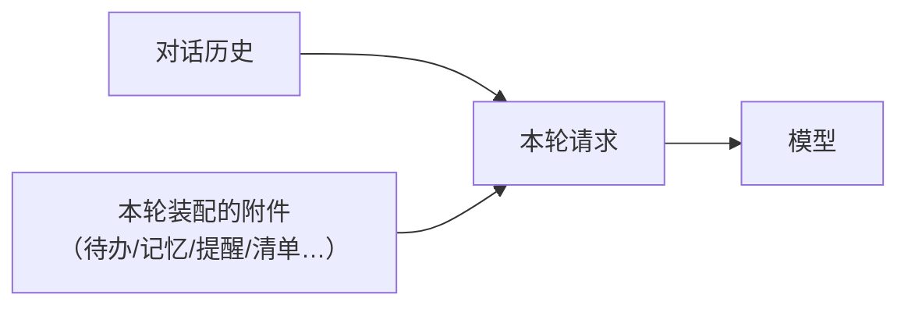

**关键推论**：模型"当下知道什么"，一部分来自历史，另一部分来自**装配的附件**。所以像待办这种**状态**，即使历史很长也不会被遗忘——它被**节流地重注最新快照**（印证[《工具·调用·权限系统》](./01-tool-call-authority.md)§3.1 的"状态型工具被持续重注"）。

> **两个贯穿全篇、务必先建立的口径**（详见 §5.3）：
> 1. **"装配"≠"每轮全量重发"**：附件的**注入频率因类而异**——只有少数（计划/自动/待办提醒）按节流"隔几轮重注"，多数是 **delta（变了才发）/ 事件触发（发生才发）/ 每提交轮预取一次**。
> 2. **后置附件会落盘、会累积**（不是 transient）——只有**前置 `userContext`** 不落盘。累积由"节流 + delta/事件 + 会话上限 + 压缩清场"多重兜住，不会失控。

---

## 2. 每轮如何收集：三阶段聚合

> **这里的"每轮"= API 交互轮**（`query()` 每次循环迭代、工具执行后调用一次），**非提交轮**。也就是说**收集很频繁**——正因如此，§4 的 full/sparse 与待办催办才**改按"人类轮"节流**，避免每个 API 交互轮都注入（会过频约 20 倍）。

每个 API 交互轮通过一个聚合入口（`getAttachments`）分三类并行收集，每个收集器都用统一包装器兜底（失败即返回空，不影响其他）：

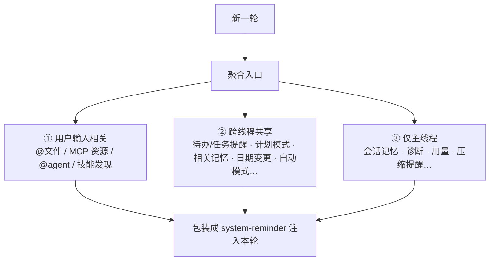

- **失败隔离**：每个收集器独立、失败返回空，个别出错不拖垮整批。
- **有超时护栏**：附件收集有秒级超时，避免阻塞主循环。

---

## 3. 附件有哪些：一张能力地图

附件种类很多（数十种），按用途可归为几类：

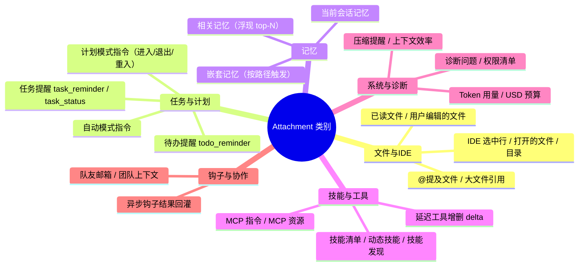

这些附件让模型"被提醒"当前处境：还有哪些待办、计划模式的规矩、相关的项目记忆、诊断报错、可用技能、当前烧了多少 token……很多能力（如待办、计划模式、记忆浮现）本质上都是**靠这套附件机制生效的**。

> ⚠️ 这张图只列**类别**，**不代表它们都"每轮注入"**——各类的**注入频率**（节流/delta/事件触发/预取）与**是否落盘累积**差别很大，统一见 **§5.3**。

---

## 4. 全量 vs 稀疏：重复提醒但不刷屏

若每轮都把"完整清单"塞进去会很费 token；若从不重申模型又会遗忘。系统用**全量/稀疏节流**折中（以计划模式为例）：

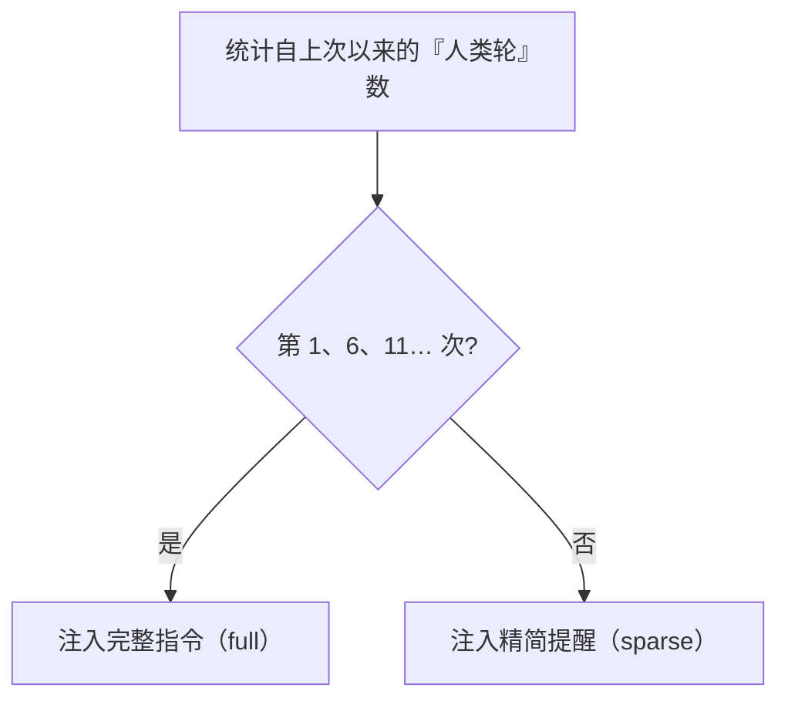

- **按"人类轮"计数，而非助手轮**：源码明确——因为附件收集在**每个 API 交互轮**都会被调用，若按助手轮/每条消息计数会**过频约 20 倍**；改按"人类轮"计数才对齐"每几轮提醒一次"的语义。
  - **"人类轮" = 提交轮 = 真实用户消息**：源码判定为"**非 `isMeta`、且不含 `tool_result` 的 user 消息**"，即真实用户敲入的那条。每次 `submitMessage` 恰好产生一条，故人类轮数 = 真实提交数。（对比：API 交互轮数**每条** user 消息都 +1、含 tool_result，所以频繁得多。）
- **典型节奏**：计划模式/自动模式约**每 5 个人类轮**注入一次，且每第 N 次为**全量**、其余为**稀疏**。待办/任务提醒则在"多轮未使用相关工具"时才提醒。
- **退出即重置**：退出计划/自动模式会重置节流计数。

> **§4.1~4.3：任务与计划类附件详解。** 这组附件常被混作一类，其实是**两个家族、机制不同**，下面各设一节展开：
>
> | 家族 | 附件 | 绑定什么 | 本质 | 详见 |
> |------|------|----------|------|------|
> | **权限模式提醒** | `plan_mode`（进入/重入/退出） | 当前**权限模式** | 反复提醒"这个模式下该怎么行动"，full/sparse 节流 | §4.1 |
> | | `auto_mode` | 当前**权限模式** | 同上，但背后是"分类器放行" | §4.2 |
> | **待办催办** | `todo_reminder` / `task_reminder` | **工具用没用**（隔多久没更新待办） | "好久没维护待办了" + 附当前快照 | §4.3 |
> | **任务状态** | `task_status` | **Task 框架的每个任务** | 每轮同步各任务的状态/增量 | §4.3 |

### 4.1 计划模式（`plan_mode`）——不止是提醒，还是权限模式 + 本地计划文件

`plan_mode` 附件反复注入的是**计划模式工作流约束**：只读探索、迭代访谈用户、**本轮只能以 `ExitPlanMode` 或 `AskUserQuestion` 结束**、不许做实际改动。变体：进入/常驻、**重入**（退出后又回来且已有计划文件）、**退出**（一次性通知）。

但它背后**不只是一条 reminder**，还牵动两件事（这是与一般模式的关键差别）：

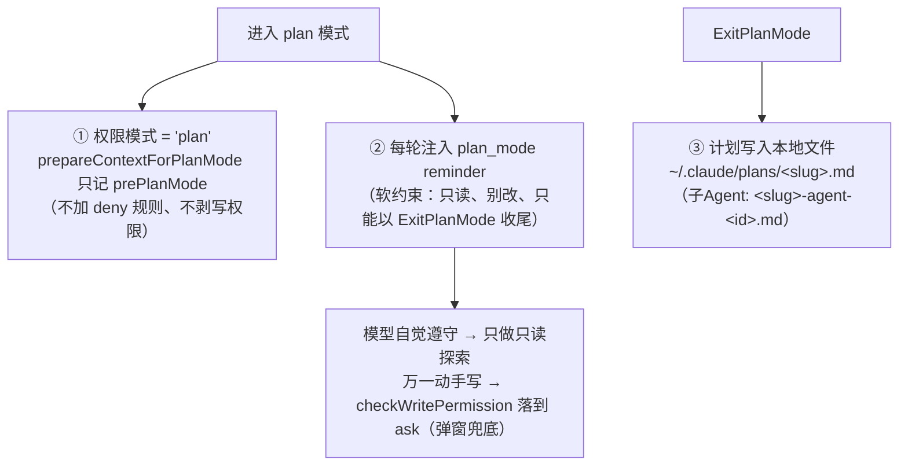

> ⚠️ **重大更正（此前高估了 plan 模式）**：把源码里该拦写的地方都翻了一遍——`prepareContextForPlanMode`（进 plan 时）**不加 deny、不剥写权限**；`checkWritePermissionForTool`（Write/Edit/Notebook）**无 plan 分支**，plan 下写文件落到末尾的 **`ask`**；`bashPermissions`、权限引擎、`filterToolsForAgent` 均**无 `mode==='plan'→拦写`**。**结论：plan 权限模式（主 Agent）没有"权限层禁写硬闸"**，它的只读是**软约束**（reminder 指示 + 写会 `ask` 兜底），靠模型自觉。

- **谁是"硬只读"、谁是"软只读"——最容易混的一点**：

| | 载体 | 硬 / 软 | 能不能编辑 |
|---|---|---|---|
| **Plan / Explore 子 Agent** | agent 定义的 `disallowedTools`（`FILE_EDIT`/`FILE_WRITE`/`NOTEBOOK_EDIT` 全禁）| **硬（结构性）** | **不能**——写工具**根本不在它的 schema 里** |
| **plan 权限模式（主 Agent）** | `plan_mode` reminder + 写落到 `ask` | **软（提示 + 兜底）** | 技术上**能**（会弹 `ask`），靠 reminder 约束不去写 |

  > 所以"绝对不能编辑"的是**子 Agent**（工具集被砍）；主 Agent 的 plan 模式**不是硬锁**——这也解释了"感觉还在 plan 模式却像在实施"：那是模型在做 plan 允许的**只读探索**（读/搜/派 Explore），真要写会 `ask`，而真正的落地实施在 `ExitPlanMode` 批准、模式切回之后。
- **计划存本地文件**：`ExitPlanMode` 把计划写到 **`~/.claude/plans/<slug>.md`**（磁盘文件，**不是内存、不是 transcript**）。**对比一般模式**：一般模式没有这个计划文件——这是 plan 模式相对一般模式"多出来"的东西（注意：并非"多出一道权限层只读硬闸"，见上）。

**"换提示词"的准确说法**：进入 plan 模式后模型每轮**多收到一大段计划工作流指令**，但它是 **`plan_mode` 附件（每轮注入的 `<system-reminder>`，full/sparse 节流）**，**不是把 API 的 `system` 字段整个换掉**。基础系统提示里只有对权限模式的**通用说明**；plan 的**详细 5 阶段工作流是附件**。

**谁触发进入**：两条路径——**不是只有模型能决定**：

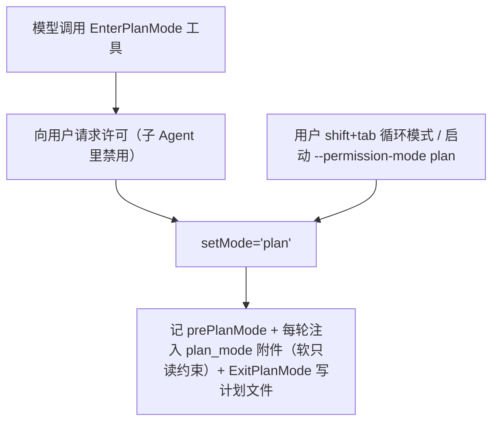

- **模型提议**：调用 `EnterPlanMode` 工具（`tools/EnterPlanModeTool`）→ **向用户请求许可**（描述原文 *Requests permission to enter plan mode*）→ 批准后 `setMode:'plan'`；**子 Agent 上下文里禁用**（*cannot be used in agent contexts*）。
- **用户直接切**：**shift+tab** 循环权限模式（`confirm:cycleMode`）或启动时 `--permission-mode plan`。

**模型凭什么决定进 plan——引导在"工具描述"里，不在系统提示**：让模型判断"该不该进 plan"的那段文案，是 **`EnterPlanMode` 工具自己的 `description`/`prompt`**（`tools/EnterPlanModeTool/prompt.ts`），核心是一段 **"When to Use This Tool"**，列了 7 个该进的条件（新功能、多方案、改现有结构、架构选型、多文件、需求不清、涉及用户偏好）+ "简单小修不要用"。它走 **API `tools` 参数 → `<functions>`**（见 §5.2），**不是**基础系统提示、**也不是** `<system-reminder>`。

**WHEN vs HOW 的分工**（`isPlanModeInterviewPhaseEnabled` 开关）：

| 阶段 | 讲什么 | 通道 |
|------|--------|------|
| 进入前 | **何时该进**（7 条件） | `EnterPlanMode` 工具描述 → `<functions>` |
| 进入后 | **在 plan 里怎么干**（5 阶段工作流） | 每轮 `plan_mode` 附件 → `<system-reminder>` |

即：**工具描述告诉模型"何时进" → 模型判断并调用（需用户批准）→ 进入后附件每轮告诉它"怎么干"**。这也是通例——**驱动模型行为的引导，很多在工具描述里，而非系统提示**。

**7 个"何时该进"条件**（工具描述原文提炼）：

| # | 条件 | 例子 |
|---|------|------|
| 1 | 新功能实现 | "加登出按钮""加表单校验"——放哪？点击后干啥？ |
| 2 | 多种可行方案 | "给 API 加缓存"→ Redis/内存/文件？ |
| 3 | 改动现有行为/结构 | "改登录流程""重构组件" |
| 4 | 架构选型 | 实时更新 WebSocket vs SSE vs 轮询；状态管理 Redux vs Context |
| 5 | 多文件改动 | 预计触及 >2-3 个文件 |
| 6 | 需求不清 | "让 app 更快"先定位瓶颈；"修 bug"先查根因 |
| 7 | 涉及用户偏好 | 本想用 `AskUserQuestion` 澄清方向的，改用 EnterPlanMode |

（"When NOT"：单行/明显小修、需求已很具体的，别用。）

**5 阶段"在 plan 里怎么干"**（进入后每轮 `plan_mode` 附件原文提炼）：

| 阶段 | 目标 | 关键动作 |
|------|------|----------|
| Phase 1 · Initial Understanding | 吃透需求 | 用 **Explore 子 Agent 并行探索**代码 + 提问；此阶段**只用 Explore**，优先找可复用实现 |
| Phase 2 · Design | 设计方案 | 启动 **Plan 子 Agent**，基于 Phase 1 结果设计 |
| Phase 3 · Review | 对齐用户意图 | 审阅 Phase 2 的方案 |
| Phase 4 · Final Plan | 产出最终计划 | 写进计划文件（篇幅有 control/trim/cut/cap 变体做实验） |
| Phase 5 · Call ExitPlanMode | 请用户批准 | 调 `ExitPlanMode`——本轮**只能**以 `ExitPlanMode` 或 `AskUserQuestion` 结束 |

> 呼应[《Agent 系统》](./02-agent.md)：Phase 1 用 **Explore agent**、Phase 2 用 **Plan agent**——plan 模式内部本身就是一套"探索→设计→评审→定稿→提交"的**多子 Agent 编排**。

**反复改计划时发生什么——5 阶段是"引导"不是"状态机"**：`ExitPlanMode` 呈现计划后，你若给反馈要改（"No"选项自带反馈输入框），源码让模型"*refine your plan based on the feedback*"、**留在 plan 模式**；批准才退出。关键是**代码里没有 phase 状态机**（无 `currentPhase` 之类），5 阶段纯是每轮附件里的**提示文字**。

**改稿走哪条轮——别当成新 query（这里曾写错，已按源码更正）**：弹窗的批准/拒绝是 `ExitPlanMode` 的**权限 `ask`**，三种结果**去向不同**：

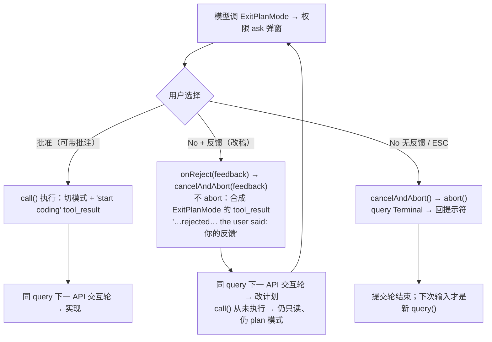

**三种结果一张表**（决定性变量只有两个：`call()` 跑没跑、是否 `abort()`）：

| 结果 | 触发 | abort? | `call()` 执行? | 模式 | tool_result / 去向 | 落到哪一级轮 |
|------|------|--------|----------------|------|--------------------|--------------|
| **批准**（可带批注） | 选 Yes（`onAllow(…, acceptFeedback)`）| 否 | ✅ 执行 | plan → **prePlanMode**（解锁）| "User has approved your plan. You can now start coding …"（带批注时追加 `User feedback on this plan: …`）| **同 query，下一 API 交互轮** → 实现 |
| **No + 反馈**（改稿） | "No"框里打字（`onReject(feedback)` → `cancelAndAbort(feedback)`）| **否** | ❌ 未执行 | **不变**：仍 plan、仍只读 | 合成 `REJECT_MESSAGE_WITH_REASON_PREFIX + 反馈`（"…rejected… the user said: 你的反馈"）| **同 query，下一 API 交互轮** → 改稿 |
| **No 无反馈 / ESC** | 直接确认无输入 / 取消（`cancelAndAbort(undefined)`）| **是** | ❌ 未执行 | 不变（但循环终止）| 命中 `abortController.abort()` → query 返回 **Terminal** | **提交轮结束**；下次输入才是新 `query()` |

- **改稿 = 同一个 `query()` 内、下一 API 交互轮**（**不是**新提交轮）：你的反馈作为 **`ExitPlanMode` 这个 tool_use 的合成 tool_result** 带回（`REJECT_MESSAGE_WITH_REASON_PREFIX + 反馈`）。因为 `checkPermissions` 判 `ask` 被拒、`call()` **从未执行**，所以**模式没切、权限仍只读、`plan_mode` 附件仍在**——始终"在计划模式里"，但走的是 **API 交互轮**，不是新 `query()`。
- **批准也能带反馈（`acceptFeedback`）——不用先拒再改**：在"No"框里写了字却仍选 Yes 时，反馈经 `onAllow` 作为 `acceptFeedback` 追加进"start coding"的 tool_result（`User feedback on this plan: …`），让你"边批准边补一句（如'顺便更新 README'）"而**免去一次 拒绝→重规划 的往返**。此路 `call()` 照跑、模式照切，属**批准**分支。
- **只有"无反馈的纯拒绝 / ESC"才终结提交轮**：`cancelAndAbort(undefined)` 命中 `abort()` → query 返回 Terminal → 回提示符；你**下次敲的消息**才是新 `query()`（新提交轮）。
- **深浅由模型定**：小改往往就是"重读+编辑计划文件"；大改可能再派 Explore/Plan 子 Agent 重新探索（≈重走 Phase 1/2）。**没有代码逼它"必须重走 5 步"或"只能轻改"**——循环到你**批准**才退出。

> **一句话对照**（三种结果都在**同一提交轮**里决出，只有末种会结束它）：批准→同 query 续跑**实现**；No+反馈→同 query 续跑**改稿**（仍 plan 模式）；No 无反馈/ESC→**abort**、提交轮结束。所以"改稿"和"批准后实现"**同属 API 交互轮**，区别只在 `call()` 跑没跑、模式切没切。

**通用原则：代码管"约束"，提示管"流程"**——5 阶段只是给模型的**软引导**（可偏离：简单任务可能压缩/跳步，复杂任务才老实走全套），真正**锁死**的只有代码级约束。这个分法适用于**整个 Agent**：

| 层面 | 谁定 | 模型能否绕过 | plan 模式里的例子 |
|------|------|--------------|-------------------|
| **约束**（硬） | 代码（权限层 + 工具逻辑） | **不能** | 退出必须经 `ExitPlanMode` 且**需用户批准**、计划写本地文件；**子 Agent** 的工具集只读（Plan/Explore `disallowedTools` 砍掉写工具）|
| **流程**（软） | 提示（`plan_mode` 附件文字） | **能** | 5 阶段怎么走、派几个子 Agent、探索多深；**主 Agent 的 plan 只读本身也是软的**（reminder 约束 + 写落 `ask`，非权限层硬 deny）|

> 记住这条分界能避免很多误解：**很多你以为"它一定会这么做"的行为，只是提示在引导、模型可能偏离；只有落到代码/权限层的才是铁律。**（例：工具的并发/权限是代码铁律，而"先探索再动手""维护待办""plan 模式主 Agent 只读"是提示软引导。）

#### 4.1-bis 批准 `ExitPlanMode` 之后：解锁 + **同一循环续跑实现**（不是新对话轮）

上图"批准 → 开始实现"这一步常被想当然,展开讲清:**批准的那一刻,后续实现就在同一个 `query()` 里顺下去了,不需要用户再发一句话。** 机制是我们全书那条主线"**tool_result = 下一轮输入**"的又一实例。

**`ExitPlanMode` 是个"必须问人"的普通工具**:模型写完计划后**自己调它**(它是 deferred 工具,即使 plan 模式也在可调用清单里);它 `requiresUserInteraction()` 恒真、`checkPermissions` 恒返回 **`ask`("Exit plan mode?")**——即权限流水线 **1e"工具声明必须交互"** 那档,**连 bypass 都压不掉**,一定弹给用户批。

你点"批准"后,工具的 `call()` 干**两件事** + 回一条**催开工的 tool_result**:

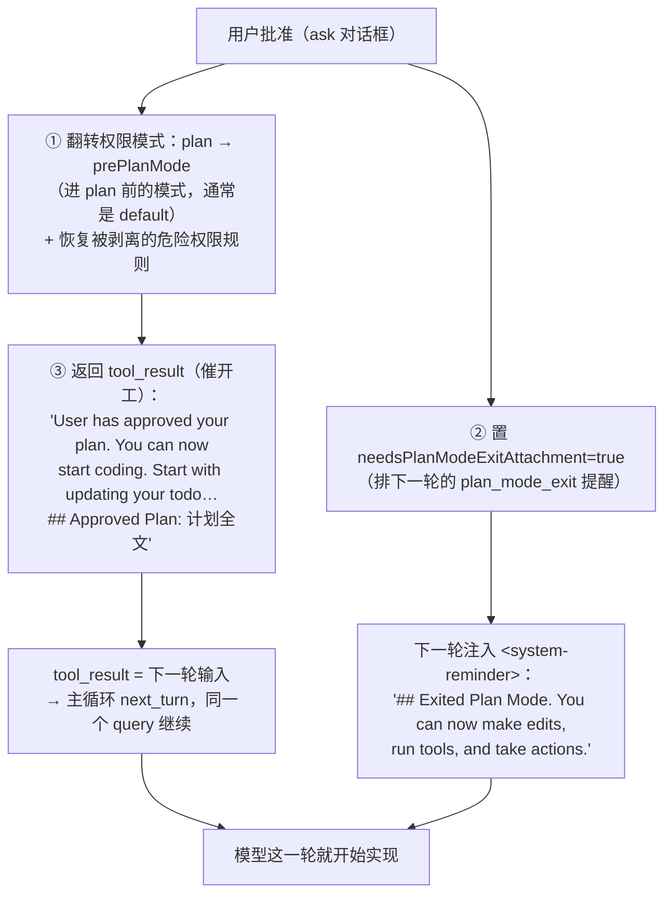

三个动作合起来 = "**解锁 + 递上计划 + 催开工**":

1. **切回模式**:`toolPermissionContext.mode` 从 `plan` 切回 **`prePlanMode`**——`plan_mode` reminder 的软只读约束随之停发、被剥离的危险权限还原。(注意:plan 模式本无"权限层禁写硬闸",所谓"解锁"主要是**停掉软约束 + 恢复到 prePlanMode 的放行基调**;若 prePlanMode 是 acceptEdits/auto,这一步才真正放宽了写的自动放行。)
2. **tool_result 即下一轮 user 输入**:内容是"已批准、可以开始写代码、先更新 todo、附计划全文",主循环按 `next_turn` **在同一个 `query()` 里进下一轮**,模型读到就直接实现。
3. **再补一条提醒**:下一轮注入 `plan_mode_exit` 的 `<system-reminder>`("已退出计划模式,可以动手了")。

**所以没有"另起对话""等用户再发话"这回事**——它是"工具调用 + tool_result 回灌"驱动的,不是新提交轮。(**批准后开工**与**改稿(No+反馈)**其实**同属"同一 query 的下一 API 交互轮"**,区别只在 `call()` 跑没跑、模式切没切——详见本节前文 §4.1 的"三种结果一张表";真正开新 `query()` 的只有"无反馈拒绝/ESC→abort"。)

**三个容易想当然的坑(源码为准):**

| 坑 | 真相 | 源码依据 |
|----|------|----------|
| 以为"退出计划 = 之后全自动放行" | ❌ 退回的是 **`prePlanMode`**(进 plan 前的模式,通常 `default`),**不是 acceptEdits**;实现阶段写文件/命令**照走正常权限 ask**,除非你进 plan 前本就是 acceptEdits/auto/bypass | `call()` 里 `mode: restoreMode = prePlanMode ?? 'default'` |
| 以为"Plan 子 Agent 批准后也会实现" | ❌ 若调用者是子 Agent(`isAgent`),tool_result 变成 *"User has approved the plan. There is nothing else needed from you now. Please respond with 'ok'"*——**Plan 子 Agent 只产出计划就返回**,实现交回父/主 Agent | `mapToolResultToToolResultBlockParam` 的 `isAgent` 分支 |
| 以为"团队队友也弹本地框问用户" | ❌ `isTeammate() && isPlanModeRequired()` 时**不问本地用户**,而是把 `plan_approval_request` 写进 **team-lead 邮箱**、返回"**收到批准前不要动手**",**阻塞等 leader 异步回信** | `call()` 的 teammate 分支 + `writeToMailbox('team-lead', …)` |

> 一句话:**普通主 Agent 下,批准 = 权限模式即刻解锁 + tool_result 催开工 + 同一 `query()` 续跑实现;计划正文存 `~/.claude/plans/`,压缩/clear 不丢、实现时可回看。**

### 4.2 自动模式（`auto_mode`）——远不止 reminder，是"分类器放行"

**先纠一个误解**：auto 模式**不是"某些操作默认通过 + reminder"**（那样太像 plan 的镜像）。auto 与 plan 其实是**两个极端**——**plan = 全拦（只读）；auto = 用 AI 判断自动放行有风险的操作**。reminder 只是它的一小部分。

**auto_mode 附件本身**（每轮 full/sparse）：full 版是 6 条自主守则——立即执行、少打断、**重行动轻规划**、接受随时纠偏、**不做过度破坏**（删数据/改生产仍需确认）、**不外泄数据**（发消息/贴密钥需授权）；sparse 版一句"仍在 auto，自主执行、少打断、重行动"。

**但 auto 的内核在权限层**（多在[《10》](./10-permission-rules.md)[《11》](./11-bash-security.md)展开，这里汇总）：

| 机制 | 做什么 |
|------|--------|
| **① 分类器判定（核心）** | 每个本该"问用户"的动作 → 交 **LLM 分类器**判安/危 → allow/deny；**不是固定放行清单**（`yoloClassifier`，[《11》](./11-bash-security.md)§8） |
| **② 快路** | "acceptEdits 下本就允许" / "工具在安全白名单" → **跳过分类器**省成本 |
| **③ 进入时剥离危险 allow 规则** | 摘掉过宽危险规则（`Bash(*)` 等）防被架空（[《11》](./11-bash-security.md)§4），**退出时恢复** |
| **④ 拒绝追踪 + 升级** | 连续/累计拒绝过多 → **退回问用户**（[《10》](./10-permission-rules.md)§7） |
| **⑤ 熔断 + 自动踢出** | 分类器反复失败 / 模型不支持 → **强制回 `default`** 并注入 `auto_mode_exit` |
| **⑥ 仍硬性要问的工具** | PowerShell、声明需交互的工具、`.git`/`.claude` 等安全护栏 —— auto 下也强制问 |
| **⑦ 对外隐藏** | 对 SDK 映射成 `default`（[《10》](./10-permission-rules.md)§8） |

**怎么进入 / 退出**：

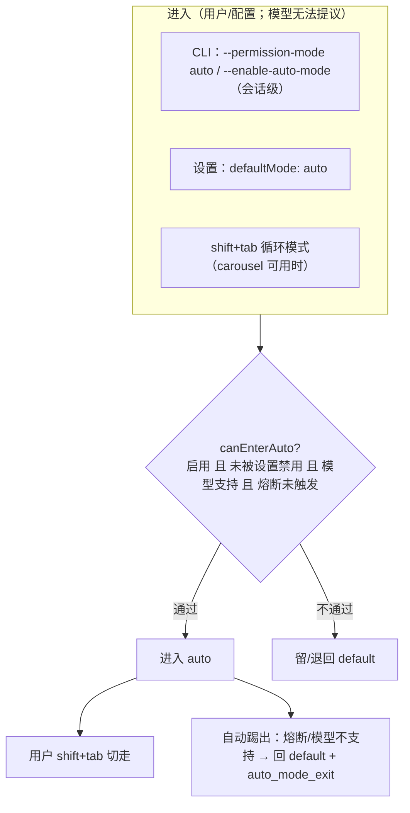

- **进入**：CLI 标志、`defaultMode: auto` 设置、或 shift+tab 循环；都要过 **`canEnterAuto`** 门槛（功能启用、未被设置禁用、**模型支持分类器**、熔断未触发）。
- ⚠️ **与 plan 的关键区别**：**模型不能提议进 auto**（没有 `EnterAutoMode` 工具）——它是**用户/配置**的选择；而 plan 模型可调 `EnterPlanMode` 提议。
- **退出**：① 用户 shift+tab 切走；② **自动踢出**——分类器熔断或模型不支持时强制回 `default`、恢复被剥的危险规则、注入 `auto_mode_exit`。

> 一句话：**plan 与 auto 是权限模式的两极——plan 靠"只读 + 引导"全拦，auto 靠"分类器 + 快路 + 剥险规则 + 拒绝升级 + 熔断自退"自动放行**；两者都叠加每轮的模式 reminder 附件。

### 4.3 待办与任务（`todo_reminder` / `task_reminder` / `task_status`）——待办催办 vs 任务状态

**注意：这里有两套都叫 "task" 的东西，别混——数据源不同：**

| | `todo_reminder`(V1) / `task_reminder`(V2) | `task_status` |
|---|---|---|
| 数据源 | `utils/tasks.ts`（`listTasks`） | `utils/task/framework.ts`（读 `appState.tasks`） |
| 追踪什么 | **模型自己的待办清单**（`subject`/`status`/`blockedBy`） | **后台/子 Agent 任务注册表**（`local_agent`/远程/队友的运行状态） |
| 对应面板 | "◼ tasks (…)" 待办清单 | 后台 Agent 任务进度（"▸ 某 agent 运行中"） |
| 附件作用 | 隔久没更新 → 催办 + 当前清单快照 | 每轮同步各**运行中 agent 任务**状态 + `deltaSummary`（新增输出） |

- **`todo_reminder`（V1）与 `task_reminder`（V2）= 同一机制**：距上次用待办工具 **≥10 个人类轮** 且 距上次提醒 **≥10 轮** 才注入"好久没维护待办了 + **当前清单快照**"。由 `isTodoV2Enabled` **二选一**（V1=`TodoWrite` 单清单，V2=`TaskCreate/Update/List`），同一套阈值。这清单是**状态型工具**——模型自己列/自己打勾、存储只被动记录（见[《工具·调用·权限系统》](./01-tool-call-authority.md)§3.1）。
- **`task_status` = 另一套**：读的是**运行时派生出去的 Agent 作业**（`appState.tasks`，见[《Agent 系统》](./02-agent.md)后台任务），每轮同步它们的状态与新增输出——**与"待办清单"不是一份数据**。

**待办清单具体由哪些工具实现**（工具名也复用了 "Task"，同样别混）：

| 归属 | 工具 | 干什么 | store |
|------|------|--------|-------|
| **待办清单 V1** | `TodoWrite` | 一把梭：用新清单**整体重写**（`!isTodoV2Enabled`）| `utils/tasks.ts` |
| **待办清单 V2** | `TaskCreate` / `TaskUpdate` / `TaskGet` / `TaskList` | 单条 CRUD，支持 `blockedBy`/`owner`（`isTodoV2Enabled`）| `utils/tasks.ts` |
| **后台 Agent 作业** | `Agent`（派生）+ `TaskStop` / `TaskOutput`（管控）| 停止/取输出 | `appState.tasks` |

- **待办清单**：V1 只一个 `TodoWrite`（整表重写、粗粒度）；V2 是 `TaskCreate/Update/Get/List` 一组 CRUD（细粒度、可多 Agent 协调）；**二者互斥**，都写 `utils/tasks.ts`。
- ⚠️ **`TaskStop`/`TaskOutput` 不是待办清单工具**——它们读 `appState.tasks`（后台 Agent 注册表），属 `task_status` 那套。

> 归纳：**`plan_mode`/`auto_mode` 是"权限模式行为守则"**；**待办清单**（`TodoWrite` 或 `TaskCreate/Update/Get/List` → `utils/tasks.ts` → `todo_reminder`/`task_reminder`）是"模型的便签，自己列/自己打勾"；**后台 Agent 作业**（`Agent`+`TaskStop`/`TaskOutput` → `appState.tasks` → `task_status`）是"派出去在跑的活"。两套都叫 "task"，但**工具、store、附件三处全分开**。这些附件都经 `<system-reminder>`、标 `isMeta`——但**注意会落盘并在历史里累积**（只有前置 `userContext` 才真正不落盘，见 §5.1），靠节流/压缩兜住体积。

---

## 5. 如何注入：包装成 system-reminder

附件最终被转换成**用户侧消息**并包裹在 `<system-reminder>` 标签里，合并进本轮请求：

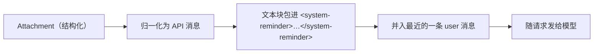

- **模型知道该怎么看待它**：系统提示里明确告诉模型——`<system-reminder>` 是**系统自动加的**、含有用信息与提醒，且**与所在的具体工具结果/用户消息无直接关系**。这避免模型把提醒误当成用户的话。
- **随流注入**：在主循环里，每个工具轮之后就生成这些附件消息并 `yield` 出来、并入工具结果一起回灌（与[《全景与主循环》](./00-overview.md)的流式回传一致）。

### 5.1 三条通道：system 字段 / 前置 reminder / 后置附件（各装什么、会不会变）

模型这一次请求里的"非对话内容"，其实分**三条不同的路**进去——最容易混的是把 git、cwd 当成"前置 userContext"，其实它们在 **system 字段**里。先钉死映射（**源码为准**）：

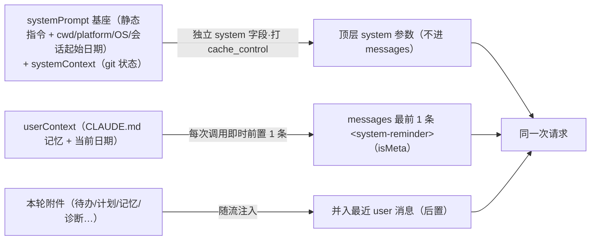

| 装什么 | 走哪条通道 | 源码 |
|---|---|---|
| 静态指令 + **cwd / platform / OS / 会话起始日期** + **git 状态** | **顶层 `system` 字段**（`buildSystemPromptBlocks` 打 `cache_control`）| `constants/prompts.ts:642-691`（cwd/平台/OS）、`context.ts:116`（`getSystemContext`→git）、`claude.ts:3213`/`:1376`/`:1472` |
| **CLAUDE.md 记忆 + 当前日期** | **messages[0] 的 `<system-reminder>`**（isMeta、仅 1 条）| `getUserContext`→`{claudeMd, currentDate}`（`context.ts:155-188`）、`prependUserContext`（`utils/api.ts:449`）|
| 待办 / 计划 / 记忆附件 / 诊断 / 用量… | **messages 尾部** `<system-reminder>` | 本篇 §3/§5 |

- **前置**：`userContext`（**CLAUDE.md + 日期**，**不是** cwd/git）由 `prependUserContext` 在**每次调模型时**拼**一条** `<system-reminder>` 放 messages **最前**（`isMeta`）。
- **后置**：本篇各类附件，注入到**最近一条 user 消息**（工具结果之后）。
- **`systemPrompt` 独立成路**：角色/规则/工具说明 + cwd/平台/OS/日期 + git 状态，走 API 的**独立 `system` 字段**（打 cache_control），既不是前置也不是后置——**三条路，别混**。特别地：**git 在 system 字段（`systemContext`），不在前置 reminder**。

**会不会变（易错，与《08》§4.1 呼应）**：

- **一个提交轮内**：三段前缀全部**逐字节不可变**——`systemPrompt`/`systemContext`/`userContext` 在 `queryLoop` 入口解构为只读 param（注释 *"Immutable params — never reassigned during the query loop."*，`query.ts:251-262`），连轮内压缩都不动。
- **跨提交轮**：`userContext` 与 `systemContext` 都是 **`memoize`（会话级冻结）**——**不是每次提交跟着环境重读**；**只有 cwd 改 / 压缩**才 `cache.clear()` 刷新（`context.ts:32-33`）。所以 git 状态、日期在会话中途通常**不刷**（跨午夜也不刷，除非清缓存）。而基座 `systemPrompt`（**不 memoize**）每个提交轮**现读 cwd/平台重建**，cwd 改了它确实变——但系统提示按 `SYSTEM_PROMPT_DYNAMIC_BOUNDARY` 分成**静态段（可缓存）+ 动态段（cwd/平台/OS/git，不打 cache_control）**，cwd 变**只 churn 未缓存的动态尾段、不破静态大前缀**（详见《08》§4.1）。**换言之：`systemPrompt` 会随 cwd/平台变，但变的部分被结构性地挡在缓存边界之外。**
- **真正每轮都变的动态内容**（待办/计划/记忆浮现/诊断）**不进 system**，走**尾部** `<system-reminder>` 附件——正是为让 `system` 字段稳定可缓存（这也是本篇后置通道存在的根本动机）。

**持久化差别（易错）**：三条路里，只有**前置 `userContext` 真 transient**——

- **前置 `userContext`**：`prependUserContext` 即时拼一个新数组给 API，**从不进 `mutableMessages`、不落盘、不累积**。
- **后置附件会落盘并累积**：`QueryEngine` 的 `case 'attachment'` 会 `mutableMessages.push` + `recordTranscript`——**进活动上下文、在历史里累积**（靠节流/去重/会话上限/压缩兜住，见 §6.3 记忆 60KB 上限）。
- ⚠️ **`isMeta` ≠ "不落盘"**：`isMeta` 只表示"合成消息"（非用户敲入），不代表不持久化。只有前置 `userContext` 因根本不进 messages 才真正不落盘。

### 5.2 工具 schema 不走 system-reminder：`<functions>` vs `<system-reminder>`

一个高频误解：**工具定义不是 `<system-reminder>` 附件**。工具 schema 走 API 的**独立 `tools` 参数**（带 `input_schema`、cache_control），由服务端**渲染成 prompt 顶部的 `<functions>` 块**（每个工具一行 `<function>{…}</function>`）。只有**延迟工具的名字**和**技能清单等上下文**才经 `<system-reminder>`。一张表分清"谁走哪条通道":

| 内容 | 通道 | 形式 |
|------|------|------|
| 常规工具定义 | API `tools` 参数 | 服务端渲染成 `<functions>`（prompt 顶部） |
| 延迟工具的**名字** | messages 里的附件 | `<system-reminder>`（`deferred_tools_delta`） |
| ToolSearch 取回的 schema | 工具结果 | `<functions>` 块 |
| 技能清单 / 待办 / 记忆 / 诊断 / 用量 | messages 里的附件 | `<system-reminder>` |

- **常规工具** → `tools` 参数 → `<functions>`（延迟加载与 ToolSearch 见[《工具·调用·权限系统》](./01-tool-call-authority.md)§6）。
- **延迟工具（MCP/`shouldDefer`）**：初始只把**名字**经 `<system-reminder>` 告知模型（`deferred_tools_delta`），完整 schema 要靠 **ToolSearch** 拉取、以 `<functions>` 块返回。
- **技能清单**（本篇附件之一）确实是 `<system-reminder>`——但**技能是经 SkillTool 调用的提示流程，不是工具 schema**，别混（见[《Skill 系统》](./03-skill.md)）。

> 一句话：**工具 schema 走 `tools` 参数（→ `<functions>`）；只有"延迟工具的名字"与"技能清单/上下文提醒"才经 `<system-reminder>`。** 与[《00》](./00-overview.md)§2.1 呼应：`system` / `tools` 都是 API 的独立参数，都不在本篇的附件通道里。

### 5.3 持久化 · 注入频率 · 累积控制（统一口径）

前面各处提到"落盘""累积""每轮"，这里**统一钉死**，避免自相矛盾。三问讲清。

#### A. 谁落盘、谁累积？

| 通道 | 进 `messages`/落盘? | 会累积? | 说明 |
|------|:---:|:---:|------|
| `systemPrompt`（+ `systemContext`：git 状态）| ❌ | ❌ | 走 API 独立 `system` 字段；基座每提交轮重建，`systemContext` 为 memoize（会话冻结）|
| `tools` schema | ❌ | ❌ | 走 API 独立 `tools` 参数（→`<functions>`）|
| **前置 `userContext`**（CLAUDE.md + 日期）| ❌ | ❌ | `prependUserContext` 即时拼、**从不进 `mutableMessages`**；内容为 memoize（会话冻结，cwd 改/压缩才刷）|
| **后置各类附件**（待办/计划/记忆/IDE/诊断…）| ✅ | ✅**（受控）** | `QueryEngine` `case 'attachment'` → `recordTranscript`，**进活动上下文并累积** |

> 纠正一个曾经的误解：**`isMeta` ≠ 不落盘**。`isMeta` 只表示"合成消息"，附件仍会落盘。真正 transient 的只有**前置 `userContext`**。

#### B. 各附件"多久注入一次"？（频率因类而异，多数≠每轮）

| 频率 | 附件 | 说明 |
|------|------|------|
| **① 节流·每 N 人类轮** | `plan_mode`/`auto_mode`、`todo_reminder`/`task_reminder` | **唯一**周期性重注的一档；约每 5~10 人类轮、且多为 sparse 小条 |
| **② delta·变了才发** | `deferred_tools_delta`、`agent_listing_delta`、`mcp_instructions_delta` | 工具/agent/MCP **增删**才发（字段就是 `addedNames`/`removedNames`）|
| **③ 首次 + 增量** | `skill_listing` | 首次全量、之后靠 `sentSkillNames` **只发新增**；**压缩后不重列整份**（故意，非疏漏——分"怎么调 / 有哪些"两层,详见 §5.3C 末的技能清单专述）|
| **④ 事件触发·发生才发** | @文件、IDE 打开/选中、编辑的文件、MCP 资源、嵌套记忆、诊断、钩子结果、队友邮箱、`task_status` | 只在那件事发生时注入 |
| **⑤ 每提交轮预取一次** | 相关记忆 | 依据不变的提问，`query()` 开头预取一次（见 §6.3）|

> **所以"很浪费"是误解**：只有 ① 是周期性重注（且小、稀疏）；②③④ 都"变了/发生了才发"，⑤ 每提交轮一次。**绝大多数 API 交互轮根本不产生新附件**，更不会每轮把工具/技能/MCP 一大坨重塞。

#### C. 累积怎么被兜住？——四道闸门 + 压缩清场

```mermaid
flowchart TB
    Att["后置附件会落盘累积"] --> G1["① 节流：多数轮不发新的"]
    Att --> G2["② delta/事件：变了/发生才发"]
    Att --> G3["③ 会话上限：相关记忆封顶 60KB/会话"]
    Att --> G4["④ 压缩清场：旧史（含旧附件）被摘要/丢弃、计数器重置"]
    G4 --> Strip["压缩时先剔除：skill_listing/skill_discovery + 图片/文档<br/>其余（todo/plan/记忆）一起喂给摘要模型"]
    Strip --> Reset["压缩后重置缓存：readFileState.clear()、记忆计数、微压缩状态…"]
    Reset --> After["压缩后：旧附件全从链里消失；下一轮按各自频率重新生成"]
```

- **压缩喂给摘要模型的**（`compact.ts`）：`stripReinjectedAttachments` 把 `skill_listing`/`skill_discovery` + 图片/文档**先剔除**再压缩（喂摘要纯浪费）；其余附件（待办/计划/记忆）**会一起喂给摘要模型**。压缩后旧附件随旧史被丢弃（指针重链，见[《04》](./04-session-compaction.md)§4.1）。
- **压缩后重置的缓存**（`postCompactCleanup.ts`）：清 `readFileState`（`compact.ts:521/920` → 已读文件去重重置，全文可重发）、记忆 60KB 计数（随旧史归零）、微压缩状态、系统提示分段缓存、分类器审批等。
  - ⚠️ **例外——技能清单压缩后不重列**：`postCompactCleanup` **故意不**调 `resetSentSkillNames`。所以压缩后**待办/计划/记忆会按各自频率重来，但技能清单不会重列**——这是**有损取舍**：模型对"没用过的 skill"会失去感知（详见下面专述）。

> **技能清单压缩后为何不重列——把"怎么调"和"有哪些"分开看**
>
> 常见疑问:「`sentSkillNames` 不重置、清单又随旧史被压缩丢了,模型岂不是不知道有哪些 skill、也不知道怎么调?」拆成两层就清楚了——两者载体不同、命运也不同:
>
> | | 载体 | 每轮是否重发 | 压缩后 |
> |---|---|---|---|
> | **怎么调 skill** | `SkillTool` 走 API **`tools` 参数**(→ `<functions>`) | ✅ 每轮随 schema 重发 | **永在** |
> | **有哪些 skill(名单+描述)** | 仅 `skill_listing` 这条 `<system-reminder>` | ❌ 只"首次 + 增量" | **不重列(会丢)** |
>
> **诚实结论(别当无损兜底)**:通道① 的工具描述说"去 system-reminder 找名单",但通道② 压缩后**不重发**——那句指引**指向一个空信箱**。**所以压缩后模型确实拿不到完整名单了**,这是**设计者明知并接受的有损取舍**,不是"有兜底所以等于没丢"。
>
> - **"怎么调"永在,压缩动不了**:`SkillTool` 每轮都在 `tools` 参数里,其描述明写 *"Available skills are listed in system-reminder messages"*,入参 `skill` 是**自由字符串**(非 enum)。工具 schema **本就不含名单**,但"能调 skill + 调用协议 + 匹配到必须先调"每轮随 schema 重发——这半边和压缩无关。
>
> **压缩后到底还剩什么(逐条·源码级)**:
>
> | 还剩 / 丢了 | 具体 | 源码验证 |
> |---|---|---|
> | ✅ **怎么调** | `Skill` 工具 + 调用协议 + "匹配到必须先调" | 每轮随 `tools` schema 重发 |
> | ✅ **用过的 skill(全文)** | 本会话 invoke 过的,连正文补回 | `invoked_skills`(`createSkillAttachmentIfNeeded`)|
> | 🟡 **摘要蹭到的名字** | 摘要散文若提到某 skill,名字还在 | 概率性,不保证 |
> | ✅ **磁盘 skill 集真变** | 插件 reload / 新增文件 → 重新播报 | `skillChangeDetector` → `resetSentSkillNames` |
> | ✅ **skill-search 构建** | 按需重新发现 | `EXPERIMENTAL_SKILL_SEARCH` 的 discovery/ToolSearch |
> | ❌ **没用过 + 摘要没提 + 磁盘没变 + 非 skill-search** | 这类 skill 模型**就是不知道了** | `getSkillListingAttachments` 见 `sentSkillNames` 全命中 → 返回 `[]` |
>
> **为何敢这么丢**(注释原话 *"pure cache_creation with marginal benefit"*):压缩后通常在继续**同一件事**,相关 skill 多半已用过(→`invoked_skills` 保住)或在摘要里;重列整份 ~4K tokens 是纯 `cache_creation`,而"压缩后恰好第一次要用一个没碰过的 skill"是低频事件。**用极低概率的一次遗忘,换每次压缩省 4K token。**(两条通道的**真实内容示例**——`<function>` 块与 `skill_listing` 原文——见[《03 Skill 系统》](./03-skill.md)§4.1。)

#### D. IDE 文件附件：多为"轻量标记"

| 附件 | 内容 | 触发/去重 |
|------|------|-----------|
| `opened_file_in_ide` | **仅一行文件名**（"The user opened the file X"，约 15 tokens，**无内容**）| 反映**当前活动文件**；切走再切回 → 会再出现，但可忽略 |
| `selected_lines_in_ide` | 选中文本（截断 ≤2000 字符）| **只在你真的选中文字时**才发 |
| `already_read_file` | 一句"你已读过此文件" | @提及的文件**没改动**且**仍在 `readFileState` 里**时只发这句，**不重发全文**（内容级去重，基于内存缓存 `readFileState`，非扫消息）|

> **"打开新文件又切回旧 tab 会不会注入"** → 会再出现一条 `opened_file_in_ide` **文件名标记**（成本可忽略）；**文件全文**在未改动时有 `already_read_file` 去重、不白重发。
>
> **压缩后要重置吗——是，源码正是这么做的**：压缩会 `context.readFileState.clear()`（`compact.ts:521/920`）**清空"已读追踪"**。因为压缩把文件内容从上下文丢掉了，若不清空则 `already_read_file` 会**误说"已在上下文里"**。清空后：**压缩后再 @/读该文件会重新发全文**（去重被重置）——与相关记忆 60KB 计数器"压缩后重置"同理。（`readFileState` 也是 **LRU**，满了自动淘汰。）

---

## 6. 记忆系统：三类记忆 + 浮现机制

"记忆"在附件里其实有**三类**，常被混为一谈——尤其"当前会话记忆"**不是**原始历史 message。先分清：

### 6.1 三类记忆对比

| 名称 | 是什么 | 来源 | 触发/注入 |
|------|--------|------|-----------|
| **相关记忆（Surfacer）** | 跨会话的**事实**文件（top-N） | `memdir/` 记忆文件 | 每轮按相关性排序取前若干 |
| **当前会话记忆** | 本会话的**提取式摘要**（结构化，有"Current State""Errors & Corrections"等段） | SessionMemory 从对话**熬**出 | 增量提取、按 token 预算自我压缩 |
| **嵌套记忆** | 子目录里的 **`CLAUDE.md`** 项目说明 | 文件树 | 碰到该目录下文件时按路径触发 |

三者**都经 `<system-reminder>` 注入，但都不是原始历史 message**——历史 message 本身就是请求里的 `messages` 数组，无需 reminder。要点厘清：

- **当前会话记忆 ≠ transcript**：它是从对话里**蒸馏出的浓缩摘要**（"进展到哪、犯过什么错、纠正了什么"），用于压缩前置、跨压缩保要点（呼应[《04》](./04-session-compaction.md)AutoCompact 的 SessionMemory 前置）；原始对话是另一回事。
- **嵌套记忆**：顶层 `CLAUDE.md` 常驻，**深层目录的 `CLAUDE.md`** 只有当你碰到那个目录下的文件时才按路径注入（去重避免反复注入）。

### 6.2 文件式记忆的构成与路径

"相关记忆"的底层是 `memdir/` 的**文件式记忆**（注意 **`MEMORY.md` 只是索引、不是记忆本身**）：

```
~/.claude/projects/<项目(清洗后的路径)>/memory/
  MEMORY.md              ← 索引：一行一条「- [标题](file.md) — 钩子」，无 frontmatter
  user_role.md           ← 一条记忆（frontmatter: name/description/type）
  feedback_testing.md    ← 一条记忆
  logs/YYYY/MM/…md        ← 按日期的追加日志
```

- **每条记忆一个 `.md`**，带 `type: user|feedback|project|reference` 等 frontmatter；`MEMORY.md` 是**一行一条的目录**。
- **路径**默认 `~/.claude/projects/<项目>/memory/`（根 `~/.claude`，按**项目/git 根**分目录），可被环境变量 `CLAUDE_COWORK_MEMORY_PATH_OVERRIDE` 或项目设置覆盖。
- 与[《04》](./04-session-compaction.md)的会话 transcript 是**邻居**：`~/.claude/projects/<项目>/` 下，`<sessionId>.jsonl` 是逐会话对话记录、`memory/` 是跨会话记忆（细节：transcript 按 **cwd**、memory 按 **git 根**分目录）。

### 6.3 浮现（Surfacer）：按相关性挑 top-N

"相关记忆"注入前要先**挑**，机制值得单独看：

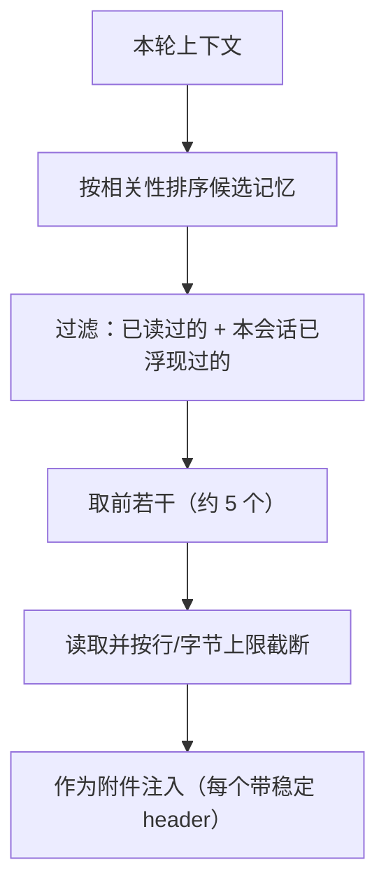

- **每"提交轮"一次，不是每 API 交互轮**（易错点）：相关记忆的检索依据是**用户这次的提问**，而提问在一轮 `query()` 的多次 API 交互中不变——所以源码在 `query()` **开头 prefetch 一次、消费一次**（注释原文 *Fired once per user turn — the prompt is invariant across loop iterations*），**不**每个交互轮重复检索。这与其他附件（每 API 交互轮都收集）不同。
- **有预算**：每次注入约 5 个、每个约 4KB（约 **20KB/提交轮**），另有**会话级上限约 60KB**（≈3 次满注入）兜住整会话总量，避免无限膨胀。
- **去重**：已读过或本会话已浮现过的不重复注入。
- **异步预取**：相关记忆改为**异步预取**、主循环消费前等其就绪，避免阻塞。
- **稳定 header 保缓存**：每条记忆预计算一个稳定头部，减少对 prompt 缓存的扰动。

---

## 7. 关键设计取舍

| 取舍 | 做法 | 为什么 |
|------|------|--------|
| 上下文每轮装配 | 历史 + 每 API 交互轮收集附件 | 状态/提醒不随历史变长而丢失 |
| 收集器失败隔离 | 统一包装、失败返回空 + 秒级超时 | 单点出错不拖垮整批、不阻塞循环 |
| 注入频率因类而异 | 节流/delta/事件触发/每提交轮预取（见 §5.3B）| 只在必要时发，绝大多数轮不产生新附件 |
| 全量/稀疏节流 | 按人类轮计数、每 N 轮全量 | 既反复提醒又不刷屏费 token |
| 幂等快照而非增量 | 每次注入当前完整/概要状态（体积有界）| 单次注入小、始终最新态（**注意仍会落盘累积**，靠节流+压缩兜住，见 §5.3）|
| 后置附件持久化 + 累积受控 | 落盘累积，但四道闸门（节流/delta·事件/会话上限/压缩清场）兜住 | 状态可 `--resume` 恢复，又不失控膨胀 |
| system-reminder 包装 | 统一标签 + 系统提示说明 | 模型正确区分"系统提醒"与"用户话" |
| 记忆浮现有预算 | top-N + 字节上限 + 去重 + 异步 + 60KB 会话上限 | 相关性优先、控成本、不阻塞 |
| 稳定 header | 预计算记忆头部 | 减少 prompt 缓存扰动 |
| IDE 用轻量标记 | `opened_file` 仅文件名、全文走 `already_read_file` 去重 | 跟随 IDE 焦点又几乎零成本 |

---

## 附录 · 涉及模块

- 附件聚合与各收集器：`utils/attachments.ts`（`getAttachments` / `getAttachmentMessages`；频率配置 `RELEVANT_MEMORIES_CONFIG`/`TODO_REMINDER_CONFIG`；IDE `getOpenedFileFromIDE`/`getSelectedLinesFromIDE`；delta `deferred_tools_delta` 等）
- 附件 → 消息 / system-reminder 包装：`utils/messages.ts`（`normalizeAttachmentForAPI`、`wrapMessagesInSystemReminder`、各 `case '…'` 渲染）、`memdir/memoryAge.ts`
- 持久化：`QueryEngine.ts`（`case 'attachment'` → `recordTranscript`）；前置 transient：`utils/api.ts`（`prependUserContext`）
- 压缩时的附件处理：`services/compact/compact.ts`（`stripReinjectedAttachments`、`stripImagesFromMessages`、`readFileState.clear()`）
- 压缩后缓存重置：`services/compact/postCompactCleanup.ts`（含"故意不重置技能清单"的取舍）；已读文件去重与状态：`utils/fileStateCache.ts`（`readFileState`，LRU）
- 主循环消费点：`query.ts`（记忆预取 `startRelevantMemoryPrefetch`）
- 系统提示说明：`constants/prompts.ts`（system-reminder 段落）
- 记忆来源：`memdir/`（记忆文件与路径 `memdir/paths.ts`）、`services/SessionMemory/`
- 计划模式与计划文件：`utils/planModeV2.ts`、`utils/plans.ts`（`getPlanFilePath`，`~/.claude/plans/`）、`tools/EnterPlanModeTool/`、`tools/ExitPlanModeTool/`、`utils/permissions/permissionSetup.ts`（`handlePlanModeTransition`）
- ExitPlanMode 批准后的"解锁+续跑"：`tools/ExitPlanModeTool/ExitPlanModeV2Tool.ts`（`requiresUserInteraction`/`checkPermissions:'ask'`；`call()` 里 `mode: prePlanMode` 还原 + `restoreDangerousPermissions`；`mapToolResultToToolResultBlockParam` 的"start coding"/`isAgent`/teammate 三分支）；退出提醒 `plan_mode_exit`：`bootstrap/state.ts`（`setNeedsPlanModeExitAttachment`）、`utils/attachments.ts`（`getPlanModeExitAttachment`）、`utils/messages.ts`（`case 'plan_mode_exit'`）
- ExitPlanMode 拒绝/改稿的分流：`components/permissions/ExitPlanModePermissionRequest/ExitPlanModePermissionRequest.tsx`（`'no'` 分支 + `planFeedback` 输入框、`acceptFeedback` 批注）、`hooks/toolPermission/handlers/interactiveHandler.ts`（`onReject(feedback)`）、`hooks/toolPermission/PermissionContext.ts`（`cancelAndAbort`：有反馈**不 abort**、无反馈才 `abortController.abort()`）、拒绝文案 `utils/messages.ts`（`REJECT_MESSAGE`/`REJECT_MESSAGE_WITH_REASON_PREFIX`）
- 计划/自动模式指令文案：`utils/messages.ts`（`getPlanModeInstructions`、`getAutoModeInstructions`）
- 待办/任务提醒：`utils/attachments.ts`（`TODO_REMINDER_CONFIG`、`getTaskReminderAttachments`、`generateTaskAttachments`）、`isTodoV2Enabled` / `listTasks`（Task 框架）
