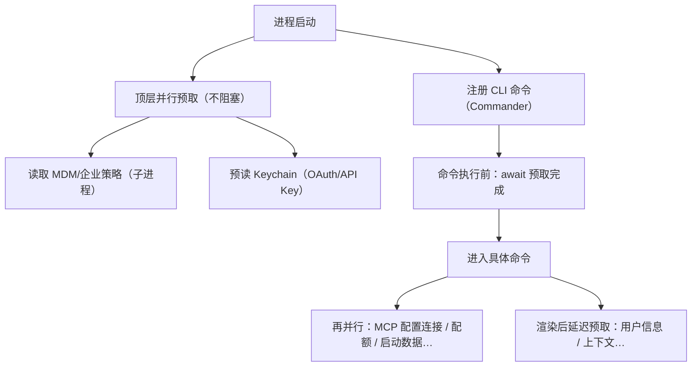
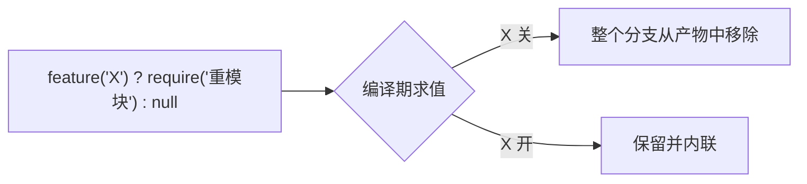
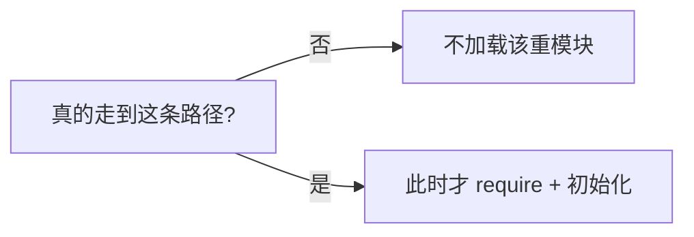
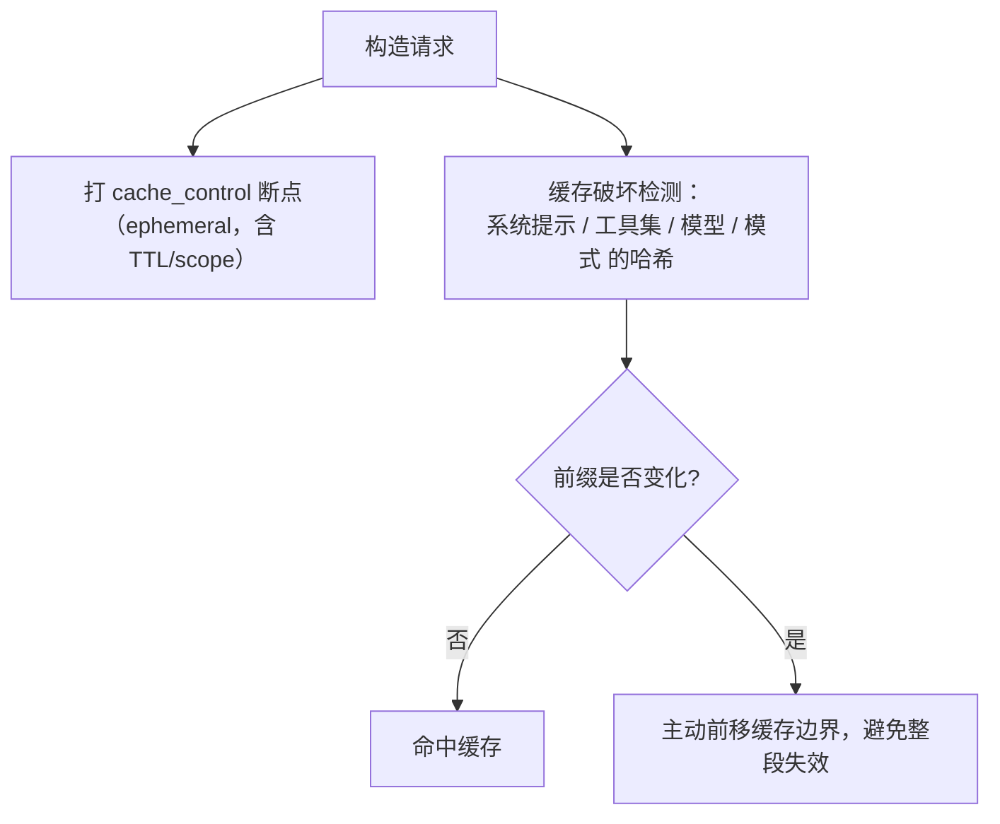
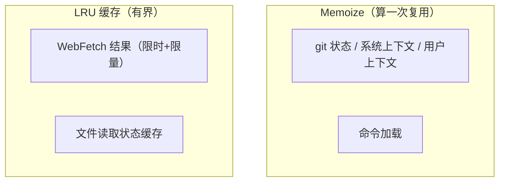
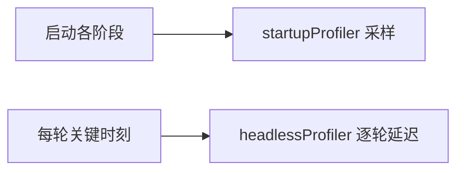

# 启动与性能（Bootstrap & Performance）

> 讲清 Claude Code 如何做到"启动快、运行省"：并行预取、编译期死代码消除、懒加载、prompt 缓存共享、Token/成本核算、以及运行时缓存与性能测量。
>
> **原则：源码为准。** 机制均从 `claude-code-cli` 求证；无法确证者标注「推断」。文末附涉及模块。

---

## 1. 启动：先并行预取，再进正题

入口（`main.tsx`）一开始就在**顶层作用域**并行启动几件"迟早要用、且可能慢"的事——不等它们、先往下走，真正需要时再 await：



- **重叠 I/O**：把策略读取、凭据读取、MCP 配置、配额等**并行铺开**，用"命令执行前的钩子"统一等待必需项，其余延后到渲染之后。
- **分层预取**：必需 → 立即并行；可延后 → 渲染后再取，缩短"到首屏/首响应"的时间。

---

## 2. 编译期死代码消除（Feature Flag）

大量功能用 `feature('XXX')` 门控（源自 `bun:bundle`）。关键在于：**这个判断在编译期就被求值**，未启用分支被 Bun 打包器**整段删除**——不是运行时 `if`，而是**编译期裁剪**，零运行时成本、也不进包体。



典型用法是"**条件 require**"：只有开关打开时才把对应重模块编译进来（命令、协调者模式、Snip 压缩等都这么做）。这让同一套源码能按构建目标产出**不同体量**的产物。

---

## 3. 懒加载与延迟 require

即使在同一产物里，也尽量**推迟加载重依赖**到真正需要时：

- **条件/延迟 require**：把只有特定路径才用到的模块（如拉起 React/Ink 的消息筛选器、AWS SDK 的 token 计数）**用到才 require**，避免启动时白白解析。
- **懒初始化**：内置插件/技能注册是纯内存操作（极快），而重的网络/文件工作都延后或并行。



---

## 4. Prompt 缓存共享：让请求前缀"字节稳定"

> **本节是"性能视角"小结**（memoize 冻结、会话内锁定、破坏检测遥测）。**底层原理（KV 前缀缓存）、cache_control 打点布局（tools★/system★/messages★）、global/org 策略、计费三桶与 API 语义** → 见专题[《Prompt 缓存机制》](./prompt-cache.md)。

省钱省时的大头是 **prompt 缓存**：只要请求的前缀字节稳定，服务端就能命中缓存、跳过重复计算。系统为此做了两件事：

> **先厘清两个"轮"**（下文严格区分，源码为准）：
> - **提交轮**：你敲一次回车 = 一次 `query()` 调用（进入一次 `queryLoop`）。**`systemPrompt` 在这一层只算一次**（`QueryEngine.ts:321`）。
> - **工具轮**：`queryLoop` 内 `while(true)` 的**每一次迭代 = 一次模型 API 请求**（发一次、模型回一次；若调了工具就跑完工具、带着 `tool_result` 进入下一次迭代）。**这才是源码里的 `turn`**——`turnCount++`、`transition:'next_turn'`（`query.ts:1704-1727`），`maxTurns` 限的就是它（`:1705`）。
> - **一个提交轮 = 1..N 个工具轮**。下文凡"每轮 / 上一轮 / 下一轮"未特别说明，都指**工具轮（相邻两次 API 请求）**——prompt 缓存的命中正发生在相邻工具轮之间。



- **缓存断点**（`addCacheBreakpoints` / `getCacheControl`）：一次请求打**三处** `cache_control`——**tools（最前）+ system 块 + 一个消息级尾部标记**。消息级标记**每请求仅一个**，位置 `markerIndex = skipCacheWrite ? length-2 : length-1`：**默认打在最后一条消息**（把含本轮的整段声明为可缓存前缀，供下轮命中）；只有 fire-and-forget fork（`skipCacheWrite`）才前移到**倒数第二条**（最后的共享前缀点，让 fork 不把自己的尾巴写进 KV 缓存）。为何"恰好一个"是服务端 KV 页驱逐的权衡（`claude.ts:3078` 注释，细节属服务端「推断」）。详见 §4.1。
- **破坏检测**（`checkResponseForCacheBreak`）：**纯事后遥测,不处理边界、不阻止失效**。它在响应回来后发现 `cache_read` 比上轮掉了 >5%（且绝对量超阈值）→ diff 出是哪块（system / tools / model / betas / `perToolHashes`）变了 → `logEvent('tengu_prompt_cache_break')` + 写 `.diff` 文件归因。**缓存该破还是破了**，这套只"揪凶手"、事后告诉你是谁破的（与 §4.2 一致；原先"有意识地处理边界而非静默失效"的说法不准，已纠正）。
- **会话内锁定**（latch，**≠ §4.1 的"上下文固定"**）：把喂进 `cache_control`/`betas` 的**易变请求级开关**首次算出即**锁存进 bootstrap state**、之后恒用锁存值——`should1hCacheTTL` 锁 **overage 资格 + allowlist**（`claude.ts:403-412`），AFK / cachedMC beta 头、fast mode 头亦"sticky-on latched session-stable"。目的：防中途翻转改动 **TTL（1h↔5m）或 beta 头** → 那会废掉 ~20K token 的服务端缓存。**注意分层**：§4.1 的"上下文固定"冻的是**消息内容字节**（`userContext` memoize），这里冻的是**请求参数/开关**——两层各自求稳，合起来才保住"整条请求字节稳定"。详见 §4.3。

> 这也解释了前面几篇反复出现的"保 prompt 缓存"动机：工具结果预算冻结（工具篇）、压缩保留段重链（会话篇）、记忆稳定 header（上下文篇）——它们共同服务于"**前缀字节稳定**"这一个目标。

### 4.1 "重发 ≠ 破缓存"——命中只看字节，不看内容新旧

一个高频误解：`tools` schema **每个工具轮**都重发、`system` 每次都带上、`userContext` **每个工具轮**都在 `messages[0]` 前置一条 `<system-reminder>`——**这些不会破缓存吗？** 不会——**前缀缓存按字节命中，"重发一模一样的字节"正是它想要的；只有字节变了才破**。而这条前缀的三段（`tools` / `system` / `messages` 头部）在**同一提交轮内是逐字节不可变的**——不是"碰巧没变"，是**结构上被冻死**，下面逐段给源码。

缓存前缀的**布局与顺序**（三段拼成一条序列）：

```text
[ tools 参数 ]  →  [ system 参数 ]  →  [ messages ]
   最前端            系统提示            userContext(msg[0]) + 对话历史 + 尾部附件
   ↑ 一变，后面全塌                                        ↑ 断点默认在最后一条（fork 才倒数第二条）
```

- **`tools`（含 Skill 工具）每个工具轮重发 → 命中**：工具集不变 → 序列化字节不变 → **相同字节重发正是命中条件**。只有工具**字节真的变**（增删、或描述内嵌的动态列表变）才破。
- **`system`（`systemPrompt` + `systemContext`）一个提交轮算一次、工具轮内不可变 → 命中**：`systemPrompt` 在提交轮初始化时**只算一次**（`QueryEngine.ts:321`）；进入 `queryLoop` 后它连同 `userContext`/`systemContext` 一起被解构为**只读 param**，源码原话注释 *"Immutable params — never reassigned during the query loop."*（`query.ts:251-262`）。实际发出的整段 = `appendSystemContext(systemPrompt, systemContext)`（`query.ts:450`），而 `appendSystemContext`（`utils/api.ts:437`）只是**确定性拼接**（无时间/随机成分）；其中 `systemContext`（git 状态等）本身也是 **`memoize`**（`context.ts:116`）。→ **每个工具轮的 system 字节完全一致**。
- **`userContext` 在 `messages[0]` 每个工具轮前置 → 也命中，因为输入字节被 memoize 冻结**：每个工具轮确实都新建一条 reminder——`prependUserContext(messagesForQuery, userContext)`（`query.ts:660`）；但它的内容 **100% 由 `userContext` 决定**（`utils/api.ts:449` 就是把字典拼成固定模板），而 `userContext = getUserContext()`（`getUserContext = memoize`，`context.ts`）+ 一次性算好的 coordinator context，也是上面那条**只读 param**。→ **新建的那条消息逐字节相同**，照命中。代价是"框架可能陈旧"（git 中途变了也不刷新），但这是**为保缓存有意冻结**（呼应[《00》](./00-overview.md)§2.1）。
- **断点在尾部 + 易变内容也放尾部**：`addCacheBreakpoints` **每请求仅一个消息级 `cache_control`**，`markerIndex = skipCacheWrite ? length-2 : length-1`——**默认打在最后一条消息**（`length-1`，把含本工具轮的整段声明为可缓存前缀、供下一工具轮命中）；仅 fire-and-forget fork（`skipCacheWrite`）前移到**倒数第二条**（`length-2`，最后的共享前缀点，避免 fork 把自己尾巴写进 KV）。真正易变的东西（待办 / 计划提醒 / 状态）**故意注入在尾部附近**，变时**只废一小段后缀、不动前缀**。（早前把 fork 特例当通则写成"倒数第二条"，此处纠正。）

**三段前缀为何在提交轮内"结构上冻死"（而非碰巧没变）：**

- **只读 param**：`systemPrompt`/`systemContext`/`userContext` 在 `queryLoop` 入口一次解构，全程不再赋值（`query.ts:251-262` 注释明写 immutable）。
- **连"轮内压缩"都不动它**：若 autocompact 在工具轮之间触发，**只替换 `messagesForQuery = postCompactMessages`**（`query.ts:528-534`，注释 *"Continue on with the current query call using the post compact messages"*），三段前缀原封不动。
- **什么时候才真会变 = 下一个提交轮**：只有下一次顶层 `query()` 才在 `QueryEngine` 里重新 `fetchSystemPromptParts`。而 `getUserContext`/`getSystemContext` 两个 memoize **不随 bash `cd` 刷新**——真正 `cache.clear()` 的是**压缩（`compact.ts:63/117/203`）、`/clear`（`caches.ts:52`）、injection 变（`context.ts:32`）**（`claudeMd` 走 `getMemoryFiles`，另由 `/memory`/worktree/resume/启动清）；且清缓存只影响"下次调用"——`queryLoop` 循环内**从不重新调**它们，故对**当前提交轮零影响**。所以跨提交轮通常也仍命中，除非发生上述清缓存事件、且底层内容确实不同。
- **即便 cwd 变了，system 也不是整段全废——靠"动态边界"隔离**：基座 `systemPrompt`（`getSystemPrompt`，**不 memoize**）每个提交轮现读 `getCwd()`/`env.platform`/OS 重建（`constants/prompts.ts:444,499,642-646`），所以 cwd 改了文本确实变。但系统提示按 `SYSTEM_PROMPT_DYNAMIC_BOUNDARY`（`constants/prompts.ts:573`）切两段，`splitSysPromptPrefix`（`utils/api.ts`）据此分块、`buildSystemPromptBlocks`（`claude.ts:3213`）只给静态段打 `cache_control`：

| 段 | 内容 | `cacheScope` | 打 `cache_control`? |
|---|---|:---:|:---:|
| **静态段（边界前）** | 角色/规则/actions/工具用法/语气/输出效率 | `'global'` | ✅（可缓存大前缀）|
| **动态段（边界后）** | `env_info`（cwd/平台/OS）、token_budget、末尾 `appendSystemContext` 拼的 **git 状态** | `null` | ❌ |

> 所以 **cwd 一变，只 churn 边界后那截未缓存的动态尾段，静态大前缀仍命中**。这是"env 有意放边界后"的设计——源码注释：*"Session-variant guidance that would fragment the `cacheScope:'global'` prefix if placed before boundary."*（`constants/prompts.ts:344-345`）。换言之：**`systemPrompt` 会随 cwd/平台变，但变的部分被结构性地挡在缓存边界之外。**

> 一句话：**三段前缀（tools / 冻结的 system+systemContext / 冻结的 userContext）在一个提交轮内逐字节不可变 → 每个工具轮都命中；易变的东西（待办/计划/状态）放尾部 → 变时只废尾部一小段。** 这就是"前缀字节稳定"的具体落地；跨提交轮才可能刷新，且仅在**压缩 / `/clear` / `/memory` / worktree 进出 / resume** 等清缓存事件时（**不含 bash `cd`**）。

### 4.2 工具在缓存最前端：一变全塌，故拼命防抖

**`tools` 在前缀最前端**（`tools → system → messages`），所以**任何工具变化（增 / 删 / 某个描述变）→ 从 tools 处就不一致 → 后面 `system` + 全部 `messages` 统统冷 miss**——这是**最贵的破法（整段全废）**，且**没有"工具变了还续用缓存"的机制**（与 §会话篇 `cache_edits` 删 messages 中间那种可命中的情形本质不同：那个不动前缀，工具却在前缀最前端）。

- **`perToolHashes` 只做归因、不保缓存**：`promptCacheBreakDetection.ts` 是**检测/遥测**模块——存逐工具哈希，当工具**没增没删却仍变了**（占工具破缓存的 ~77%）时，diff 出**是哪个工具的描述变了**，`logEvent('tengu_prompt_cache_break', …)` 上报。它**只揪凶手，不阻止、不修复**。
- **正因一变全塌，设计上拼命保 tools 稳定**：
  - **MCP 工具默认 deferred**：不进初始 schema、靠 ToolSearch 现搜 → 避免每次 MCP 增删都抖 tools；
  - **动态列表移出工具描述**：SkillTool 描述说"名单在 system-reminder 里"而**不内嵌 skill 名单**、AgentTool 同理 → 工具描述**本身静态**，动态部分丢到 messages 尾部 reminder（变了只废尾部）；
  - **稳定排序** + `perToolHashes` **兜底监控**（还有谁在抖，立刻抓到）。

> 这就解释了[《03》](./03-skill.md)/[《08》](./08-context-assembly.md)里"SkillTool 宁可让描述指向 system-reminder、也不把 skill 名单写进工具描述"——**根因就是保住最前端的 tools 缓存**。

### 4.3 会话内锁定（latch）：冻的是"请求级开关"，不是消息内容

§4.1 讲的"上下文固定"冻的是 **messages 里的内容字节**（`userContext` memoize）。但缓存命中还取决于**请求级参数**——`cache_control` 的 **TTL**、以及 `betas` 头列表。这些参数**背后是一批会中途翻转的动态状态**（额度是否超支、GrowthBook allowlist、AFK/缓存编辑 beta 是否激活、fast mode）。若让它们**逐轮跟随实时值**，一次翻转就会改掉 TTL 或 beta 头 → **服务端前缀缓存整段作废**（注释：~20K token/次）。

**做法：首次算出即锁存，之后恒用锁存值**（`should1hCacheTTL`，`claude.ts:403-412`）：

```text
第 1 次请求:  live 状态 → 算出 eligible/allowlist/beta 头 →【存进 bootstrap state】→ 用它
第 N 次请求:  bootstrap state 有锁存值 →【直接用锁存值，无视 live 已翻转】→ TTL/beta 头不变 → 命中
```

| 被锁存的开关 | 锁在哪 | 不锁会怎样 |
|--------------|--------|-----------|
| 1h-TTL 资格（含 `isUsingOverage`） | `get/setPromptCache1hEligible` | 中途超支翻转 → TTL 1h↔5m → 缓存废 |
| 1h-TTL allowlist | `get/setPromptCache1hAllowlist` | GrowthBook 磁盘缓存中途更新 → TTL 混用 |
| AFK / cachedMC beta 头 | claude.ts 内 sticky-on latch | beta 头增删 → `betas` 变 → 缓存废 |
| fast mode 头 | 同上（session-stable） | 同上 |

- **与"上下文固定"分层互补**：一个稳**消息内容字节**（§4.1）、一个稳**请求参数/头**（§4.3），**两层都稳，整条请求才字节稳定、才命中**。
- **有意"用陈旧值"**：锁存意味着"你会话中途真超支了/allowlist 真更新了，本会话也不改 TTL"——**为缓存有意接受轻微陈旧**（同 `userContext` memoize 接受"框架陈旧"的取舍）。`promptCacheBreakDetection` 里那些 `autoModeActive`/`isUsingOverage`/`cachedMCEnabled` 字段带着 "should NOT break cache anymore … Tracked to verify the fix" 注释，正是**用遥测验证这些 latch 确实不再破缓存**。

---

## 5. Token 与成本核算

- **成本追踪**（`cost-tracker.ts`）：累计输入/输出 token、API 时长、按模型的用量与花费——`result` 事件里的成本数字即来自此。
- **Token 估算**（`services/tokenEstimation.ts`）：为不同后端（如 Bedrock/Vertex）提供 token 计数，其重依赖按需懒加载。
- **预算刹车**：Token 预算续跑/停止、USD 预算上限等在主循环里生效（见[《全景与主循环》](./00-overview.md)§5）。

---

## 6. 运行时优化：缓存与记忆化



- **记忆化**：对启动/每轮都要用、但结果稳定的东西（git 状态、系统/用户上下文、命令清单）做 memoize，避免重复计算。
- **有界 LRU**：对可能无限增长的缓存（网页抓取、文件状态）用 LRU + TTL 限住体积。
- **UI 层**：终端 UI（Ink/React）主要靠精准的局部更新，不依赖通用的重型重渲染优化。

---

## 7. 性能测量

优化要可度量，系统内建两套探针：

- **启动探针**（`startupProfiler.ts`）：在启动关键点打 checkpoint，采样上报各阶段耗时（导入、初始化、设置、总时长）。
- **无头逐轮探针**（`headlessProfiler.ts`）：在 `-p`/SDK 模式测**单轮延迟**——到系统消息、到查询开始、到首个响应等关键时刻（`QueryEngine` 内多处打点）。



> 注：具体启动毫秒数依机器/构建而异，本篇不引用某个固定数字（避免与实测不符）；重点是**这些探针让启动/延迟可持续度量与回归监控**。

---

## 8. 关键设计取舍

| 取舍 | 做法 | 为什么 |
|------|------|--------|
| 并行预取 + 分层等待 | 顶层铺开 I/O，必需项才 await | 缩短到首响应时间 |
| 编译期死代码消除 | `feature()` 编译期裁剪 | 零运行时成本、可裁剪包体 |
| 懒加载重依赖 | 用到才 require | 不为未走到的路径付启动代价 |
| prompt 缓存共享 | 稳定前缀 + 断点 + 破坏检测 | 省 token、降延迟 |
| 会话内锁定易变因素 | 早期锁定额度/白名单 | 防中途打断缓存 |
| 记忆化 + 有界 LRU | 稳定结果复用、增长可控 | 省重复计算、控内存 |
| 内建探针 | 启动 + 逐轮延迟测量 | 优化可度量、防性能回归 |

---

## 附录 · 涉及模块

- 启动入口与预取：`main.tsx`、`bootstrap/`
- Feature Flag：`bun:bundle` 的 `feature()`（见各处 `feature('X') ? require(...) : null`）
- Prompt 缓存：`services/api/claude.ts`（`getCacheControl`——tools/system/消息三处 `cache_control`；`addCacheBreakpoints`——每请求一个消息级断点、`markerIndex = skipCacheWrite ? length-2 : length-1` 默认最后一条、fork 前移倒数第二条；§4.3 会话内锁定 `should1hCacheTTL` + `get/setPromptCache1hEligible`/`...Allowlist`、AFK/cachedMC/fast-mode beta 头 sticky-on latch）、`services/api/promptCacheBreakDetection.ts`（**纯事后遥测**：`checkResponseForCacheBreak` 检 `cache_read` 掉幅 → `toolsHash`/`perToolHashes` 逐工具哈希归因 → `tengu_prompt_cache_break` + 写 `.diff`；不阻止失效）、`context.ts`（`getUserContext = memoize`、`getSystemContext = memoize` `:116`；`.cache.clear()` 触发点：injection 变 `:32`、压缩 `compact.ts:63/117/203`、`/clear` `caches.ts:52`——**非 cwd 改**；`claudeMd` 走 `getMemoryFiles`，另由 `/memory`/worktree/resume/启动清 `claudemd.ts:1119`）、`utils/api.ts`（`prependUserContext` 前置 `messages[0]` `:449`、`appendSystemContext` 确定性拼接 `:437`）、前缀稳定性 `QueryEngine.ts`（`systemPrompt` 提交轮算一次 `:321`）、系统提示静态/动态切分 `constants/prompts.ts`（`getSystemPrompt` 不 memoize `:444`、`env_info_simple` 动态段 `:499`、`SYSTEM_PROMPT_DYNAMIC_BOUNDARY` `:114/:573`、注释动机 `:344-345`）+ `utils/api.ts`（`splitSysPromptPrefix`：边界前 `cacheScope:'global'`、边界后 `null`）+ `services/api/claude.ts`（`buildSystemPromptBlocks` 只给非 null scope 打 `cache_control` `:3213`）、`query.ts`（`queryLoop` 只读 param「never reassigned during the query loop」`:251-262`、`fullSystemPrompt`=`appendSystemContext` `:450`、`prependUserContext` 调用点 `:660`、轮内压缩只换 messages `:528-534`）
- 「轮」的语义：`query.ts`（`while(true)` 每迭代 = 一个 `turn`：`turnCount++`/`transition:'next_turn'` `:1704-1727`；`maxTurns` 计的是工具轮 `:1705`）；提交轮 = 一次 `query()`/`queryLoop`
- 成本/Token：`cost-tracker.ts`、`services/tokenEstimation.ts`
- 运行时缓存：`context.ts`（memoize）、`tools/WebFetchTool/utils.ts`（LRU）、`Tool.ts`（文件状态缓存）
- 性能测量：`utils/startupProfiler.ts`、`utils/headlessProfiler.ts`
