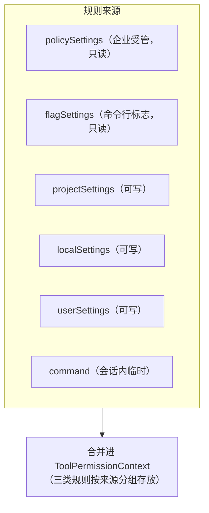
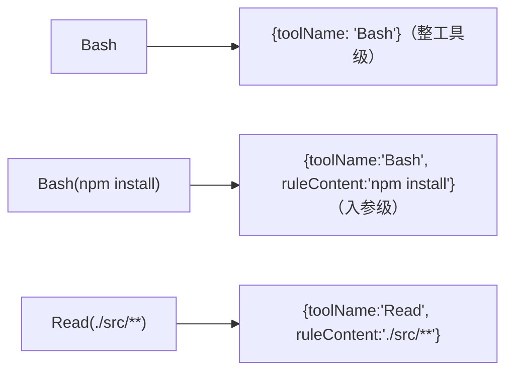
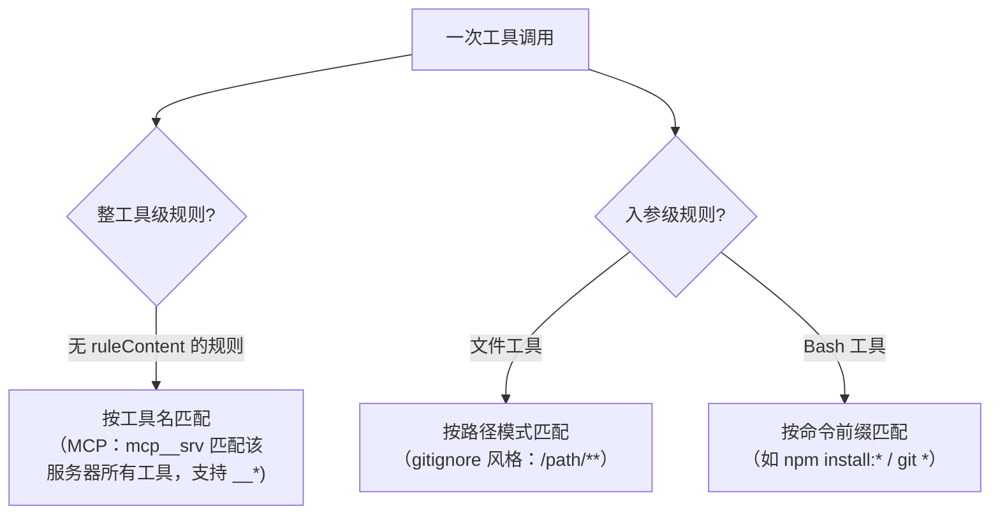
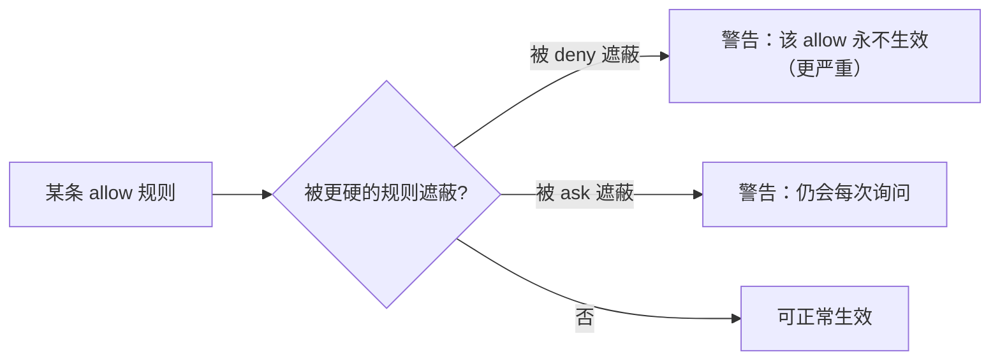
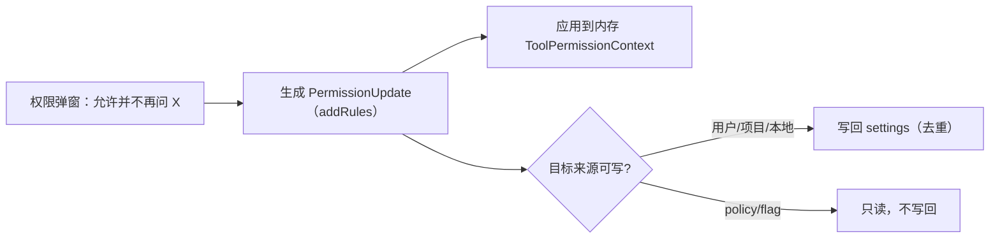
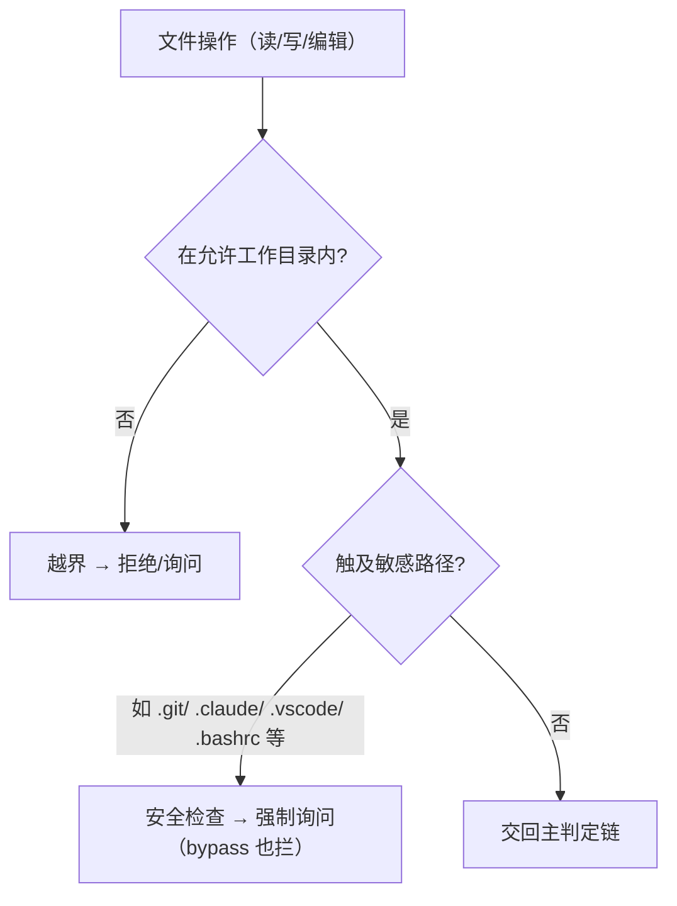
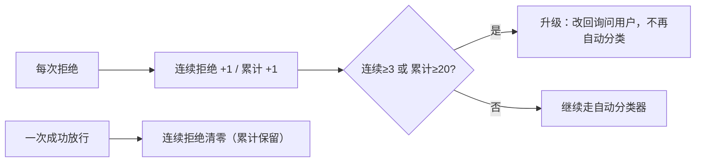

# 权限规则系统（Permission Rules）

> [《工具·调用·权限系统》](./01-tool-call-authority.md)给的是权限**主干判定链**（`1a→3`）。本篇下钻到规则本身：**规则从哪来、优先级如何、怎么解析与匹配、影子规则、"下次不再问"如何写回、文件路径边界、以及拒绝追踪与升级**。
>
> **原则：源码为准。** 机制均从 `claude-code-cli/utils/permissions/` 求证；无法确证者标注「推断」。文末附涉及模块。
>
> 前置：先读[《工具·调用·权限系统》](./01-tool-call-authority.md)§4（模式、`1a→3`、两层结构）。

---

## 1. 规则的来源与优先级

权限规则（allow / deny / ask 三类）来自**多个设置来源**，加载时按启用来源合并（`permissionsLoader.ts`）：

- **三类规则**：`alwaysAllow` / `alwaysDeny` / `alwaysAsk`，**按来源分组**存放（每个来源一组字符串）。
- **可写 vs 只读**：只有 **用户 / 项目 / 本地** 三个来源可被写回（"下次不再问"落到这里）；**policy / flag 只读**——企业受管规则不可被用户覆盖或写回。
- **受管锁定**：开启 `allowManagedPermissionRulesOnly` 后，**只认 policy 来源**的规则，本地一切规则失效——企业可借此完全接管权限策略。

---

## 2. 规则的形态与解析

一条规则是个字符串，解析成 `{ 工具名, 规则内容? }` 两部分（`permissionRuleParser.ts`）：

- **两级粒度**：只有工具名 = **整工具级**；带括号内容 = **入参级**（命令前缀、路径模式等）。
- **转义**：内容里的 `(` `)` `\` 有转义规则（`\(` `\)` `\\`），解析时按"前面偶数个反斜杠才算未转义"判断括号边界——保证像 `python -c "print(1)"` 这种含括号的命令能被正确解析。

---

## 3. 规则如何匹配一次调用

匹配分**工具名级**与**入参级**两条路径：

- **工具名级**：无 `ruleContent` 的规则匹配整工具；MCP 特殊——`mcp__服务器` 可匹配该服务器**所有**工具，并支持 `mcp__服务器__*` 通配。
- **入参级（文件工具）**：路径模式用 **gitignore 风格**匹配相对路径（`/src/**` 之类），命中即对该路径应用对应 allow/deny/ask。
- **入参级（Bash）**：把命令抽成**前缀**（见[《11 · Bash 命令安全》](./11-bash-security.md)）去匹配 `Bash(前缀:*)` 规则。
- 工具可实现 `preparePermissionMatcher` 参与"规则模式如何匹配这次入参"的定制。

> 这几条匹配就是主干判定链里 `1a`（deny 规则）、`1b`（ask 规则）、`2b`（allow 规则）与 `1c` 内 checkPermissions 所"读的规则"。

---

## 4. 影子规则检测：拦住"永远生效不了"的规则

用户可能配了一条 allow 规则，却被更高优先级的 deny/ask **遮蔽**（unreachable）。系统会**检测并警告**这类"影子规则"（`shadowedRuleDetection.ts`）：

- **特例**：Bash + 沙箱启用时，工具级 ask 规则**不遮蔽**个别 allow 规则（因为沙箱本就会自动放行）；但来自共享设置（项目/策略）的 ask 仍会告警。

---

## 5. "下次不再问"：规则的写回与持久化

当用户在权限弹窗选"允许并不再询问"，系统生成一个**权限更新**并**写回设置**（`PermissionUpdate.ts`）：

- **两步生效**：先改内存（本会话立刻生效），再按目标来源**持久化**（仅可写来源）。
- **去重**：写回前把规则解析再规范化序列化，用集合去重，避免重复堆积。
- **更新类型**：支持增/删/替换规则。

---

## 6. 文件工具的路径边界

除 Bash 外，文件类工具的"能不能碰这个路径"由路径边界逻辑把关（`filesystem.ts` / `pathValidation.ts`）：

- **允许工作目录**：当前 cwd + 额外声明的工作目录；判定会**解析软链**，确保所有解析形式都落在允许范围内（防软链逃逸）。
- **越界判定**：规范化路径（去掉 macOS `/private/` 前缀等）后看相对路径是否含 `..`。
- **敏感路径护栏**：一批**危险文件/目录**（版本控制、shell 配置、编辑器与 Claude 自身配置目录等）被标为安全检查项——**即使 bypass 模式也强制询问**（对应主干判定链的 `1g`）。
- **Scratchpad**：受控的临时可写目录（会话隔离的 `/tmp/...` 路径），供需要落盘的场景使用。

---

## 7. 拒绝追踪与升级（auto 模式）

自动模式下，为防"分类器反复放行/拒绝"失控，系统追踪**拒绝次数**（`denialTracking.ts`）：

- **阈值**：连续拒绝达上限（约 3）或累计达上限（约 20）就**升级**——从"自动分类"退回"问用户"，避免自动模式在反复被拒时空转或误伤。
- **成功即重置**：任何一次成功放行会清零连续计数（累计仍保留）。

---

## 8. 权限模式的内部与对外映射

六种模式（`PermissionMode.ts`）各有内部行为与**对外（SDK）映射**：

| 内部模式 | 行为 | 对外映射 |
|----------|------|----------|
| `default` | 危险动作要问 | `default` |
| `plan` | 只读探索，禁改动 | `plan` |
| `acceptEdits` | 工作区编辑自动放行 | `acceptEdits` |
| `bypassPermissions` | 尽量不拦 | `bypassPermissions` |
| `dontAsk` | 把"问"转成"拒" | `dontAsk` |
| `auto` | LLM 分类器替代问 | **对外隐藏为 `default`** |

> `auto` 模式对 SDK **隐藏**为 `default`——它是内部自动化能力，不作为公开模式暴露。

---

## 9. 关键设计取舍

| 取舍 | 做法 | 为什么 |
|------|------|--------|
| 多来源 + 可写受限 | 只用户/项目/本地可写回 | 企业策略不可被本地覆盖 |
| 受管锁定 | 只认 policy 来源 | 企业可完全接管权限 |
| 两级粒度规则 | 工具名级 + 入参级 | 既能整体授权也能精确到命令/路径 |
| 影子规则检测 | 警告被遮蔽的 allow | 避免"配了却不生效"的困惑 |
| 写回两步 + 去重 | 先内存后磁盘、规范化去重 | 即时生效又不堆重复规则 |
| 路径边界 + 敏感护栏 | 允许目录 + 软链解析 + 敏感路径强问 | 防越界与软链逃逸、护住关键文件 |
| 拒绝追踪升级 | 连续/累计阈值 → 退回询问 | 防自动模式失控、误伤 |

---

## 附录 · 涉及模块

- 加载与来源：`utils/permissions/permissionsLoader.ts`、`PermissionMode.ts`
- 解析与匹配：`utils/permissions/permissionRuleParser.ts`、`permissions.ts`
- 影子检测：`utils/permissions/shadowedRuleDetection.ts`
- 写回：`utils/permissions/PermissionUpdate.ts`
- 路径边界：`utils/permissions/filesystem.ts`、`pathValidation.ts`
- 拒绝追踪：`utils/permissions/denialTracking.ts`
