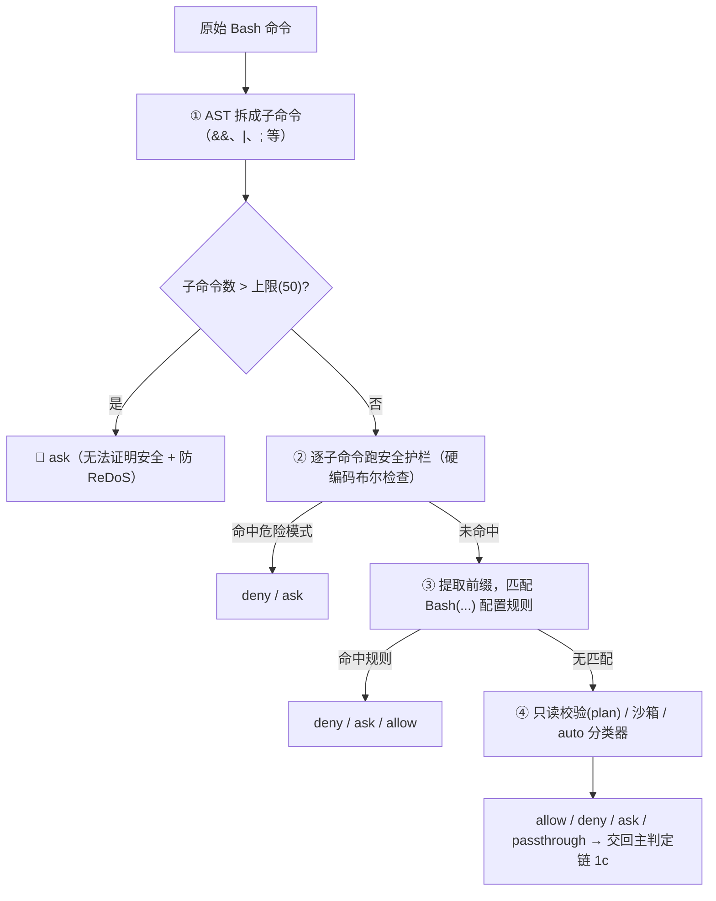
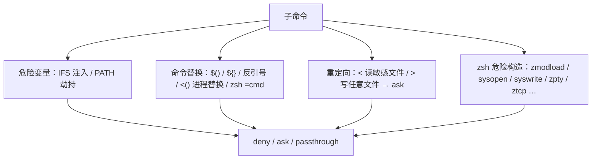
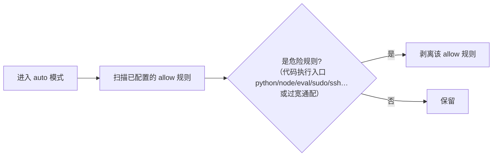
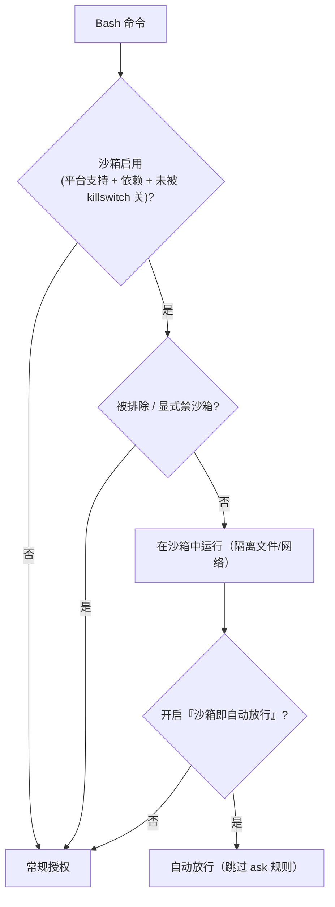
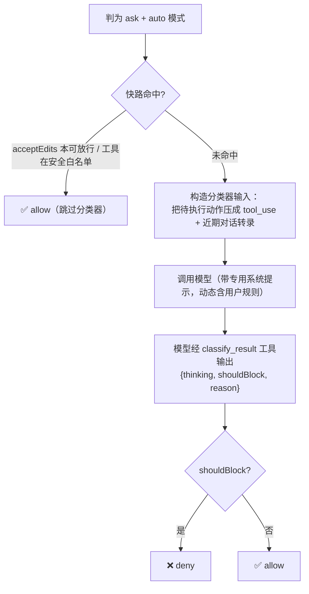

# Bash / 命令安全、沙箱与分类器

> Bash 是所有工具里授权最复杂的一个。本篇把[《工具·调用·权限系统》](./01-tool-call-authority.md)§4.5 的概览**展开成深水区**：命令拆分与前缀、硬编码安全护栏、危险规则剥离、只读校验、sed 特判、沙箱、以及 auto 模式的 LLM 分类器内幕。
>
> **原则：源码为准。** 机制均从 `claude-code-cli` 求证；无法确证者标注「推断」。文末附涉及模块。
>
> 前置：先读[《工具·调用·权限系统》](./01-tool-call-authority.md)§4 与[《权限规则系统》](./10-permission-rules.md)。

---

## 0. 先辟谣：不存在"威胁评分算法"

坊间"剖析"资料流传一套 **"威胁分数 = 命令基础分 × 标志乘数 × 目标乘数"**（`rm=80`、`dd=95`、`/etc=3.5`、"分数 71-85 → HIGH → ask"…）——**源码中查无此物**（`tools/BashTool/*`、`utils/permissions/*` 不存在任何 `threatScore/baseScore/multiplier`）。这是被杜撰的伪细节。

真实的 Bash 授权**不是打分**，而是下面这套 **AST 拆分 + 硬编码模式护栏 + 配置规则 + LLM 分类器**，核心信条：**证明不了安全，就 ask/deny**。

---

## 1. 全景：Bash 的 checkPermissions 做什么

---

## 2. 命令拆分与前缀提取

- **AST 拆分**：复合命令按 shell 语法拆成子命令**逐个审**（基于语法树，而非简单字符串切分）。
- **子命令上限（50）**：超过就直接 **ask**——一是"太复杂、无法逐段证明安全，保守就问"，二是防止超长复合命令触发正则回溯（ReDoS）拖垮事件循环。这条"上限即问"是 Bash 授权**失败关闭**性格的缩影。
- **稳定前缀**：从子命令抽出"命令+子命令"前缀（如 `git commit`、`npm run`），抽取时**跳过安全环境变量赋值**（`VAR=value`），且要求第二个 token 长得像子命令（排除文件名/数字/flag）。
- **拒绝裸 shell 前缀**：`sh`/`bash`/`zsh`/`sudo`/`env`/`xargs` 等**裸壳前缀**被禁止生成建议规则——否则一条 `Bash(bash:*)` 就等于放行任意代码。
- **建议规则上限（5）**：ask 时给"下次不再问 X"的前缀建议，复合命令最多 5 条（再多是噪音）。

---

## 3. 硬编码安全护栏（不可配置）

对每个子命令跑一批**硬编码的危险模式检查**（`bashSecurity.ts`），命中返回 deny/ask，否则 passthrough：

- **危险变量**：识别 `IFS` 注入、`PATH` 劫持等把环境变量当攻击面的写法。
- **命令替换**：`$()`、`${}`、反引号、进程替换 `<()`、以及 zsh 的 `=cmd` 扩展——这些能"命令里再套命令"，需谨慎（多返回 ask）。
- **重定向**：`<`（可读取敏感文件）、`>`（可写任意文件）触发 ask。
- **zsh 特有构造**：`zmodload` 及其模块内建（`sysopen`/`syswrite`/`zpty`/`ztcp`/`zsocket` 等）能绕过常规检查做文件/网络 I/O，作为**纵深防御**直接拦。

这些护栏的目的是**堵绕过**（编码、包装、引号技巧、注入），而非给命令算危险分。

---

## 4. 危险规则剥离（进入 auto 模式时）

`dangerousPatterns.ts` 是一批**正则/前缀谓词**。它的用途**不是判命令**，而是在**进入 auto 模式时剥离"过宽的危险 allow 规则"**（`permissionSetup.ts` 的 `isDangerousBashPermission`）：

- 防止用户配了 `Bash(*)`、`Bash(curl:*)`、或 `python`/`node`/`eval`/`sudo`/`ssh` 这类**代码执行入口**的宽规则后，auto 模式据此把危险命令也自动放行。
- 匹配多种形态：精确、`:*` 后缀、`*` 通配、` -*` flag 等。PowerShell 侧有对应的 `isDangerousPowerShellPermission`（`iex`/`invoke-expression`/`start-process` 等）。

---

## 5. 只读校验（plan 模式用）

plan 模式只允许**只读** Bash。`readOnlyValidation.ts` 判断命令是否只读：

- 逐个子命令判断是否修改文件系统；任一会写就不算只读。
- 大量**git 相关的安全特判**：裸仓库中 `.git/HEAD` 被删可能触发恶意 hooks、git 写入 `.git` 内部路径、git 在 cwd 外 + 沙箱的竞态等——这些看似只读实则危险的场景被单独识别。
- 命令语义（`commandSemantics.ts`）还处理退出码含义（如 `grep` 返回 1 是"无匹配"而非错误），避免误判。

---

## 6. sed 特判：它能改文件

`sed -i` 能就地改文件，所以 sed 被特殊对待（`sedValidation.ts` / `sedEditParser.ts`）：

- **按模式区别**：`acceptEdits` 模式下允许 sed 写文件，否则从严。
- **解析编辑意图**：识别是否 `sed -i` 就地编辑、解析出文件路径与替换内容（还要处理 BRE↔ERE 正则语法差异），从而把"用 sed 改文件"当作**写操作**纳入权限，而不是当普通命令放过。

---

## 7. 沙箱：用隔离换自动放行

- **是否用沙箱**（`shouldUseSandbox.ts`）：取决于沙箱是否启用、命令是否在用户配置的排除列表、是否显式 `dangerouslyDisableSandbox`。
- **沙箱隔离什么**：受限的文件/网络访问，让命令即使乱来也困在隔离环境里。
- **沙箱即放行**：开启后，可沙箱化的命令**自动放行**（跳过主判定链 `1b` 的 ask 规则）——这就是[《工具·调用·权限系统》](./01-tool-call-authority.md)§4.3 图里"Bash 沙箱可例外"的来源。本质是**用隔离性换取更少打断**。

---

## 8. auto 模式的 LLM 分类器内幕

当主判定链得出 **ask** 且处于 auto 模式时，先走快路、不中再调**分类器**（`yoloClassifier.ts`）：

- **是 LLM 判断，不是数值阈值**：把待执行动作格式化成一个 `tool_use` 块，连同近期对话转录（排除助手纯文本）一起发给模型，用**专门的系统提示**（动态嵌入当前用户规则）让模型判"该不该拦"，经一个 `classify_result` 工具返回 `shouldBlock`。
- **安全白名单快路**：只读/无害工具（文件读取、Grep、Glob、LSP、任务类、向用户提问等）在**白名单**里，直接放行、**不花分类器的 API 调用**。
- **acceptEdits 快路**：若该动作在 acceptEdits 模式下本就允许，也直接放行。
- **升级兜底**：连续/累计拒绝过多会退回"问用户"（见[《权限规则系统》](./10-permission-rules.md)§7）；PowerShell 等有额外特判。

---

## 9. 关键设计取舍

| 取舍 | 做法 | 为什么 |
|------|------|--------|
| 不打分、靠模式+规则+分类器 | AST 拆分 + 护栏 + 规则 + LLM | 语义级判断，堵绕过而非估危险度 |
| 证明不了就问 | 子命令超限/无法判定 → ask | 失败关闭 |
| 纵深防御 | 拆分→逐段→多类硬护栏 | 防编码/包装/注入/模块攻击绕过 |
| 拒绝裸壳前缀 | 禁 `Bash(bash:*)` 类规则 | 防一条规则放行任意代码 |
| 危险 allow 剥离 | 进 auto 前剥离过宽规则 | 防自动模式被宽规则架空 |
| sed 当写操作 | 解析 `-i` 编辑意图 | 防"用命令绕过文件权限" |
| 沙箱换自动 | 隔离即自动放行 | 用隔离性减少打断 |
| 分类器 + 快路 | 白名单/acceptEdits 快路 + LLM | 常见安全操作零成本，复杂的交给模型 |

---

## 附录 · 涉及模块

- 主流程与前缀：`tools/BashTool/BashTool.tsx`、`bashPermissions.ts`
- 安全护栏：`tools/BashTool/bashSecurity.ts`
- 危险规则剥离：`utils/permissions/dangerousPatterns.ts`、`permissionSetup.ts`
- 只读/语义：`tools/BashTool/readOnlyValidation.ts`、`commandSemantics.ts`、`modeValidation.ts`
- sed：`tools/BashTool/sedValidation.ts`、`sedEditParser.ts`
- 沙箱：`tools/BashTool/shouldUseSandbox.ts`、`utils/sandbox/sandbox-adapter.ts`
- 分类器：`utils/permissions/yoloClassifier.ts`、`bashClassifier.ts`、`classifierShared.ts`、`classifierDecision.ts`
