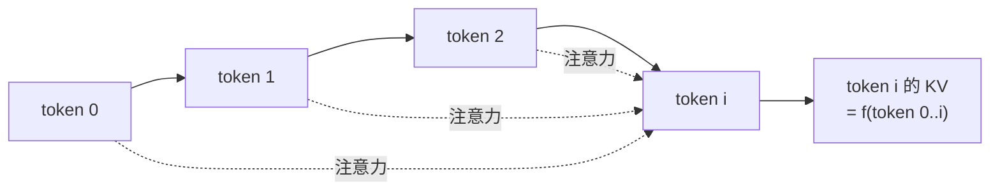
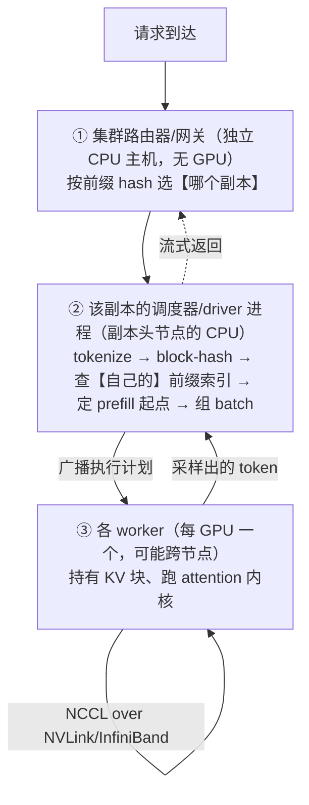
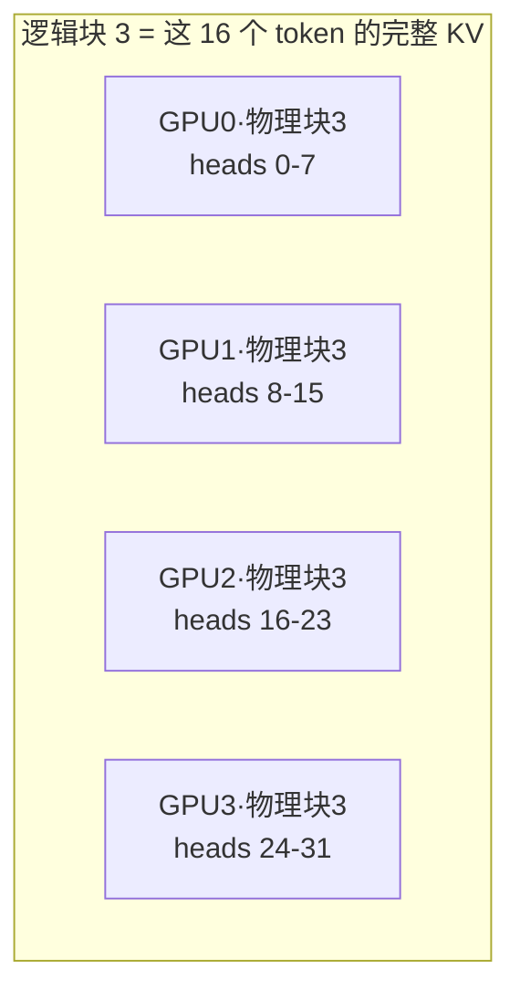
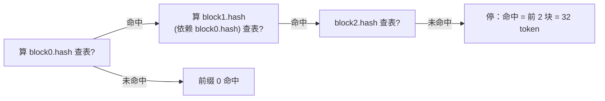
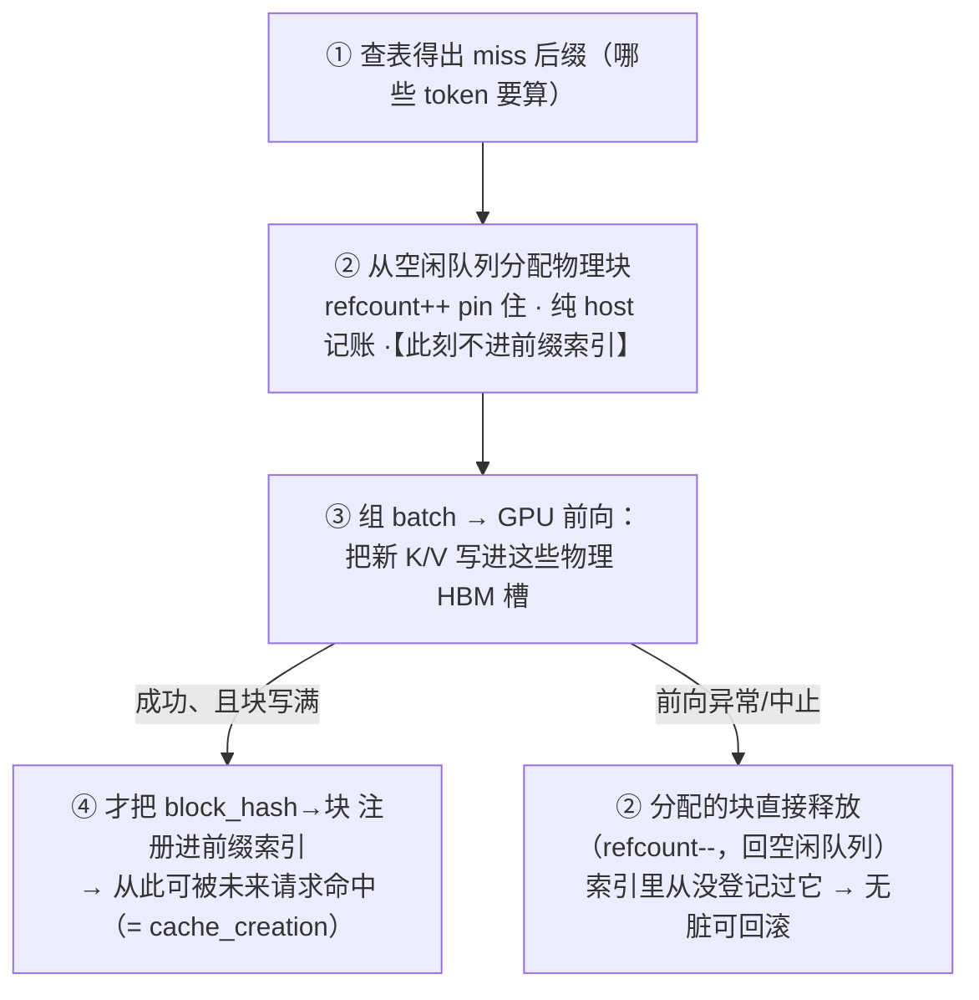

# Prompt 缓存机制：前缀原理 · cache_control 打点 · global/org 策略

> 把散在各篇的"保 prompt 缓存"动机收口成一篇**机制真相源**：缓存的底层是什么、`cache_control` 断点打在哪、为什么能"分层命中"、以及 Claude Code 的 **global/org** 策略。其它篇（工具/会话/上下文/Agent）只讲各自的"本地动机"，机制细节一律指向本篇。
>
> **来源分层（务必分清）**——本篇跨越"模型内部 → API 语义 → Claude Code 实现"三层，标注三类：
> - 〔**源码**〕：`claude-code-cli` 源码可确证（带 `文件:行`）。
> - 〔**文档**〕：Anthropic 公开的 API/计费行为（数值可能随时间/机型变动）。
> - 〔**推断**〕：服务端/模型内部未公开，据业界（vLLM/SGLang）与物理约束合理推断。

---

## 1. 底层原理：为什么是"前缀缓存"，不是"块哈希" 〔推断/公开知识〕

一个高频误解：把缓存想成"对每段内容算个哈希、独立存取"。**错**。它是**前缀缓存（prefix caching）**。

**根因在注意力机制**：transformer 里，第 `i` 个 token 在每一层的 **Key/Value 向量**，由它的隐状态算出；而隐状态又通过前面各层的注意力**依赖 token `0..i-1` 的全部**。



所以 **token `i` 的 KV = f(整个前缀 0..i)**。由此三条硬约束：

- **缓存实体 = "从第 0 个 token 到某断点"的整段 KV**，不是"某一块"。
- **复用前提 = 从头到断点逐 token 完全一致**；前面差一个 token，后面全部作废。
- **中间改了 → 其后全废**：即使后面文本没变，其 KV 依赖前文，也失效。

> 这就是全套设计"**tools → system → messages 顺序 + 前缀字节稳定**"的物理原因——你没法把中间某块单独缓存。

**缓存的是什么、存哪**〔推断〕：缓存的是**注意力 K/V 张量**，留驻在**推理集群的显存（HBM）/主存**，由**分页式 KV 管理 + 前缀树**组织；分布式下用**前缀感知路由**把相同前缀打到同一副本命中。**不是**序列化进 Redis/`torch.save`——KV 可达数 GB，per-request 走网络会把省下的算力赔光。业界同类：**vLLM 的 Automatic Prefix Caching、SGLang 的 RadixAttention**；Claude 的 `cache_control` 是把这能力**通过 API 显式暴露**，让调用方主动标断点、并据此区分读/写计费。服务端到底怎么**存/命中/管理**这批 KV，见 §2。

---

## 2. 服务端实现：KV 缓存怎么存、命中、管理 〔推断/公开知识〕

> **边界先说死**：本节 `claude-code-cli` **源码一行都确证不了**——它是推理服务端/模型内部的事，Anthropic 具体实现不公开。以下全部依据开源推理引擎 **vLLM（PagedAttention + Automatic Prefix Caching）**、**SGLang（RadixAttention）** 的公开设计 + 物理约束合理推断；Anthropic 大概率是同类架构的自研版，细节可能不同。七小节回答：打到哪、KV 存哪张卡、谁判命中、元数据怎么管、怎么写、失败怎么办、`cache_control` 到底改了什么。

### 2.1 两层路由：选副本 → 副本内调度器（顺序是 CPU 先、GPU 垫底）

先破一个直觉误区：**不是"前向到某节点、GPU 再路由"，而是路由/命中判断都是纯 CPU 工作、发生在前向之前**。分**两层 CPU 决策**：



- **① 集群路由器**：一层**独立的 CPU 服务**（自己的主机，不带 GPU），按前缀选**副本**。一个副本 = **一个能独立跑完整前向的服务实例**，内部由**多卡张量并行（TP）/流水并行（PP）**拼成（可能跨多台物理节点）——所以"打到多节点多卡"成立，选的是**这一整组**。
- **② 副本调度器**：被选中的副本里有**一个 driver/scheduler 进程**跑在头节点 CPU 上，独占该副本的 **KV 块管理器 + 前缀索引**（§2.4）。它做 tokenize、block-hash、在**自己的**索引里查最长匹配、定"从第 M 个 token 起 prefill"、组 batch，再把执行计划广播给各 worker。
- **③ workers**：每张 GPU 一个 worker 进程；**每台物理节点有自己独立的 CPU + host 内存 + 若干 GPU**，但单副本内只有 driver 的调度器做决策，其它节点 CPU 主要驱动本机 GPU 的 worker。跨卡/跨节点靠 **NCCL over NVLink/InfiniBand** 做集合通信。
- **次序：路由器 CPU（选副本）→ 调度器 CPU（判命中 + 组批）→ GPU 前向。前向永远垫底，命中判断在进 GPU 之前就做完了。**
- **每个副本各有各的 KV 池、彼此不共享**（跨节点搬 KV 太贵），前缀索引也**每副本各一份、无跨节点全局目录**。命中前提 = 下次请求被 cache-aware 路由回**上次写过该前缀的同一副本**；副本重启、扩缩容、被路由到别的副本、或该块已被驱逐 → 都会 miss（这是"命中非 100%"的来源，对应 §7 `cache_read` 掉幅遥测）。

### 2.2 KV 存哪张卡的 HBM：按并行维度切，不按 token 撒

**既不是"固定几张卡"，也不是"按 token 均匀撒到所有卡"。而是沿模型并行维度切、和权重同卡。**

| 并行方式 | 权重怎么切 | KV 就怎么切 |
|---|---|---|
| **张量并行 TP** | 每卡持有**一部分注意力头**的权重 | 每卡存**它那部分头**的 KV——但存的是**全部 token** 的 |
| **流水并行 PP** | 每卡持有**一部分层** | 每卡存**它那些层**的 KV（全部 token、全部头）|

- **KV 必须和"用它做注意力的那份权重"同卡**，否则每步都要跨卡搬 KV。所以 **KV 切分 = 权重切分的镜像**（TP 按头、PP 按层）。
- 不存在"整条序列 KV 全压 GPU0"（显存先爆），也不存在"token 0-100 在卡0、101-200 在卡1"（没法算注意力——后面 token 要 attend 前面**所有** token）。
- **卡内排布**：启动时把"权重之外的剩余显存"预分配成 **KV 池**（vLLM 的 `gpu_memory_utilization≈0.9`），池按**固定大小块（block，常见 16 token）分页**（PagedAttention）；逻辑位置→物理块靠**块表（block table）**映射。

**TP 下"逻辑块跨卡对称"**（你会问的关键点）：逻辑块号在整个 TP 组**共享、对称**。设某 16 个 token 落在**逻辑块 3**：



- **每张卡的逻辑块 3 都存这同一批 token 的 KV，只是各存自己那份头分片**；合起来才是这 16 个 token 的完整 KV。
- 正因对称，**调度器只需维护一张逻辑块表 / 一棵前缀索引**，对全 TP 组通用——不必记"哪张卡哪个头"，分片是隐含的（每卡跑相同分配逻辑、由同一 driver 广播，块号天然对齐）。block hash 也只按 **token 内容**算（与卡/头无关），所以命中判断在逻辑层算一次就对所有卡成立。
- （PP 不同：PP 各 stage 存不同**层**、各有独立块池，不像 TP 这样"同一逻辑块号横跨所有卡装同批 token 的不同头"。）

### 2.3 命中判断在调度器（CPU），不在 GPU：链式 block-hash 逐块 walk

**前缀命中判断在前向之前的调度器（host/CPU）用哈希/前缀树查表完成，GPU 不做"要不要算"的决策。**关键是 **block hash 是链式的**，把"前缀位置"编进了 hash：

```text
block[0].hash = H( 空,           tokens[0:16]   [, extra_keys] )
block[1].hash = H( block[0].hash, tokens[16:32]  [, extra_keys] )
block[k].hash = H( block[k-1].hash, tokens[16k:16k+16] [, extra_keys] )
```



- **逐块算 hash、逐块查表，碰到第一个查不到的块就停**；命中块数 × 16 = 命中前缀长度——**永远是 16 的整数倍（块对齐）**。
- **链式 = 真前缀而非"集合匹配"**：`block[k].hash` 含了 `block[k-1].hash`，所以① 前面任一 token 变 → 从那块起后面全变 → 全 miss；② 同样内容的一块出现在不同前缀位置、hash 也不同，**不会误命中**。这正是 §1"前缀逐字节一致才命中"在实现层的样子。
- **末尾不满 16 的残块不缓存**（等填满才建 hash/入索引）——这也是 API **~1024 最小可缓存**门槛是 16 倍数的原因。
- **GPU 端**：命中的前缀 token **根本不重算**（省的就是这块 prefill 算力），attention 阶段直接读现成 KV；GPU 只对断点之后的新 token 算 QKV、写新块。
- （SGLang 的 RadixAttention 用基数树、边挂变长 token 串，匹配是"沿树走最长公共路径"，粒度可细到 token；思路同——都是"从头找最长公共前缀"。）

### 2.4 元数据与块生命周期：hash 表 + LRU 空闲队列，块有三态

调度器 host 内存里存的是**索引/元数据**，不是 KV 本身（KV 在 HBM）。两个核心结构（vLLM 口径）：

| 结构 | 内容 | 干什么 |
|---|---|---|
| **`block_hash → 块** 哈希表** | 每个缓存块：物理块号、`refcount`、所属 hash | §2.3 查表命中就查它 |
| **LRU 空闲队列**（双向链表）| 所有 `refcount==0` 的块，按最近使用排序 | 分配新块从**最旧端**取；若取到的块还带 hash，就顺手从哈希表删掉它（= 驱逐）|

**块的三态**（这是"refcount 归 0 ≠ 释放"的关键——否则就没有跨请求前缀缓存了）：

| 状态 | refcount | 在 hash 索引里? | 命运 |
|---|:--:|:--:|---|
| **活跃 pin** | >0 | 是 | 正被在跑的序列用，**不可驱逐** |
| **缓存空闲** | 0 | **仍在** | 请求已结束但**留驻**；同前缀再来 → **命中**（重新 pin）。进 LRU 空闲队列 |
| **被驱逐** | 0 | 否 | 池满时 LRU 选中 → 删 hash 映射、物理块回收 → 再来 miss |

- **refcount 决定"能不能驱逐"（在用就不能）；LRU 决定"一堆 refcount==0 的块里谁被复用、谁被淘汰"。** 请求结束 → refcount--；归 0 的块挂回空闲队列**队尾（最新）**、hash 映射仍保留。
- **TTL = LRU 驻留时间**：命中一次就把该块 recency 顶到最新（更晚被挤掉）——**"访问续期"就是"LRU recency 被 bump"**；API 层把它对外表述成"滑动 TTL 5m/1h、命中续满"。不是每块一个定时器。
- **跨用户共享靠内容寻址**：前缀相同 → block hash 相同 → 指向**同一物理块**，`refcount` 记引用数 → 这就是 `scope` 的物理基础（§2.6、§6）。

### 2.5 写路径与失败原子性：先写 KV、成功了才发布索引

这一节回答"miss 的 token 怎么算怎么存、前向异常会不会把元数据搞脏"。**关键顺序：登记进前缀索引是前向成功之后的最后一步，不是之前。**



- **前向炸了（CUDA 错 / OOM / abort）**：这些块**从没进过前缀索引**（第④步没执行），**没有指向半成品的条目要回滚**；占用块 refcount-- 丢回空闲队列，HBM 里那截垃圾 KV 没人引用、等被覆写。**干净收场、零不一致。**
- **即便 HBM 已被部分写入**：那是**未登记**的物理槽，前缀 walk（查 hash 表）永远查不到它 → 后续命中不会读到"写了一半的 KV"。
- **它当轮复用的命中前缀块**（别人早先成功写好的）只是 refcount--、内容有效、不受影响。
- 这就是 **write-then-publish（提交后才发布）** 纪律：**先把 KV 写进 HBM 确认成功、再发布到索引；失败的东西发布不出去。**
- **驱逐同理不碰 GPU**：驱逐一个块 = 调度器**改两个数据结构**（删 hash 映射 + 物理块号丢回空闲队列），**没有发给 GPU 的删除指令、不清零 HBM**；旧 KV 留成垃圾，直到该物理块被复用写新内容时才被覆写。
- **极端**：不可恢复的致命错误 → 整个 worker/副本重启，KV 池与索引全丢、重建为空。代价只是**冷启动 miss**——因为一致性靠"只发布已提交的块"保证，**KV 缓存坏了最坏是重算，永不返回错误 KV**。

### 2.6 引擎自动缓存 vs `cache_control` 托管合同：marker 到底改了什么

一个高频误解：既然 vLLM APC **自动**缓存所有写满的块、读也自动最长前缀匹配，那 `cache_control` 是不是**只是拿来计费**？——**不是。** 要分清**两种"缓存"根本不是一回事**：

| | 引擎瞬态 KV 复用 | API 托管 prompt 缓存 |
|---|---|---|
| 谁做 | vLLM APC / SGLang **自动** | Anthropic 托管层**在引擎之上/之内**加的合同 |
| 需要 marker? | **不需要**（自动最长前缀匹配）| **需要 `cache_control`** |
| 保留 | best-effort，**LRU 随时驱逐**、无保证 | **保证 TTL**（≥5m、命中续期）|
| 计费 | 无概念 | cache_read 0.1× / cache_creation 1.25× |
| 共享域 | 引擎内（裸的话谁都能撞）| **scope: org / global** 明确控制 |

**`cache_control` 很可能是把参数"下推"进 block manager，改的是 host 缓存块的真行为**（〔推断〕，但受 TTL/隔离的功能需求**逻辑强约束**——纯"引擎不动 + 上层记账"给不出这些保证）。三个触点：

| `cache_control` 字段 | 下推到引擎的哪个机制 | 改变的 host 侧 block 行为 |
|---|---|---|
| **scope: org/global** | **block_hash 的 extra_keys** | 把租户 id **掺进/剔出** hash → **直接改"谁和谁能匹配"**。org=掺租户 key（只组织内撞）；global=不掺（跨租户撞同块）。这是改**命中范围**，非记账。（vLLM 的 block hash **本就有 `extra_keys` 口子**——原为 LoRA/多模态而设，塞租户标识是顺势扩展）|
| **TTL 5m/1h + marker 在场** | **块的保留属性 + 驱逐策略** | 裸 LRU"说冲就冲"；要保证"≥5m、命中续期"得给 marked 块加**保护/保留属性**、不被纯 LRU 立刻驱逐 → 改**驱逐逻辑** |
| **marker 在场（写断点）** | **整块 hash 是否发布进"跨请求保留索引"** | 决定算不算 `cache_creation`、能否被后续命中 → 改**发布那一步** |

- **只有"计费边界"是纯记账；"TTL 保留保证"和"scope 共享域"是引擎自动缓存给不了的真控制。**
- 一个佐证 marker 功能性必需、非装饰的**文档事实**〔文档〕：**不打 `cache_control` 就拿不到 `cache_read`、整段按全价 input 计费**——哪怕后端物理上恰好还留着块。能不能享受缓存，被 marker 闸住。
- **诚实边界**：Anthropic 用原版 vLLM / fork / 自研引擎不公开，我不编。但"分页块 + `hash→块` 索引 + refcount + LRU"近乎通用，所以"marker 下推、改 block 层行为"这个结论**与具体引擎无关地成立**——任何这类引擎要提供"带 TTL、带租户隔离的前缀缓存"，都只能在这几个触点动手。

### 映射回 API 语义（§3-6）

| 服务端物理机制（本节）| 对上 API 的哪个概念 |
|---|---|
| 内容寻址块 + refcount 跨用户共享 | `scope:'global'`（§6）；掺租户 key = `'org'` |
| LRU 驱逐、命中续用（recency bump）| 滑动 **TTL 5m / 1h**（§3）|
| 链式 block hash（前一块变→后面全变）| "前缀逐字节一致才命中"（§1）、tools 一变全塌（§5/§7）|
| 块粒度 16 对齐 + 建索引成本 | **~1024 token 最小可缓存**（§4）|
| extra_keys（租户/beta）进 block hash | scope 隔离、`anthropic-beta` 头稳定才命中、latch（§5④/§7）|

> 一句话：**API 的 `cache_control`/scope/TTL 不是"另一套缓存系统"，而是把服务端"分页 KV 池 + 内容寻址块 + LRU + 前缀路由"这套物理机制，用几个字段下推去主动标断点、选共享域、控保留期——命中匹配是引擎自动的，但保留保证与共享域是 marker 驱动改到 block 层的真控制。**

---

## 3. 计费：三个**互斥**的 token 桶 + TTL 〔文档〕

一次请求里，每个输入 token **只落进一个桶**（不叠加）：

| 桶 | 何时 | 价格（相对基础 input）| `usage` 字段 |
|---|---|---|---|
| **cache_creation**（写）| 首次写入这段前缀 | **1.25×**（5m TTL）/ **2×**（1h TTL）| `cache_creation_input_tokens` |
| **cache_read**（读）| 命中已缓存前缀 | **0.1×**（省 ~90%）| `cache_read_input_tokens` |
| **普通 input** | 未缓存 / 断点之后的新内容 | 1× | `input_tokens` |

- **写比普通 input 贵**（5m 贵 25%）；省钱来自**后续多次读**（0.1×）。**只有"同一前缀被复用够多次"才划算**。
- 常见误区"该段按写价 **且** 整段又按输入价"——**错**，三桶互斥。
- **TTL**：默认 **5 分钟**，且**滑动**——每命中一次就续 5 分钟；另有 **1 小时**选项。过期自动回收。
- **作用域**：按**组织（org）隔离**，不跨组织共享（隐私）。

---

## 4. API 怎么控制 〔文档/API 语义〕

**① 打断点**：在**内容块**上加字段（可加在 `system` 块、`messages` 内容块、`tools` 项）：

```json
{ "type": "text", "text": "……大段稳定前缀……",
  "cache_control": { "type": "ephemeral" } }          // 5m
// 或 { "type": "ephemeral", "ttl": "1h" }             // 1h
```

**② 语义 = "从开头到此项（含）声明为可缓存前缀"**——marker 是**段末的存档点**，不是"给这一项建缓存"。所以要缓存一整段，**只在该段最后一项打一个** marker：

```
tool1  tool2 … toolN★     ← 打在末项 = 整段 tools 进前缀
静态块1 … 静态块k★         ← 打在静态段末 = tools+静态system 进前缀
msg1 … msgN★              ← 打在最后一条 = 到本轮的整段进前缀
```

> ⚠️ 上面是**通用 API 规则的举例**（任一段末项都可打）。**Claude Code 实际只打 system + messages 两处、`tools` 不单独打**（tools 由 system 那处前缀顺带缓存），见 §5。

**③ 读取自动、最多 4 断点**：
- **读不用标记**——服务端**自动匹配最长的、已被写过且仍逐 token 一致的前缀**命中（该前缀须在之前某请求里被写过、未过期）。
- **最多 4 个** `cache_control` → 可打**嵌套断点**（见 §5），越靠后变只废越小一截。
- **门槛**：最小可缓存前缀约 **1024 token**（Haiku 类约 2048），太短不缓存。

**④ 回执**：响应 `usage` 里 `cache_creation_input_tokens` / `cache_read_input_tokens` / `input_tokens` 分列，用于对账命中。

---

## 5. Claude Code 的打点布局：两处 marker（tools 无独立 marker）〔源码〕

请求序列拼成 `tools → system → messages`。**关键：`tools` 各项本身不带 `cache_control`**——marker 只打在 **system 静态块**和 **messages 最后一条**两处；`tools` 因排在最前，被 **system 那个 marker 的前缀"顺带圈住"**。


| 段 | 有独立 marker? | 说明 | 源码 |
|---|:--:|---|---|
| **tools** | ❌ | 无自己的 `cache_control`——`toolToAPISchema` 的两个调用点都不传 `cacheControl`（`claude.ts:1237`、`analyzeContext.ts:242`），建好到进 `allTools` 之间也没补。**它被 ★1 的前缀 `[tools+静态system]` 一并缓存** | `utils/api.ts:119,229`（有能力但未启用）|
| **system ★1** | ✅ | 打在**静态块末尾**（`SYSTEM_PROMPT_DYNAMIC_BOUNDARY` 前）；scope `global`（无 MCP）或 `org`；动态尾巴（env/git）无 marker | `buildSystemPromptBlocks`（`claude.ts:3213`）、`splitSysPromptPrefix`（`utils/api.ts`）|
| **messages ★2** | ✅ | **恰好一个**：`markerIndex = skipCacheWrite ? len-2 : len-1`（默认最后一条；fork 前移倒二）| `addCacheBreakpoints`（`claude.ts:3063-3089`）|

> 〔**存疑**〕`claude.ts:1385-1388` 有注释称 *"toolSchemas (which carries the cache_control marker)"*（暗示 tools 末项有 marker、把 `/advisor` 挡在其后）——但**本代码树里没有对应实现**（无处给 tool 设 `cache_control`）。可能注释滞后于重构，或另有未走到的 `'tool_based'` 策略（`GlobalCacheStrategy` 类型有此值，现行分支只用 `system_prompt`/`none`）。**以代码为准：当前 tools 无独立 marker。**

**最终发给 API 的样子（HTTP 头 + body）**（示意裁剪；`// ←` 是注解非 JSON）：

```jsonc
// ── HTTP 头 ──
// POST https://api.anthropic.com/v1/messages
// x-api-key: sk-ant-...
// anthropic-version: 2023-06-01
// content-type: application/json
// anthropic-beta: claude-code-20250219,prompt-caching-scope-2026-01-05,context-1m-2025-08-07,…
//                 └─ prompt-caching-scope 让下面 "scope":"global" 生效；betas 列表一变即破缓存

{
  "model": "claude-...",

  "tools": [
    { "name": "Bash", "input_schema": { /* … */ } },
    { "name": "Read", "input_schema": { /* … */ } },
    { "name": "Edit", "input_schema": { /* … */ } }
    // ↑ 注意：tools 各项都【没有】cache_control —— 它们被下面 system 的 marker 前缀一并缓存
  ],

  "system": [
    {
      "type": "text",
      "text": "You are Claude Code … 角色/规则/工具用法…（静态、人人相同）",
      "cache_control": { "type": "ephemeral", "scope": "global" }   // ← ★1 唯一的 scope 声明点：圈 [tools+静态system]，跨用户全局
    },
    {
      "type": "text",
      "text": "Working directory: /repo\nPlatform: darwin\ngitStatus: …"
      // ↑ 动态尾巴（env+git）：无 cache_control，变了只废这一小截
    }
  ],

  "messages": [
    { "role": "user", "content": [
      { "type": "text", "text": "<system-reminder>…CLAUDE.md + 当前日期…</system-reminder>" } ] },
    { "role": "user", "content": "帮我改下登录逻辑" },
    { "role": "assistant", "content": [ /* 文本 + tool_use */ ] },
    { "role": "user", "content": [
      { "type": "tool_result", "tool_use_id": "toolu_…", "content": "…",
        "cache_control": { "type": "ephemeral" } }    // ← ★2 最后一条：圈 [tools+system+messages]（org 级）
    ] }
  ]
}
```

**读这段的四个要点**：

- **直接回你的问题："tools 是 global 还是 org？"** —— tools **没有自己的 scope 字段**。scope 只在 **★1（system 静态块）声明一次**；tools 排在它前面、被同一前缀圈住，所以 tools 事实上**跟着 ★1 走**：无 MCP → 整个 `[tools+静态system]` 全局；有 MCP → 一起降 org。**不存在"★1 与 tools scope 是否一致"——因为只有一个 scope 声明点。**
- **`getCacheControl` 形状**（`claude.ts:369-373`）：base 恒 `{"type":"ephemeral"}`；**仅 `scope==='global'` 才多 `"scope":"global"`**（org/默认不带该字段，普通 ephemeral 本就 org 隔离）；命中 1h 资格多 `"ttl":"1h"`。
- **两个 marker 是嵌套前缀**：★1 圈 `[tools+静态system]`、★2 圈 `[tools+system+messages]`——同一条序列上的两个存档点。
- **HTTP `anthropic-beta` 头，双向相关**〔源码〕：① `prompt-caching-scope-2026-01-05`（`betas.ts:17`）让 `"scope":"global"` 生效——`useGlobalCacheFeature` 时自动加进 `betas`、经 SDK 序列化成头（`claude.ts:1216-1222,1479,1713`）；base ephemeral 缓存已 GA、无需头。② **头本身进服务端缓存键**——beta 列表一变即破整段前缀（`promptCacheBreakDetection` 把 `betas` 列为"could affect the server-side cache key"，`claude.ts:1470`），故易变 beta（AFK/cachedMC/fast-mode）latch 成 sticky-on、1h 资格/allowlist 冻结，防翻转废掉 ~50-70K token（详见《08》§4.3）。

> 一句话：**marker 只有两处（system 静态块 + 最后一条消息）；`tools` 无独立 marker，被 system 那个 marker 顺带缓存、scope 也由这一处决定。命中要"body 前缀字节稳定" + "`anthropic-beta` 头稳定"。**

**压缩场景的额外点**〔源码〕：`cache_edits` 会在被删/改的历史消息处再 splice 几个 `getCacheControl`（`claude.ts:603/648`），让"改中段也尽量命中"，非常态。

---

## 6. global vs org：静态段能否"跨用户共享" 〔源码〕

`system` 的静态段不只是"会话内可缓存"，还可能是**跨所有 Claude Code 用户共享的全局缓存**——因为**静态系统提示对人人字节相同**。这由 `cacheScope` 三档决定：

`splitSysPromptPrefix`（`utils/api.ts`）按 `SYSTEM_PROMPT_DYNAMIC_BOUNDARY`（`constants/prompts.ts:114/573`）切分：

| 段 | 内容 | `cacheScope` | 打 marker? |
|---|---|:---:|:---:|
| **静态段（边界前）** | 角色/规则/actions/工具用法/语气/输出效率（`prompts.ts:561-571`）| `'global'` 或降级 `'org'` | ✅ |
| **动态段（边界后）** | `env_info`(cwd/平台/OS，`:499`) + `systemContext`(git) + token_budget… | `null` | ❌ |

`buildSystemPromptBlocks`（`claude.ts:3213`）只给 `cacheScope !== null` 的块打 `cache_control`。

**但 global 有个前提：tool 前缀也得全局一致**。因为缓存是前缀，`[tools + 静态system]` 要人人相同才能跨用户命中——而 **MCP 工具是 per-user**。源码正是这么判的（`claude.ts:1212`）：

```js
const needsToolBasedCacheMarker =
    useGlobalCacheFeature &&
    filteredTools.some(t => t.isMcp === true && !willDefer(t));   // 有 MCP 且未被 defer（真渲染进 tools）
const globalCacheStrategy =
    useGlobalCacheFeature ? (needsToolBasedCacheMarker ? 'none' : 'system_prompt') : 'none';
// skipGlobalCacheForSystemPrompt: needsToolBasedCacheMarker  (:1377)
```

| 情形 | tool 前缀 | 策略 | 静态 system scope | 共享范围 |
|---|---|---|:---:|---|
| 全内置工具，或 **MCP 全 deferred** | 全局一致 | `'system_prompt'` | **`'global'`** | 跨所有用户（别人预热，你冷启动也可能命中）|
| 有 MCP 工具**真渲染**进 tools | 因人而异 | `'none'` | 降级 **`'org'`** | 仅本组织跨会话 |

- **触发降级的是"MCP 工具真渲染"**（`!willDefer(t)`），不是"有没有配置 MCP"。
- **MCP 默认 deferred**（走 ToolSearch、不进初始 schema）→ 大多数情况 tool 前缀仍是纯内置 → **全局缓存保住**。这是"MCP 默认延迟加载"的**又一层动机**：不只防自己每轮抖 tools，更是**把 per-user 的 MCP 挡在全局前缀外**（见[《08》](./08-context-assembly.md)§5.2、[《05》](./05-mcp.md)）。
- `type GlobalCacheStrategy = 'tool_based' | 'system_prompt' | 'none'`（`logging.ts:46`）——`'tool_based'` 是类型保留值，现行两条分支只用 `system_prompt`/`none`〔现状〕。
- 启用全局缓存需带 `PROMPT_CACHING_SCOPE_BETA_HEADER`（`claude.ts:1216-1222`）。

> **这条边界一箭双雕**：会话内——动态 env/git 变只废尾巴、静态前缀仍命中；跨用户——静态段 `'global'` 共享。把 per-session 的 cwd/git 混进静态段会同时毁掉两者，所以源码注释明写要挡在边界后（`prompts.ts:344-345` *"Session-variant guidance that would fragment the cacheScope:'global' prefix"*）。

---

## 7. 命中级联 · 会话内锁定 · 与各篇的呼应

**命中级联**（改什么 → 命中到哪个断点）：

（marker 只有两处：★1 = system 静态块 = `[tools+静态system]`；★2 = 最后一条消息 = `[tools+system+messages]`。tools 无独立 marker，变了会连累 ★1 前缀。）

| 变更 | ★1 `[tools+静态system]` | ★2 `[到上一条消息]` | 结果 |
|---|:--:|:--:|---|
| 改工具描述/增删工具 | ✗（tools 变→前缀崩）| ✗ | 后面全废（**最贵**）|
| 改 env/git（cwd 变/git 刷）| ✓（env/git 在 ★1 之后的动态尾）| ✗（动态尾变、连累到此）| 只废动态尾 + messages |
| 只加一轮对话 | ✓ | ✓到上一条 | 只算新消息（**最省**）|

**会话内锁定（latch）与破坏检测**〔源码，详见《08》§4.3〕：喂进 `cache_control`/`betas` 的**易变请求级开关**（1h-TTL 资格、overage、AFK/cachedMC/fast-mode beta 头）首次算出即**锁存**，防中途翻转改 TTL/beta 头而废掉服务端缓存（`should1hCacheTTL` `claude.ts:403-412`）。`checkResponseForCacheBreak`（`promptCacheBreakDetection.ts`）是**纯事后遥测**：检 `cache_read` 掉幅 → 归因是 system/tools/model/betas 哪块变了 → 上报，**不阻止失效**。

**各篇为何都在"保缓存"**（本地动机，机制看本篇）：

- **工具篇**：工具结果预算冻结、工具 schema 稳定（tools 一变会连累 ★1 前缀）。
- [《08》](./08-context-assembly.md)§4.2/§5.2：动态列表移出工具描述、MCP deferred（防 tools 抖 + 保 global）。
- [《04》](./04-session-compaction.md)会话篇：压缩保留段重链、`readFileState` 压缩后重置。
- [《08》](./08-context-assembly.md)§5.1 / 《08》§4.1：`userContext`/`systemContext` memoize 冻结（保 messages 头部字节稳定）。
- [《02》](./02-agent.md)AgentSummary：禁工具分叉、`canUseTool` 恒 deny 以**共享 prompt 缓存**。

它们共同服务于一个目标：**让请求前缀逐字节稳定**，从而命中前缀缓存。

---

## 附录 · 涉及模块

- 断点/scope 组装：`services/api/claude.ts`（`getCacheControl` `:358`；`buildSystemPromptBlocks` `:3213`；`addCacheBreakpoints` `:3063-3089`；`needsToolBasedCacheMarker`/`globalCacheStrategy` `:1212-1229`；`skipGlobalCacheForSystemPrompt` `:1377`；`cache_edits` `:603/648`；beta 头 `:1216-1222`）
- 前缀切分：`utils/api.ts`（`splitSysPromptPrefix`：边界前 `'global'`、`skipGlobal` 时 `'org'`、边界后 `null`；`toolToAPISchema` 收 `cacheControl` `:119,229`；`prependUserContext` `:449`；`appendSystemContext` `:437`）
- 静态/动态边界：`constants/prompts.ts`（`SYSTEM_PROMPT_DYNAMIC_BOUNDARY` `:114/:573`；静态段 `:561-571`；`env_info_simple` `:499`；注释动机 `:344-345`）
- 策略类型/遥测：`services/api/logging.ts`（`GlobalCacheStrategy` `:46`）、`services/api/promptCacheBreakDetection.ts`（`checkResponseForCacheBreak`、`recordPromptState`）
- 内容冻结：`context.ts`（`getUserContext`/`getSystemContext` memoize）、`utils/claudemd.ts`（`getMemoryFiles`）
- 会话内锁定：`claude.ts`（`should1hCacheTTL` `:403-412`、`get/setPromptCache1hEligible`/`...Allowlist`、beta 头 sticky-on latch）
- 深入的 CC 侧性能视角见[《09 启动与性能》](./09-bootstrap-performance.md)§4；上下文三通道见[《08 上下文装配》](./08-context-assembly.md)§5.1。
