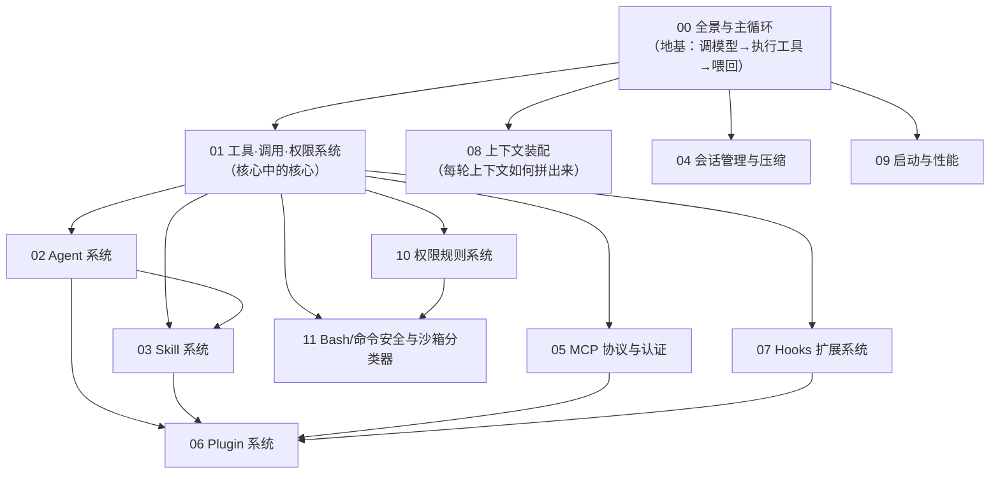

## 阅读顺序

建议先读 **00 打地基**，再读 **01 工具·调用·权限**（最核心），随后按兴趣展开：

## 贯穿全书的几条主线

留意这些**反复出现的设计母题**，它们把各篇串成一个整体：

- **工具结果即下一轮输入**：Agent 自主性的来源（00、01）。
- **保 prompt 缓存 = 前缀字节稳定**：工具结果预算冻结、压缩保留段重链、记忆稳定 header、会话内锁定易变因素——都服务于此（01/04/08/09）。
- **失败关闭**：证明不了安全就更保守（工具并发默认串行、Bash"超限即问"、权限多口硬 deny）。
- **状态被"持续重注"而非只存一次**：待办/任务等状态每轮以最新快照经 `<system-reminder>` 注入（08、01 §3.1）。
- **贡献点统一汇流**：内置/MCP/Skill/Plugin/Hooks 最终都并入同一批"工具池 / 命令池 / 钩子表 / Agent 表"（03/05/06/07）。
- **一套内核多处复用**：主循环 `query()` 同时服务 SDK、REPL、子 Agent、压缩、摘要（00、02、04）。
- **磁盘上的三套记录，各司其职**（都在 `~/.claude/` 下，别混）：
  - **会话 transcript**（`projects/<项目>/<sessionId>.jsonl`）——整段对话消息链，供 `--resume`（04）。
  - **工具结果落盘**（会话目录下 `tool-results/`）——单个超大工具结果全文，上下文只留预览（01）。
  - **文件历史备份**（`file-history/<sessionId>/`）——每次编辑前的文件副本，供 `rewind` 回退（04 §1.2）。

---

> **第一原则：源码为准。** 所有机制结论均从 `claude-code-cli` 源码求证；无法确证者显式标注「推断」。每篇文末附**涉及模块**便于回源码深挖。
